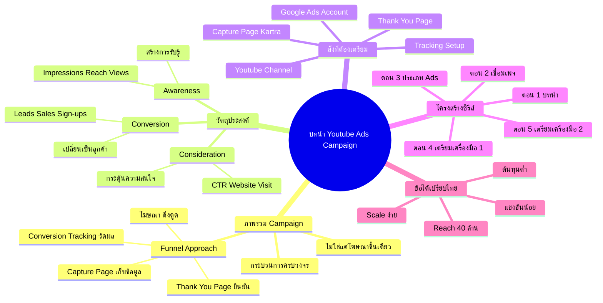

# บทนำก่อนทำ Youtube Ads Campaign — YTCAMP-001
> **Format:** Mind Map
> **Source:** SWP3 Ch19 Youtube Ads Campaign ตอนที่ 1
> **Production:** PinkCastle Academy | จูล่ง CTO
> **Date:** 2026-02-17

---

## Text Mind Map

```
บทนำ Youtube Ads Campaign
├── 1. ภาพรวม Campaign
│   ├── ไม่ใช่แค่โฆษณาชิ้นเดียว
│   ├── กระบวนการครบวงจร
│   ├── วางแผน → สร้าง → ปล่อย → วัดผล
│   └── Funnel Approach
│       ├── โฆษณา (ดึงดูด)
│       ├── Capture Page (เก็บข้อมูล)
│       ├── Thank You Page (ยืนยัน)
│       └── Conversion Tracking (วัดผล)
├── 2. วัตถุประสงค์ (Objectives)
│   ├── Awareness
│   │   ├── สร้างการรับรู้แบรนด์
│   │   ├── วัด: Impressions, Reach, Views
│   │   └── เหมาะ: ธุรกิจใหม่
│   ├── Consideration
│   │   ├── กระตุ้นความสนใจ
│   │   ├── วัด: CTR, Website Visit
│   │   └── เหมาะ: สร้าง Traffic
│   └── Conversion
│       ├── เปลี่ยนเป็นลูกค้า/Lead
│       ├── วัด: Leads, Sales, Sign-ups
│       └── เหมาะ: เก็บ Lead / ขายสินค้า
├── 3. สิ่งที่ต้องเตรียม (Prerequisites)
│   ├── Google Ads Account
│   ├── Youtube Channel
│   │   └── ต้องเชื่อมกับ Google Ads
│   ├── Capture Page
│   │   └── สร้างด้วย Kartra
│   ├── Thank You Page
│   │   └── ติด Conversion Pixel
│   └── Tracking Setup
│       ├── Google Analytics (GA4)
│       └── Conversion Tracking
├── 4. โครงสร้างซีรีส์
│   ├── ตอน 1: บทนำ (ตอนนี้)
│   ├── ตอน 2: เชื่อม Capture + Thank You
│   ├── ตอน 3: ประเภท Youtube Ads
│   ├── ตอน 4: เตรียมเครื่องมือ 1
│   └── ตอน 5: เตรียมเครื่องมือ 2
└── 5. ข้อได้เปรียบ Youtube Ads ไทย
    ├── ต้นทุนต่อ View ต่ำ
    ├── แข่งขันน้อยกว่า Facebook
    ├── Reach 40+ ล้านคนไทย
    └── Scale Budget ได้ง่าย
```

## Mermaid Diagram



---

*Node count: 38 | Depth: 4 levels | Main branches: 5*
