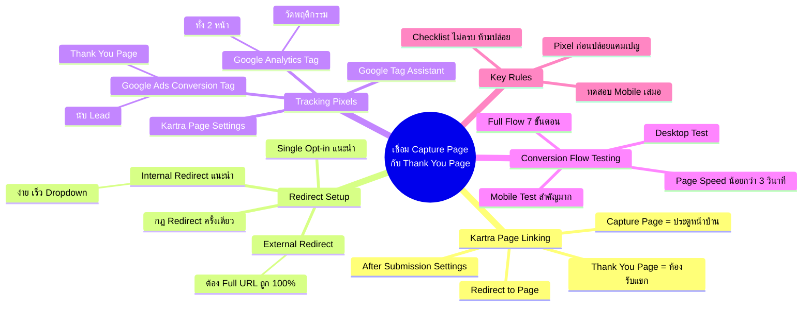
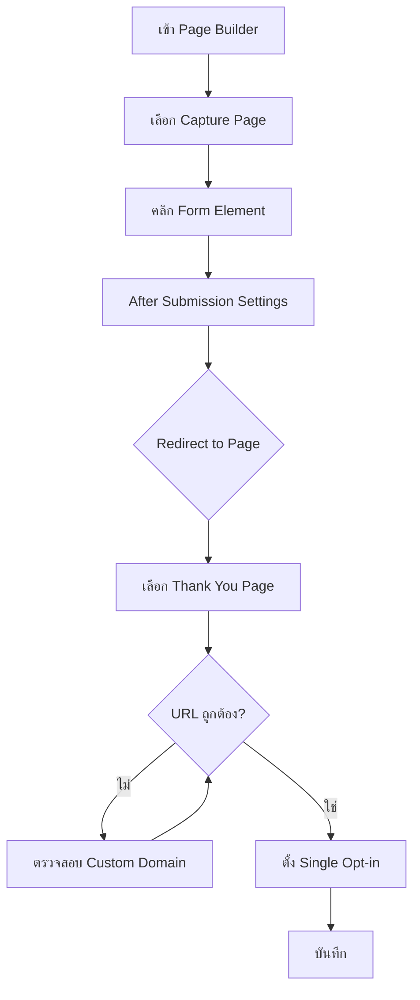
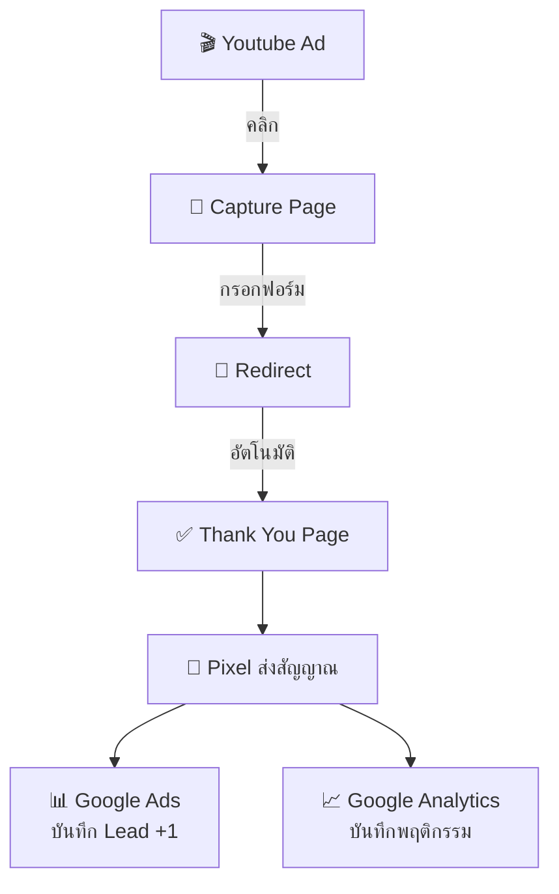
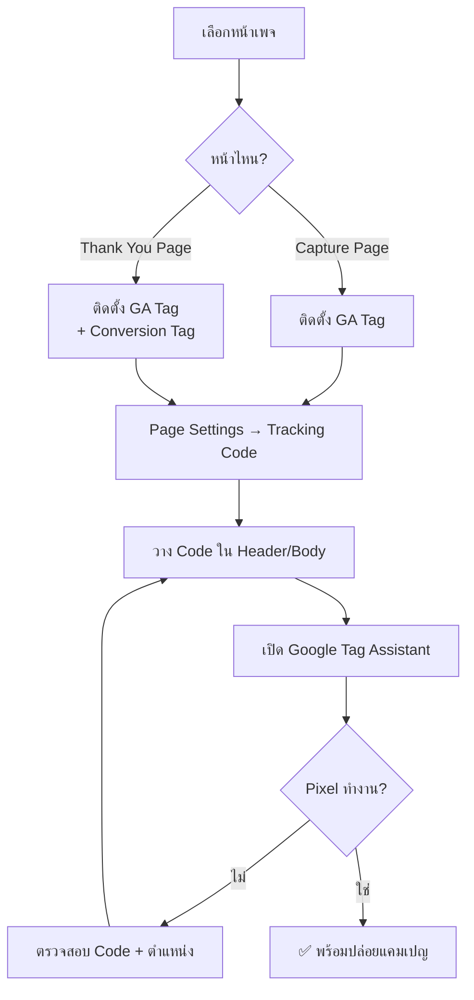
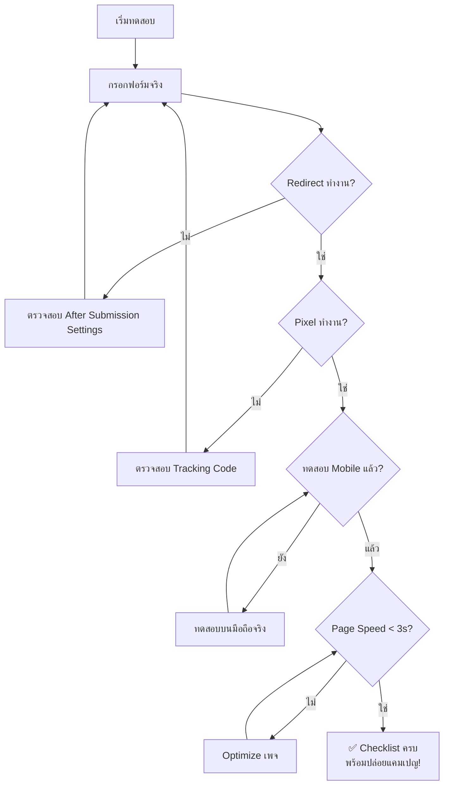

# วิธีเชื่อม Capture Page กับ Thank You Page — YTCAMP-002 Mind Map
> Format: Mind Map (7 Parts)
> Source: SWP3 Ch19 Youtube Ads Campaign ตอนที่ 2
> Production: PinkCastle Academy | จูล่ง CTO
> Date: 2026-02-18 | Duration: 0:42:23

---

## Part 1: Text-Based Mind Map (Tree Format)

```
เชื่อม CAPTURE PAGE กับ THANK YOU PAGE (YTCAMP-002)
│
├── 1. KARTRA PAGE LINKING
│   ├── Capture Page = ประตูหน้าบ้าน
│   ├── Thank You Page = ห้องรับแขก
│   ├── ขั้นตอนเชื่อมเพจ
│   │   ├── Page Builder → เลือก Capture Page
│   │   ├── คลิก Form Element
│   │   ├── After Submission Settings
│   │   ├── Redirect to Page
│   │   └── เลือก Thank You Page
│   └── สิ่งที่ต้องระวัง
│       ├── URL ต้องถูกต้อง
│       └── Custom Domain ตั้งค่าตรงกัน
│
├── 2. REDIRECT SETUP
│   ├── Internal Redirect ✅ (แนะนำ)
│   │   ├── ภายใน Kartra เดียวกัน
│   │   ├── เลือกจาก Dropdown
│   │   └── เร็วกว่า
│   ├── External Redirect ⚠️
│   │   ├── ไป URL ภายนอก
│   │   └── ต้องใส่ Full URL ถูก 100%
│   ├── Opt-in Type
│   │   ├── Single Opt-in ✅ (แนะนำ Youtube Ads)
│   │   └── Double Opt-in (เสีย Lead ระหว่างทาง)
│   └── กฎสำคัญ
│       ├── Redirect ครั้งเดียว ห้ามหลายชั้น
│       └── ทดสอบบนมือถือเสมอ
│
├── 3. TRACKING PIXELS
│   ├── Pixel คืออะไร
│   │   └── โค้ดเล็กๆ ส่งสัญญาณกลับ Google Ads
│   ├── จุดที่ 1: Google Ads Conversion Tag
│   │   ├── ติดที่: Thank You Page
│   │   └── นับ Conversion (Lead)
│   ├── จุดที่ 2: Google Analytics Tag
│   │   ├── ติดที่: ทั้ง 2 หน้า
│   │   └── ดูพฤติกรรมผู้ใช้
│   ├── วิธีติดตั้งใน Kartra
│   │   └── Page Settings → Tracking Code → วาง Code
│   └── ตรวจสอบด้วย
│       └── Google Tag Assistant
│
├── 4. CONVERSION FLOW TESTING
│   ├── Full Flow
│   │   ├── Youtube Ad → คลิก
│   │   ├── → Capture Page → กรอกฟอร์ม
│   │   ├── → Redirect
│   │   ├── → Thank You Page
│   │   └── → Pixel นับ Conversion
│   ├── Testing Checklist
│   │   ├── กรอกฟอร์มจริง
│   │   ├── ตรวจ Redirect
│   │   ├── ตรวจ Pixel (Tag Assistant)
│   │   ├── ทดสอบ Desktop
│   │   ├── ทดสอบ Mobile ← สำคัญมาก!
│   │   └── Page Speed < 3 วินาที
│   └── ให้คนอื่นทดสอบด้วย
│
└── 5. KEY RULES
    ├── ติดตั้ง Pixel ก่อนปล่อยแคมเปญ
    ├── ทดสอบ Mobile เสมอ (คนดู YT บนมือถือ)
    ├── Redirect ครั้งเดียว ไม่ผ่านหน้ากลาง
    └── ยังไม่ครบ Checklist = ห้ามปล่อยแคมเปญ
```

---

## Part 2: Mermaid Mind Map



---

## Part 3: Mermaid Flowcharts

### Flowchart 1: Kartra Page Linking Process



### Flowchart 2: Conversion Flow สมบูรณ์



### Flowchart 3: Tracking Pixel Installation



### Flowchart 4: Testing Decision Flow



---

## Part 4: Comparison Chart

### Internal vs External Redirect

| เปรียบเทียบ | Internal Redirect | External Redirect |
|-------------|------------------|-------------------|
| **ไปที่** | หน้าใน Kartra เดียวกัน | URL ภายนอก |
| **ตั้งค่า** | เลือกจาก Dropdown | ใส่ Full URL |
| **ความง่าย** | ⭐⭐⭐⭐⭐ ง่ายมาก | ⭐⭐⭐ ปานกลาง |
| **ความเร็ว** | เร็วกว่า | อาจช้ากว่า |
| **ความเสี่ยง** | ต่ำ | สูง (URL ผิด = พัง) |
| **แนะนำสำหรับ** | Youtube Ads Campaign | จำเป็นต้องไปเว็บนอก |

### Single vs Double Opt-in

| เปรียบเทียบ | Single Opt-in | Double Opt-in |
|-------------|---------------|---------------|
| **ขั้นตอน** | กรอก → Thank You ทันที | กรอก → ยืนยันอีเมล → Thank You |
| **ความเร็ว** | เร็ว | ช้า (รออีเมล) |
| **Lead Quality** | ปานกลาง | สูง (กรองแล้ว) |
| **Conversion Rate** | สูงกว่า | ต่ำกว่า (เสียระหว่างทาง) |
| **แนะนำสำหรับ** | Youtube Ads Campaign | Email List ระยะยาว |

### Tracking Pixel 2 จุด

| Pixel | ติดตั้งที่ | วัตถุประสงค์ | ข้อมูลที่ได้ |
|-------|-----------|-------------|-------------|
| Google Ads Conversion Tag | Thank You Page | นับ Conversion | จำนวน Lead, Cost per Lead |
| Google Analytics Tag | ทั้ง 2 หน้า | วัดพฤติกรรม | Traffic, Bounce Rate, Conversion Rate |

---

## Part 5: Summary Table

| # | หัวข้อ | สาระสำคัญ | Action Item |
|---|--------|----------|-------------|
| 1 | Capture Page + Thank You Page | ประตูหน้าบ้าน + ห้องรับแขก ต้องเชื่อมถูกต้อง | สร้างทั้ง 2 หน้าใน Kartra |
| 2 | After Submission Settings | จุดเชื่อมในForm Element ของ Kartra | ตั้งค่า Redirect to Page |
| 3 | Single Opt-in | แนะนำสำหรับ Youtube Ads เพื่อ Flow ลื่นไหล | ตั้งค่าใน Form Settings |
| 4 | Internal Redirect | ง่ายและเร็วกว่า External | เลือก Internal เป็นค่าเริ่มต้น |
| 5 | Redirect ครั้งเดียว | ห้าม Redirect หลายชั้น ทำให้ช้า | ตรวจว่าไม่ผ่านหน้ากลาง |
| 6 | Conversion Tag | ติด Thank You Page นับ Lead | ติดตั้งก่อนปล่อยแคมเปญ |
| 7 | GA Tag | ติดทั้ง 2 หน้า วัดพฤติกรรม | ติดตั้งพร้อม Conversion Tag |
| 8 | Google Tag Assistant | เช็คว่า Pixel ทำงาน | เช็คทุกครั้งหลังติดตั้ง |
| 9 | Mobile Testing | คนดู YT บนมือถือ ต้อง Test จริง | ใช้มือถือจริง ไม่ใช่แค่ Responsive |
| 10 | Page Speed | ต้อง < 3 วินาที ไม่งั้นเสีย Lead | เช็คด้วย PageSpeed Insights |

---

## Part 6: Implementation Roadmap

```
วันที่ 1: SETUP PAGE LINKING
├── สร้าง Capture Page ใน Kartra (ถ้ายังไม่มี)
├── สร้าง Thank You Page ใน Kartra (ถ้ายังไม่มี)
├── เชื่อม 2 หน้าผ่าน After Submission Settings
├── ตั้ง Single Opt-in
└── ตั้ง Internal Redirect

วันที่ 2: INSTALL TRACKING
├── ติดตั้ง Google Ads Conversion Tag บน Thank You Page
├── ติดตั้ง Google Analytics Tag บนทั้ง 2 หน้า
├── เปิด Google Tag Assistant
├── เช็คว่าทุก Pixel ทำงาน
└── แก้ไขถ้ามีปัญหา

วันที่ 3: TESTING
├── ทดสอบ Full Flow บน Desktop
│   ├── กรอกฟอร์มจริง
│   ├── ตรวจ Redirect
│   └── ตรวจ Conversion ใน Google Ads
├── ทดสอบ Full Flow บน Mobile (มือถือจริง)
│   ├── iOS
│   └── Android
├── เช็ค PageSpeed Insights ทั้ง 2 หน้า
├── ให้คนอื่นทดสอบ
└── ✅ ผ่านทุกข้อ → พร้อมปล่อยแคมเปญ!
```

---

## Part 7: Key Formulas & Frameworks

### สูตร Conversion Flow
```
Youtube Ad → Capture Page → Redirect → Thank You Page → Pixel → Google Ads นับ Lead
(ทุกขั้นตอนต้องทำงาน ถ้าขาด 1 ขั้น = เสีย Lead)
```

### สูตรเลือก Redirect Type
```
ถ้า Thank You Page อยู่ใน Kartra → Internal Redirect ✅
ถ้า Thank You Page อยู่นอก Kartra → External Redirect (ใส่ Full URL)
```

### สูตรเลือก Opt-in Type
```
Youtube Ads Campaign → Single Opt-in (Flow ลื่นไหล, Conversion สูง)
Email List ระยะยาว → Double Opt-in (Lead คุณภาพสูง)
```

### Tracking Pixel Formula
```
Capture Page = GA Tag
Thank You Page = GA Tag + Conversion Tag
ตรวจสอบ = Google Tag Assistant (ก่อนปล่อยแคมเปญเสมอ!)
```

### Testing Checklist Formula
```
ทดสอบ = กรอกฟอร์มจริง + Redirect + Pixel + Desktop + Mobile + Speed < 3s
ผ่านทุกข้อ = พร้อมปล่อยแคมเปญ
ไม่ผ่าน = แก้ไขแล้วทดสอบใหม่ (ห้ามปล่อย!)
```

### Page Speed Rule
```
< 3 วินาที = OK ✅
≥ 3 วินาที = Optimize (ลดรูป, ลด Code, ลด Redirect)
วัดด้วย: Google PageSpeed Insights
```

---

> ทบทวนต่อ: **YTCAMP-003** — Youtube Ads Campaign ตอนที่ 3
> Series: SWP3 Ch19 Youtube Ads Campaign
> PinkCastle Academy © 2026
