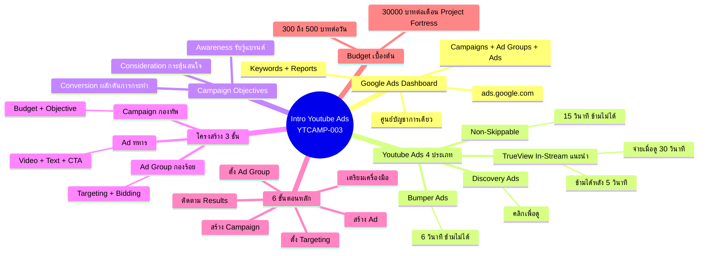
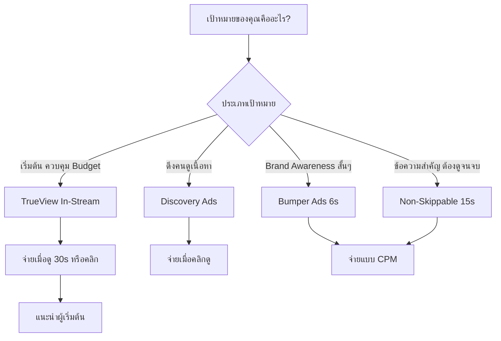
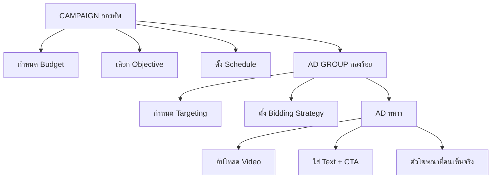
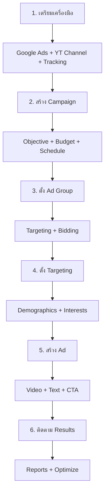
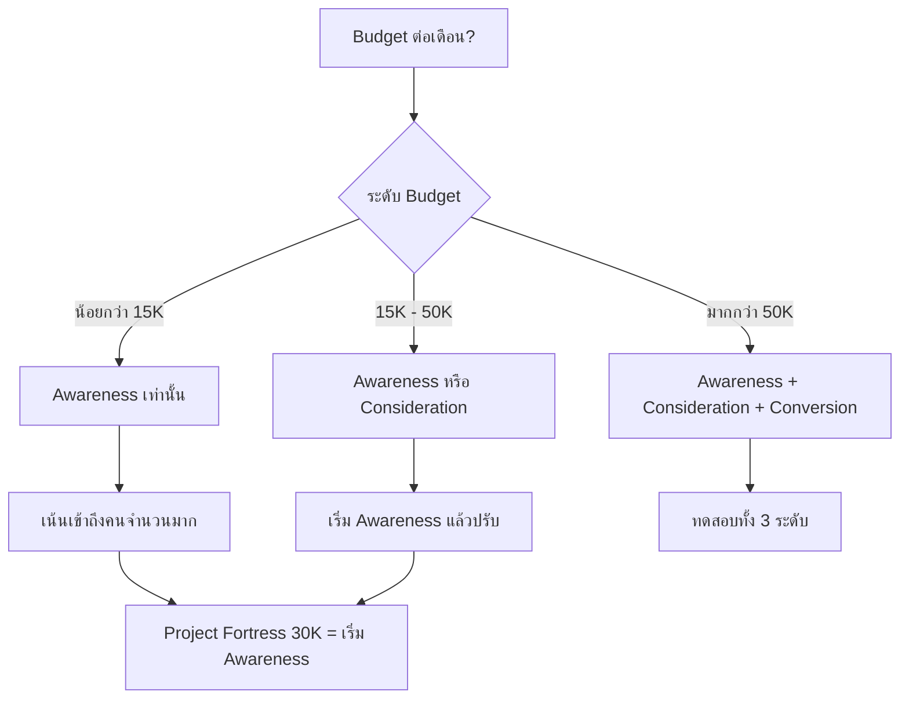

# Intro Youtube Ads — YTCAMP-003 Mind Map
> Format: Mind Map (7 Parts)
> Source: SWP3 Ch19 Youtube Ads Campaign ตอนที่ 3
> Production: PinkCastle Academy | จูล่ง CTO
> Date: 2026-02-18 | Duration: 0:03:25

---

## Part 1: Text-Based Mind Map (Tree Format)

```
INTRO YOUTUBE ADS (YTCAMP-003)
│
├── 1. GOOGLE ADS DASHBOARD
│   ├── URL: ads.google.com
│   ├── ศูนย์บัญชาการเดียว
│   ├── จัดการได้ทั้งหมด
│   │   ├── Campaigns
│   │   ├── Ad Groups
│   │   ├── Ads
│   │   ├── Keywords
│   │   └── Reports
│   └── เปรียบเหมือนห้องบัญชาการแม่ทัพ
│
├── 2. YOUTUBE ADS 4 ประเภท
│   ├── TrueView In-Stream ✅ (แนะนำผู้เริ่มต้น)
│   │   ├── เล่นก่อน/ระหว่างวิดีโอ
│   │   ├── ข้ามได้หลัง 5 วินาที
│   │   └── จ่ายเมื่อดูครบ 30 วินาที หรือคลิก
│   ├── Discovery Ads
│   │   ├── แสดงในหน้าค้นหา/แนะนำ
│   │   ├── คนต้องคลิกเพื่อดู
│   │   └── เหมาะดึงคนเข้ามาดูเนื้อหา
│   ├── Bumper Ads
│   │   ├── สั้น 6 วินาที
│   │   ├── ข้ามไม่ได้
│   │   └── เหมาะ Brand Awareness
│   └── Non-Skippable In-Stream
│       ├── ยาว 15 วินาที
│       ├── ข้ามไม่ได้
│       └── เหมาะข้อความสำคัญ
│
├── 3. CAMPAIGN OBJECTIVES 3 ระดับ
│   ├── Awareness
│   │   ├── สร้างการรับรู้แบรนด์
│   │   ├── เข้าถึงคนจำนวนมาก
│   │   └── แนะนำสำหรับ Budget 30K/เดือน
│   ├── Consideration
│   │   ├── กระตุ้นความสนใจ
│   │   └── ดูวิดีโอ เยี่ยมชมเว็บ
│   └── Conversion
│       ├── ผลักดันการกระทำ
│       └── สมัคร ซื้อสินค้า กรอกฟอร์ม
│
├── 4. โครงสร้าง CAMPAIGN 3 ชั้น
│   ├── Campaign (กองทัพ)
│   │   ├── Budget (งบประมาณ)
│   │   ├── Objective (วัตถุประสงค์)
│   │   └── Schedule (ระยะเวลา)
│   ├── Ad Group (กองร้อย)
│   │   ├── Targeting (กลุ่มเป้าหมาย)
│   │   └── Bidding (ราคาประมูล)
│   └── Ad (ทหาร)
│       ├── Video (วิดีโอโฆษณา)
│       ├── Text (ข้อความ)
│       └── CTA (Call to Action)
│
├── 5. ขั้นตอนหลัก 6 ขั้น
│   ├── 1. เตรียมเครื่องมือ (YTCAMP-004, 005)
│   ├── 2. สร้าง Campaign
│   ├── 3. ตั้ง Ad Group
│   ├── 4. ตั้ง Targeting
│   ├── 5. สร้าง Ad
│   └── 6. ติดตาม Results
│
└── 6. BUDGET เบื้องต้น
    ├── ผู้เริ่มต้น: 300-500 บาท/วัน
    ├── = 10,000-15,000 บาท/เดือน
    ├── Project Fortress: 30,000 บาท/เดือน
    └── หลักการ: เริ่มน้อย → ทดสอบ → ค่อยเพิ่ม
```

---

## Part 2: Mermaid Mind Map



---

## Part 3: Mermaid Flowcharts

### Flowchart 1: เลือกประเภท Youtube Ads



### Flowchart 2: โครงสร้าง Campaign 3 ชั้น



### Flowchart 3: 6 ขั้นตอนสร้าง Youtube Ads



### Flowchart 4: เลือกวัตถุประสงค์ตาม Budget



---

## Part 4: Comparison Chart

### Youtube Ads 4 ประเภท

| เปรียบเทียบ | TrueView In-Stream | Discovery Ads | Bumper Ads | Non-Skippable |
|-------------|-------------------|---------------|------------|---------------|
| **ความยาว** | ไม่จำกัด | - | 6 วินาที | 15 วินาที |
| **ข้ามได้?** | ได้ หลัง 5 วินาที | - (ต้องคลิก) | ไม่ได้ | ไม่ได้ |
| **จ่ายเงินเมื่อ** | ดูครบ 30 วินาที / คลิก | คลิกเข้าดู | CPM (1,000 Impressions) | CPM (1,000 Impressions) |
| **ควบคุม Budget** | ดีมาก | ดี | ปานกลาง | ปานกลาง |
| **เหมาะกับ** | ผู้เริ่มต้น | ดึงคนดูเนื้อหา | Brand Awareness | ข้อความสำคัญ |
| **แสดงที่** | ก่อน/ระหว่างวิดีโอ | หน้าค้นหา/แนะนำ | ก่อน/ระหว่างวิดีโอ | ก่อน/ระหว่างวิดีโอ |

### Campaign Objectives 3 ระดับ

| เปรียบเทียบ | Awareness | Consideration | Conversion |
|-------------|-----------|---------------|------------|
| **เป้าหมาย** | สร้างการรับรู้ | กระตุ้นความสนใจ | ผลักดันการกระทำ |
| **เข้าถึง** | คนจำนวนมาก | คนที่สนใจ | คนที่พร้อมกระทำ |
| **Budget ที่เหมาะ** | ทุกระดับ | ปานกลางขึ้นไป | สูง |
| **วัดผลด้วย** | Impressions, Reach | Views, Clicks, Engagement | Conversions, CPA |
| **Project Fortress** | แนะนำ (30K/เดือน) | ภายหลังเมื่อมีข้อมูล | ภายหลังเมื่อ Optimize แล้ว |

### โครงสร้าง Campaign 3 ชั้น

| ชั้น | เปรียบเทียบ | กำหนดอะไร | ตอบคำถาม |
|------|-----------|-----------|---------|
| Campaign | กองทัพ | Budget + Objective + Schedule | "ทำอะไร ใช้เงินเท่าไร" |
| Ad Group | กองร้อย | Targeting + Bidding | "ยิงใคร ราคาเท่าไร" |
| Ad | ทหาร | Video + Text + CTA | "คนเห็นอะไร" |

---

## Part 5: Summary Table

| # | หัวข้อ | สาระสำคัญ | Action Item |
|---|--------|----------|-------------|
| 1 | Google Ads Dashboard | ศูนย์บัญชาการที่ ads.google.com จัดการโฆษณาทั้งหมด | ล็อกอินสำรวจ Dashboard ให้คุ้นเคย |
| 2 | TrueView In-Stream | ข้ามได้หลัง 5 วินาที จ่ายเมื่อดู 30 วินาที/คลิก แนะนำผู้เริ่มต้น | เลือกเป็นประเภทแรก |
| 3 | Discovery Ads | แสดงในหน้าค้นหา คนต้องคลิกดู เหมาะดึงคนเข้าเนื้อหา | ใช้เมื่อมี Content ยาว |
| 4 | Bumper Ads | 6 วินาที ข้ามไม่ได้ CPM เหมาะ Brand Recall | ใช้เสริมหลังจาก TrueView |
| 5 | Non-Skippable | 15 วินาที ข้ามไม่ได้ CPM เหมาะข้อความสำคัญ | ใช้เมื่อต้องให้ดูจนจบ |
| 6 | Awareness Objective | สร้างการรับรู้ เข้าถึงคนมาก เหมาะ Budget จำกัด | เลือกสำหรับ 30K/เดือน |
| 7 | โครงสร้าง 3 ชั้น | Campaign > Ad Group > Ad = กองทัพ > กองร้อย > ทหาร | วางแผนบนกระดาษก่อน |
| 8 | 6 ขั้นตอนหลัก | เตรียม → Campaign → Ad Group → Targeting → Ad → Results | ทำตามลำดับ อย่าข้าม |
| 9 | Budget เริ่มต้น | 300-500 บาท/วัน ทดสอบก่อนค่อยเพิ่ม | ตั้ง Budget เริ่มต้นต่ำ |
| 10 | สำรวจก่อนออกรบ | เข้าใจพื้นฐานก่อนลงมือทำ ตอนหน้าเตรียมเครื่องมือจริง | ทบทวนให้แม่นก่อนไปต่อ |

---

## Part 6: Implementation Roadmap

```
วันที่ 1: ทำความเข้าใจพื้นฐาน
├── ทบทวน YTCAMP-003 (ตอนนี้)
├── จดสรุป 4 ประเภท Youtube Ads
├── จดสรุป 3 ระดับวัตถุประสงค์
├── จดสรุป 3 ชั้นโครงสร้าง Campaign
└── ล็อกอิน ads.google.com สำรวจ Dashboard

วันที่ 2: วางแผนแคมเปญ
├── กำหนดวัตถุประสงค์ (Awareness สำหรับ 30K Budget)
├── เลือกประเภท Ads (TrueView In-Stream)
├── วางโครงสร้าง Campaign บนกระดาษ
│   ├── กำหนด Campaign 1 ตัว
│   ├── กำหนด Ad Groups (กี่กลุ่ม Targeting)
│   └── กำหนด Ads (กี่ตัวต่อ Ad Group)
├── ตั้ง Budget เริ่มต้น (300-500 บาท/วัน)
└── กำหนดระยะทดสอบ (1-2 สัปดาห์)

วันที่ 3: เตรียมเครื่องมือ
├── เข้า YTCAMP-004 — ขั้นตอนเตรียมเครื่องมือ 1
├── ตั้งค่า Google Ads Account
├── เชื่อม Youtube Channel
├── ตั้งค่า Tracking (ต่อจาก YTCAMP-002)
└── เตรียมวิดีโอโฆษณา
```

---

## Part 7: Key Formulas & Frameworks

### สูตรเลือกประเภท Youtube Ads
```
ผู้เริ่มต้น + ควบคุม Budget → TrueView In-Stream ✅
ดึงคนดูเนื้อหาเชิงลึก → Discovery Ads
Brand Awareness สั้นๆ ราคาถูก → Bumper Ads (6s)
ข้อความสำคัญ ต้องดูจนจบ → Non-Skippable (15s)
```

### สูตรเลือกวัตถุประสงค์
```
Budget น้อย (< 15K/เดือน) → Awareness เท่านั้น
Budget กลาง (15K - 50K) → Awareness → Consideration
Budget สูง (> 50K) → ทดสอบทั้ง 3 ระดับ

Project Fortress (30K) → เริ่ม Awareness ก่อน
```

### สูตรโครงสร้าง Campaign
```
Campaign (กองทัพ) = Budget + Objective + Schedule
    ↓ ตอบ "ทำอะไร ใช้เงินเท่าไร"
Ad Group (กองร้อย) = Targeting + Bidding
    ↓ ตอบ "ยิงใคร ราคาเท่าไร"
Ad (ทหาร) = Video + Text + CTA
    ↓ ตอบ "คนเห็นอะไร"
```

### สูตร 6 ขั้นตอนหลัก
```
1. เตรียมเครื่องมือ → 2. สร้าง Campaign → 3. ตั้ง Ad Group
→ 4. ตั้ง Targeting → 5. สร้าง Ad → 6. ติดตาม Results

กฎเหล็ก: ทำตามลำดับ ห้ามข้ามขั้นตอน!
```

### สูตร Budget เบื้องต้น
```
ผู้เริ่มต้น: 300-500 บาท/วัน (10K-15K/เดือน)
ทดสอบ: 1-2 สัปดาห์ ดูข้อมูลก่อนเพิ่มงบ
หลักการ: เริ่มน้อย → ทดสอบ → เห็นผล → ค่อยเพิ่ม
```

### สูตรจำง่าย 4-3-3
```
4 ประเภท Youtube Ads (TrueView / Discovery / Bumper / Non-Skippable)
3 ระดับวัตถุประสงค์ (Awareness / Consideration / Conversion)
3 ชั้นโครงสร้าง (Campaign / Ad Group / Ad)
```

---

> ทบทวนต่อ: **YTCAMP-004** — ขั้นตอนเตรียมเครื่องมือ 1
> Series: SWP3 Ch19 Youtube Ads Campaign
> PinkCastle Academy © 2026
