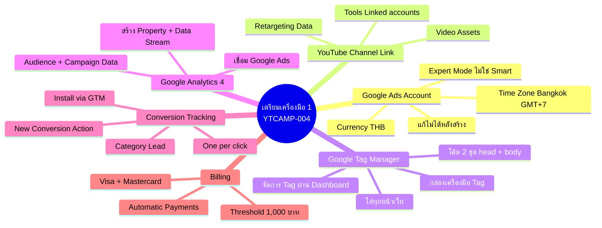
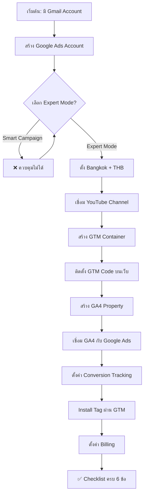
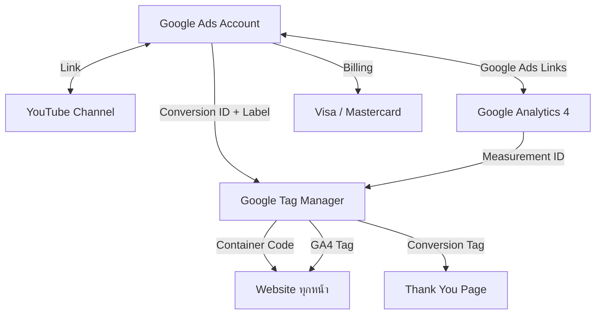
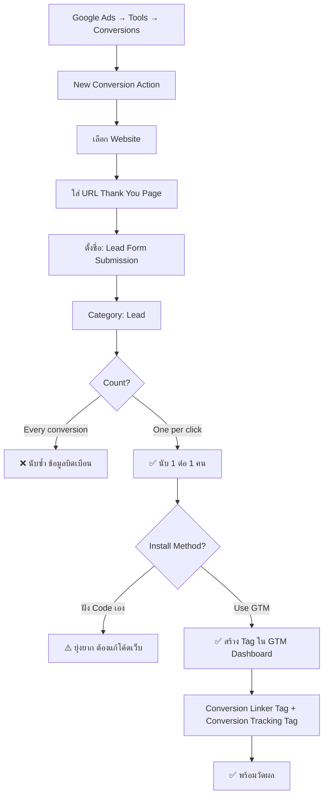
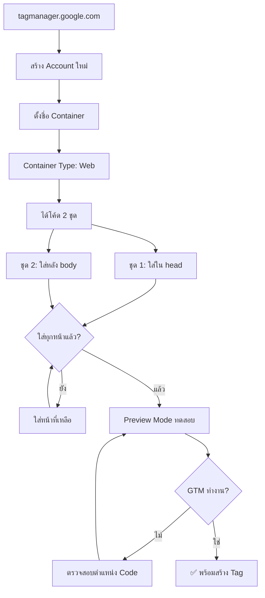

# ขั้นตอนเตรียมเครื่องมือ 1 — YTCAMP-004 Mind Map
> Format: Mind Map (7 Parts)
> Source: SWP3 Ch19 Youtube Ads Campaign ตอนที่ 4
> Production: PinkCastle Academy | จูล่ง CTO
> Date: 2026-02-18 | Duration: 0:06:38

---

## Part 1: Text-Based Mind Map (Tree Format)

```
ขั้นตอนเตรียมเครื่องมือ 1 (YTCAMP-004)
│
├── 1. GOOGLE ADS ACCOUNT
│   ├── สร้างบัญชีที่ ads.google.com
│   ├── เลือก Expert Mode (ไม่ใช่ Smart Campaign)
│   │   ├── Smart Campaign = Google ตัดสินใจแทน ❌
│   │   └── Expert Mode = ควบคุมได้ทุกอย่าง ✅
│   ├── ตั้งค่าที่แก้ไม่ได้
│   │   ├── Time Zone: Bangkok (GMT+7)
│   │   └── Currency: THB (บาท)
│   └── ⚠️ ตั้งผิด = ต้องสร้างบัญชีใหม่
│
├── 2. YOUTUBE CHANNEL LINK
│   ├── Google Ads → Tools → Linked accounts → YouTube
│   ├── ใส่ URL ของ Channel → Approve
│   └── ประโยชน์
│       ├── เข้าถึง Video Assets โดยตรง
│       └── ข้อมูล Retargeting จากคนดู
│
├── 3. GOOGLE TAG MANAGER (GTM)
│   ├── สร้างที่ tagmanager.google.com
│   ├── สร้าง Container (Type: Web)
│   ├── โค้ด 2 ชุดที่ต้องติดตั้ง
│   │   ├── ชุด 1: ใส่ใน <head>
│   │   └── ชุด 2: ใส่หลัง <body> เปิด
│   ├── ใส่ทุกหน้าของเว็บไซต์
│   └── GTM = กล่องเครื่องมือ
│       ├── ฝัง Code 1 อัน จัดการ Tag ทั้งหมด
│       └── เพิ่ม/แก้/ลบ Tag ผ่าน Dashboard
│
├── 4. GOOGLE ANALYTICS 4 (GA4)
│   ├── สร้างที่ analytics.google.com
│   ├── สร้าง Property → Data Stream: Web
│   ├── ใส่ URL เว็บไซต์
│   └── เชื่อม Google Ads
│       ├── GA4 → Admin → Google Ads Links → Link
│       └── ข้อมูลไหลระหว่าง 2 ระบบ
│           ├── เห็น Audience ใน Google Ads
│           └── เห็น Campaign data ใน GA4
│
├── 5. CONVERSION TRACKING
│   ├── Google Ads → Tools → Conversions
│   ├── New Conversion Action → Website
│   ├── ตั้งค่า
│   │   ├── Name: "Lead Form Submission"
│   │   ├── Category: Lead
│   │   ├── Value: 1
│   │   └── Count: One conversion per click
│   └── Install Tag
│       ├── เลือก Use Google Tag Manager
│       ├── สร้าง Conversion Linker Tag
│       └── สร้าง Conversion Tracking Tag
│
└── 6. BILLING
    ├── Tools → Billing → Payment Methods
    ├── รองรับ Visa + Mastercard
    ├── ระบบ Automatic Payments
    │   ├── เก็บเมื่อถึง Threshold (1,000 บาท)
    │   └── หรือทุก 30 วัน (แล้วแต่อันไหนถึงก่อน)
    └── ตั้งค่าให้เสร็จก่อนปล่อยแคมเปญ
```

---

## Part 2: Mermaid Mind Map



---

## Part 3: Mermaid Flowcharts

### Flowchart 1: ลำดับการเตรียมเครื่องมือ



### Flowchart 2: การเชื่อมต่อระหว่างเครื่องมือ



### Flowchart 3: Conversion Tracking Setup



### Flowchart 4: GTM Installation Flow



---

## Part 4: Comparison Chart

### Expert Mode vs Smart Campaign

| เปรียบเทียบ | Expert Mode | Smart Campaign |
|-------------|-------------|----------------|
| **ควบคุม Bidding** | ✅ เลือกได้ทุก Strategy | ❌ Google ตัดสินใจ |
| **Audience Targeting** | ✅ กำหนดเองได้ละเอียด | ❌ Google เลือกให้ |
| **Ad Placement** | ✅ เลือก Youtube, Search, Display | ❌ Google เลือกให้ |
| **ความยาก** | ปานกลาง (ต้องเรียนรู้) | ง่ายมาก (แค่ใส่ข้อมูล) |
| **ความเหมาะสม** | ✅ Youtube Ads Campaign | ❌ ไม่แนะนำ |
| **ข้อสรุป** | **เลือกอันนี้!** | หลีกเลี่ยง |

### GTM vs ฝัง Code โดยตรง

| เปรียบเทียบ | ใช้ GTM | ฝัง Code โดยตรง |
|-------------|---------|----------------|
| **ติดตั้ง** | ฝัง GTM 1 ครั้ง จัดการ Tag ผ่าน UI | ฝัง Code ทุกตัวลงเว็บ |
| **เพิ่ม Tag ใหม่** | สร้างใน GTM Dashboard | แก้โค้ดเว็บ |
| **แก้ไข Tag** | แก้ใน GTM ได้ทันที | แก้โค้ดเว็บ deploy ใหม่ |
| **ลบ Tag** | ลบใน GTM | หาแล้วลบจากโค้ดเว็บ |
| **ความเสี่ยง** | ต่ำ (ไม่แตะโค้ดเว็บ) | สูง (แก้โค้ดผิดอาจพัง) |
| **Preview/Test** | GTM Preview Mode | ต้อง Deploy ก่อนถึงเทส |

### Conversion Count: One per click vs Every

| เปรียบเทียบ | One per click | Every conversion |
|-------------|---------------|------------------|
| **วิธีนับ** | 1 Conversion ต่อ 1 คน | นับทุกครั้งที่เกิด |
| **ตัวอย่าง** | คนเดียวกรอก 3 ครั้ง = 1 | คนเดียวกรอก 3 ครั้ง = 3 |
| **เหมาะกับ** | **Lead Generation** ✅ | E-commerce (นับ Transaction) |
| **สำหรับ Youtube Ads** | **ใช้อันนี้!** | ❌ ข้อมูลบิดเบือน |

---

## Part 5: Summary Table

| # | หัวข้อ | สาระสำคัญ | Action Item |
|---|--------|----------|-------------|
| 1 | Google Ads Account | ศูนย์บัญชาการโฆษณา ต้อง Expert Mode | สร้างที่ ads.google.com กด Switch to Expert Mode |
| 2 | Time Zone + Currency | แก้ไม่ได้หลังสร้าง ตั้งผิด = เริ่มใหม่ | Bangkok (GMT+7) + THB ตรวจก่อนกด Create |
| 3 | YouTube Channel Link | เชื่อมเพื่อ Video Assets + Retargeting | Tools → Linked accounts → YouTube → Link |
| 4 | GTM Container | กล่องเครื่องมือจัดการ Tag ทั้งหมด | สร้าง Container + ติดโค้ด 2 ชุดทุกหน้า |
| 5 | GTM Code 2 ชุด | head + body ต้องครบและทุกหน้า | ตรวจด้วย Preview Mode หรือ Tag Assistant |
| 6 | GA4 Property | วิเคราะห์พฤติกรรม + เชื่อม Google Ads | สร้าง Property → Admin → Google Ads Links |
| 7 | Conversion Tracking | หัวใจการวัดผล One per click สำหรับ Lead | New Conversion Action → Lead → One per click |
| 8 | Install Tag via GTM | Conversion Linker + Conversion Tracking Tag | สร้าง 2 Tag ใน GTM Dashboard |
| 9 | Billing | Automatic Payments Threshold 1,000 บาท | Tools → Billing → ใส่ Visa/Mastercard |
| 10 | Checklist 6 ข้อ | ต้องครบก่อนไป YTCAMP-005 | ตรวจทุกข้อ ไม่ครบอย่าเพิ่งไปต่อ |

---

## Part 6: Implementation Roadmap

```
วันที่ 1: GOOGLE ADS + YOUTUBE
├── สร้าง Google Ads Account
│   ├── เลือก Expert Mode
│   ├── Time Zone: Bangkok (GMT+7)
│   └── Currency: THB
├── เชื่อม YouTube Channel
│   ├── Tools → Linked accounts → YouTube
│   ├── ใส่ URL Channel
│   └── Approve
└── ตรวจสอบ: บัญชีพร้อม + Channel เชื่อมแล้ว

วันที่ 2: GTM + GA4
├── สร้าง GTM Container
│   ├── Container Type: Web
│   ├── ติดตั้งโค้ดชุด 1 ใน head
│   ├── ติดตั้งโค้ดชุด 2 หลัง body
│   └── ใส่ทุกหน้าเว็บ
├── สร้าง GA4 Property
│   ├── Data Stream: Web + URL เว็บ
│   └── เชื่อม Google Ads (Admin → Google Ads Links)
└── ตรวจสอบ: GTM Preview Mode + GA4 Realtime

วันที่ 3: CONVERSION TRACKING + BILLING
├── สร้าง Conversion Action
│   ├── Category: Lead
│   ├── Count: One per click
│   └── Install via GTM
├── สร้าง Tag ใน GTM
│   ├── Conversion Linker Tag (All Pages)
│   └── Conversion Tracking Tag (Thank You Page)
├── ตั้งค่า Billing
│   └── ใส่บัตร Visa/Mastercard
└── ✅ Checklist 6 ข้อครบ → พร้อมไป YTCAMP-005!
```

---

## Part 7: Key Formulas & Frameworks

### สูตรเตรียมเครื่องมือ
```
Gmail Account → Google Ads (Expert) → YouTube Link → GTM → GA4 → Conversion Tracking → Billing
(ทำตามลำดับ เพราะแต่ละตัวใช้ตัวก่อนหน้าเป็นพื้นฐาน)
```

### สูตร Google Ads Account
```
Expert Mode + Bangkok (GMT+7) + THB = บัญชีที่ถูกต้อง
Smart Campaign หรือ Time Zone/Currency ผิด = ต้องเริ่มใหม่!
```

### สูตร GTM Installation
```
GTM Container (Web) → โค้ด 2 ชุด (head + body) → ทุกหน้าเว็บ
ขาดชุดใดชุดหนึ่ง หรือ ขาดหน้าใดหน้าหนึ่ง = Tag ไม่ Fire!
```

### สูตรเชื่อมต่อข้อมูล
```
YouTube Channel ←Link→ Google Ads ←Link→ GA4
                          ↕ Tags
                         GTM → Website
(ข้อมูลไหลระหว่างระบบทั้งหมดผ่าน Google Account เดียว)
```

### สูตร Conversion Tracking
```
Lead Generation → One per click (ไม่ใช่ Every conversion)
Category: Lead + Value: 1 + Count: One per click
Install: GTM > ฝัง Code เอง (ง่ายกว่า ปลอดภัยกว่า)
```

### Billing Formula
```
Automatic Payments: เก็บเมื่อถึง Threshold (1,000 THB) หรือ 30 วัน
Threshold จะเพิ่มขึ้นเรื่อยๆ ตามประวัติการชำระ
รองรับ: Visa + Mastercard (เครดิต + เดบิต)
```

### Checklist Formula
```
✅ Google Ads (Expert + Bangkok + THB)
✅ YouTube Channel Link
✅ GTM (โค้ด 2 ชุด ทุกหน้า)
✅ GA4 (เชื่อม Google Ads)
✅ Conversion Tracking (One per click + GTM)
✅ Billing (Visa/Mastercard)
= 6/6 ครบ → พร้อมไป YTCAMP-005!
< 6 = อย่าเพิ่งไปต่อ!
```

---

> ทบทวนต่อ: **YTCAMP-005** — ขั้นตอนเตรียมเครื่องมือ 2
> Series: SWP3 Ch19 Youtube Ads Campaign
> PinkCastle Academy © 2026
