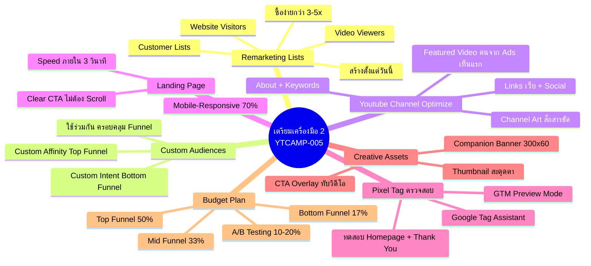
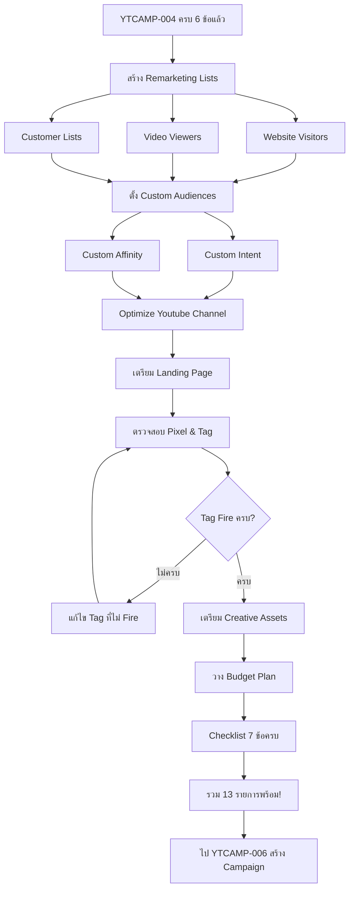
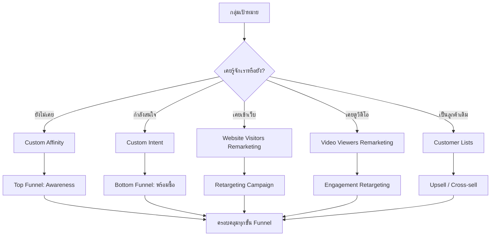
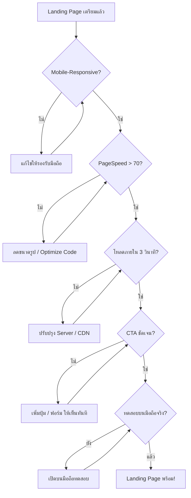
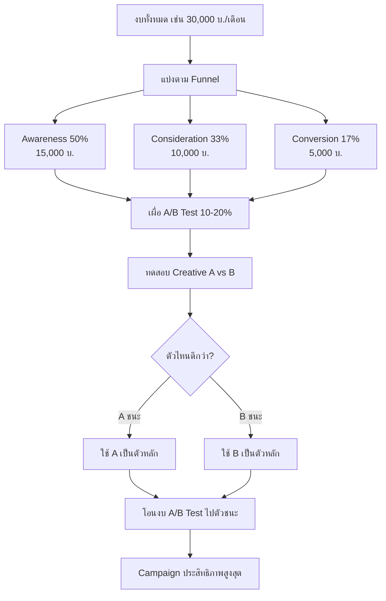

# ขั้นตอนเตรียมเครื่องมือ 2 — YTCAMP-005 Mind Map
> Format: Mind Map (7 Parts)
> Source: SWP3 Ch19 Youtube Ads Campaign ตอนที่ 5
> Production: PinkCastle Academy | จูล่ง CTO
> Date: 2026-02-18 | Duration: 0:06:09

---

## Part 1: Text-Based Mind Map (Tree Format)

```
ขั้นตอนเตรียมเครื่องมือ 2 (YTCAMP-005)
│
├── 1. REMARKETING LISTS
│   ├── สร้างที่ Google Ads → Tools → Audience Manager
│   ├── 3 แบบหลัก
│   │   ├── Website Visitors — คนเคยเข้าเว็บ (ต้องมี GTM+GA4)
│   │   ├── Video Viewers — คนเคยดูวิดีโอ Youtube (ต้อง Link Channel)
│   │   └── Customer Lists — อัปโหลดรายชื่อลูกค้า (CSV)
│   ├── คนใน Lists ซื้อง่ายกว่าคนใหม่ 3-5 เท่า
│   └── สร้างตั้งแต่วันนี้ ระบบเก็บข้อมูลทันที
│
├── 2. CUSTOM AUDIENCES
│   ├── Custom Intent Audience
│   │   ├── คนกำลังค้นหาสิ่งที่เกี่ยวกับสินค้าเรา
│   │   ├── ใส่ Keywords / URL ที่เกี่ยวข้อง
│   │   └── เหมาะกับ Bottom Funnel (คนพร้อมซื้อ)
│   ├── Custom Affinity Audience
│   │   ├── คนมีไลฟ์สไตล์ตรงกับแบรนด์
│   │   ├── เช่น สนใจธุรกิจออนไลน์ ชอบเรียนคอร์ส
│   │   └── เหมาะกับ Top Funnel (สร้าง Awareness)
│   └── ใช้ร่วมกัน = ครอบคลุมทุกขั้น Funnel
│
├── 3. YOUTUBE CHANNEL OPTIMIZE
│   ├── Channel Art (Banner) — สื่อสารชัดว่าเราทำอะไร
│   ├── About Section — คำอธิบายครบ + Keywords
│   ├── Links — เว็บไซต์ + Social Media ที่ Banner
│   └── Featured Video
│       ├── วิดีโอแนะนำตัวสำหรับคนยังไม่ Subscribe
│       └── คนจาก Ads เห็นเป็นอันดับแรก
│
├── 4. LANDING PAGE
│   ├── Mobile-Responsive
│   │   ├── 70% ดู Youtube บนมือถือ
│   │   └── ไม่รองรับมือถือ = จบ
│   ├── Page Speed
│   │   ├── ต้องโหลดภายใน 3 วินาที
│   │   ├── ช้ากว่านี้ = 50%+ กดปิด
│   │   └── ทดสอบ Google PageSpeed Insights > 70
│   └── Clear CTA
│       ├── ปุ่มกดสมัคร / ฟอร์มกรอก
│       └── เห็นทันที ไม่ต้อง Scroll หา
│
├── 5. PIXEL & TAG ตรวจสอบ
│   ├── GTM Preview Mode
│   │   ├── เข้า GTM → กด Preview
│   │   └── แสดง Tag ไหน Fire / ไม่ Fire
│   ├── Google Tag Assistant
│   │   ├── Chrome Extension
│   │   └── แสดงภาพรวมทุก Tag บนหน้านั้น
│   └── ต้องทดสอบ
│       ├── Homepage → Container Tag Fire
│       └── Thank You Page → Conversion Tag Fire
│
├── 6. CREATIVE ASSETS
│   ├── Video Thumbnail
│   │   ├── ข้อความสั้น ตัวอักษรใหญ่
│   │   ├── สีตัดกับพื้นหลัง
│   │   └── อ่านง่ายแม้ขนาดเล็ก
│   ├── Companion Banner
│   │   ├── ขนาด 300x60 px
│   │   ├── แสดงข้างวิดีโอ Desktop เท่านั้น
│   │   └── โลโก้ + ข้อความ 1 บรรทัด
│   └── CTA Overlay
│       ├── ข้อความ Call-to-Action ทับบนวิดีโอ
│       └── ตั้งค่าตอนสร้าง Campaign
│
└── 7. BUDGET PLAN
    ├── แบ่งตาม Funnel Stage
    │   ├── Awareness (Top) — 50% (มากสุด)
    │   ├── Consideration (Mid) — 33%
    │   └── Conversion (Bottom) — 17% (น้อยสุด)
    ├── ตัวอย่าง 30,000 บ./เดือน
    │   ├── Awareness: 15,000 (500/วัน)
    │   ├── Consideration: 10,000 (333/วัน)
    │   └── Conversion: 5,000 (167/วัน)
    └── เผื่อ A/B Testing 10-20%
        └── ทดสอบ Creative ไหนดีกว่า
```

---

## Part 2: Mermaid Mind Map



---

## Part 3: Mermaid Flowcharts

### Flowchart 1: ลำดับการเตรียมเครื่องมือขั้นสูง



### Flowchart 2: Remarketing Strategy Map



### Flowchart 3: Landing Page Validation Flow



### Flowchart 4: Budget Allocation Flow



---

## Part 4: Comparison Chart

### Custom Intent vs Custom Affinity

| เปรียบเทียบ | Custom Intent | Custom Affinity |
|-------------|---------------|-----------------|
| **กลุ่มเป้าหมาย** | คนกำลังค้นหาสินค้า/บริการ | คนมีไลฟ์สไตล์ตรงกับแบรนด์ |
| **ข้อมูลที่ใส่** | Keywords / URL ที่เกี่ยวข้อง | Interest / Lifestyle Categories |
| **ระดับ Intent** | สูง (พร้อมซื้อ) | ต่ำ (ยังไม่รู้จัก) |
| **Funnel Stage** | **Bottom Funnel** | **Top Funnel** |
| **เหมาะกับ** | Conversion Campaign | Awareness Campaign |
| **Cost per Click** | สูงกว่า (แข่งกันมาก) | ต่ำกว่า (กลุ่มกว้าง) |
| **ข้อสรุป** | **ใช้เมื่อต้องการยอดขาย** | **ใช้เมื่อต้องการสร้างการรู้จัก** |

### Remarketing Types Comparison

| เปรียบเทียบ | Website Visitors | Video Viewers | Customer Lists |
|-------------|-----------------|---------------|----------------|
| **แหล่งข้อมูล** | GTM + GA4 | Youtube Channel | อัปโหลด CSV |
| **ความยากในการตั้งค่า** | กลาง (ต้องมี GTM) | ง่าย (Link Channel แล้ว) | ง่าย (อัปโหลดไฟล์) |
| **ขนาด Audience** | ขึ้นกับ Traffic เว็บ | ขึ้นกับ Views | ขึ้นกับฐานลูกค้า |
| **กลยุทธ์** | Retargeting ทั่วไป | Engagement Retargeting | Upsell / Cross-sell |
| **ต้องมีก่อน** | GTM + GA4 บนเว็บ | Youtube Link | รายชื่อลูกค้า |

### Creative Assets Comparison

| เปรียบเทียบ | Thumbnail | Companion Banner | CTA Overlay |
|-------------|-----------|------------------|-------------|
| **แสดงที่** | ข้างวิดีโอ (ก่อนคลิก) | ข้างวิดีโอ Desktop | ทับบนวิดีโอ |
| **ขนาด** | ตามมาตรฐาน Youtube | 300x60 px | ข้อความ |
| **อุปกรณ์** | ทุกอุปกรณ์ | Desktop เท่านั้น | ทุกอุปกรณ์ |
| **หลักการออกแบบ** | สั้น ใหญ่ สีตัดกัน | โลโก้ + 1 บรรทัด | สั้นกระชับ |
| **ผลต่อ CTR** | สูงมาก (2-3x) | ปานกลาง | ปานกลาง |

---

## Part 5: Summary Table

| # | หัวข้อ | สาระสำคัญ | Action Item |
|---|--------|----------|-------------|
| 1 | Remarketing Lists | 3 แบบ: Web/Video/Customer ซื้อง่ายกว่า 3-5x | สร้างทั้ง 3 แบบใน Audience Manager วันนี้ |
| 2 | Custom Intent | คนกำลังค้นหาสินค้าเรา Bottom Funnel | ใส่ Keywords/URL ที่เกี่ยวกับสินค้า |
| 3 | Custom Affinity | คนมีไลฟ์สไตล์ตรง Top Funnel | ใส่ Interest/Lifestyle ของกลุ่มเป้าหมาย |
| 4 | Youtube Channel | Optimize 4 จุด: Art/About/Links/Video | ทำให้ครบก่อนปล่อย Ads |
| 5 | Landing Page | Mobile + Speed < 3s + CTA ชัด | ทดสอบ PageSpeed Insights > 70 + ทดสอบมือถือจริง |
| 6 | Pixel & Tag | GTM Preview + Tag Assistant ตรวจทุก Tag | ทดสอบ Homepage + Thank You Page |
| 7 | Thumbnail | สั้น ใหญ่ สีตัดกัน เพิ่ม CTR 2-3x | ออกแบบแล้วทดสอบดูบนมือถือ |
| 8 | Companion Banner | 300x60 Desktop only โลโก้ + 1 บรรทัด | ออกแบบเรียบง่าย อย่าใส่เยอะ |
| 9 | Budget Plan | Awareness 50% / Consider 33% / Convert 17% | วางแผนงบล่วงหน้า + เผื่อ A/B 10-20% |
| 10 | Checklist รวม | YTCAMP-004 (6) + YTCAMP-005 (7) = 13 รายการ | ตรวจทั้ง 13 ข้อให้ครบก่อนไป YTCAMP-006 |

---

## Part 6: Implementation Roadmap

```
วันที่ 1: REMARKETING + AUDIENCES
├── สร้าง Remarketing Lists
│   ├── Website Visitors (ต้องมี GTM+GA4 แล้ว)
│   ├── Video Viewers (ต้อง Link Youtube แล้ว)
│   └── Customer Lists (อัปโหลด CSV)
├── ตั้ง Custom Audiences
│   ├── Custom Intent: ใส่ Keywords/URL สินค้า
│   └── Custom Affinity: ใส่ Interest/Lifestyle
└── ตรวจสอบ: Audience Segments สร้างครบแล้ว

วันที่ 2: CHANNEL + LANDING PAGE
├── Optimize Youtube Channel
│   ├── Channel Art — สื่อสารชัด
│   ├── About — คำอธิบาย + Keywords
│   ├── Links — เว็บ + Social Media
│   └── Featured Video — สำหรับคนใหม่
├── เตรียม Landing Page
│   ├── ตรวจ Mobile-Responsive (ทดสอบมือถือจริง)
│   ├── ตรวจ Speed (PageSpeed Insights > 70)
│   └── ตรวจ CTA (เห็นทันทีไม่ต้อง Scroll)
└── ตรวจสอบ: Channel + Landing Page พร้อม

วันที่ 3: PIXEL + CREATIVE + BUDGET
├── ตรวจสอบ Pixel & Tag
│   ├── GTM Preview Mode
│   ├── Google Tag Assistant
│   ├── Homepage → Container Tag Fire
│   └── Thank You Page → Conversion Tag Fire
├── เตรียม Creative Assets
│   ├── Video Thumbnail (สั้น ใหญ่ สีตัด)
│   ├── Companion Banner (300x60 โลโก้+1 line)
│   └── CTA Overlay (ข้อความสั้นกระชับ)
├── วาง Budget Plan
│   ├── แบ่งตาม Funnel (50/33/17)
│   └── เผื่อ A/B Testing 10-20%
└── ✅ Checklist 7 ข้อครบ → รวม 13 รายการพร้อม!
```

---

## Part 7: Key Formulas & Frameworks

### สูตร Remarketing
```
Website Visitors + Video Viewers + Customer Lists = Remarketing Lists ครบ 3 แบบ
คนเคยรู้จัก = โอกาสซื้อ 3-5 เท่าของคนใหม่
สร้าง Lists ก่อนปล่อย Campaign → ระบบสะสมข้อมูลล่วงหน้า
```

### สูตร Custom Audiences
```
Custom Intent (Keywords/URL) = Bottom Funnel → คนพร้อมซื้อ
Custom Affinity (Lifestyle) = Top Funnel → สร้าง Awareness
Intent + Affinity = ครอบคลุมทุกขั้น Funnel
```

### สูตร Youtube Channel Optimize
```
Channel Art (ชัดเจน) + About (Keywords) + Links (ครบ) + Featured Video (ประทับใจ)
= Channel พร้อมรับคนจาก Ads
```

### สูตร Landing Page
```
Mobile-Responsive (70% มือถือ) + Speed < 3 วินาที (50%+ กดปิดถ้าช้า) + CTA ชัด
= Landing Page ที่เปลี่ยนคนดูเป็นลูกค้า
PageSpeed Insights > 70 = ผ่าน
```

### สูตร Tag Verification
```
GTM Preview Mode (รายละเอียด Tag ใน Container) + Tag Assistant (ภาพรวมทุก Tag)
ทดสอบ: Homepage (Container Tag) + Thank You Page (Conversion Tag)
Tag ไม่ Fire = ข้อมูลหาย = จ่ายเงินแต่วัดผลไม่ได้!
```

### สูตร Budget Allocation
```
งบทั้งหมด = Awareness (50%) + Consideration (33%) + Conversion (17%)
เผื่อ A/B Testing = 10-20% จากแต่ละแคมเปญ
Top Funnel มากสุด → ค่อยๆ ลดลงตาม Funnel
ตัวอย่าง: 30,000 บ./เดือน = 1,000 บ./วัน
```

### สูตร Checklist รวม
```
YTCAMP-004: Google Ads + Youtube Link + GTM + GA4 + Conversion + Billing = 6
YTCAMP-005: Remarketing + Audiences + Channel + Landing + Pixel + Creative + Budget = 7
6 + 7 = 13 รายการครบ → พร้อมสร้าง Campaign ใน YTCAMP-006!
```

---

> ทบทวนต่อ: **YTCAMP-006** — วิธีสร้าง Youtube Ads Campaign 1
> Series: SWP3 Ch19 Youtube Ads Campaign
> PinkCastle Academy © 2026
