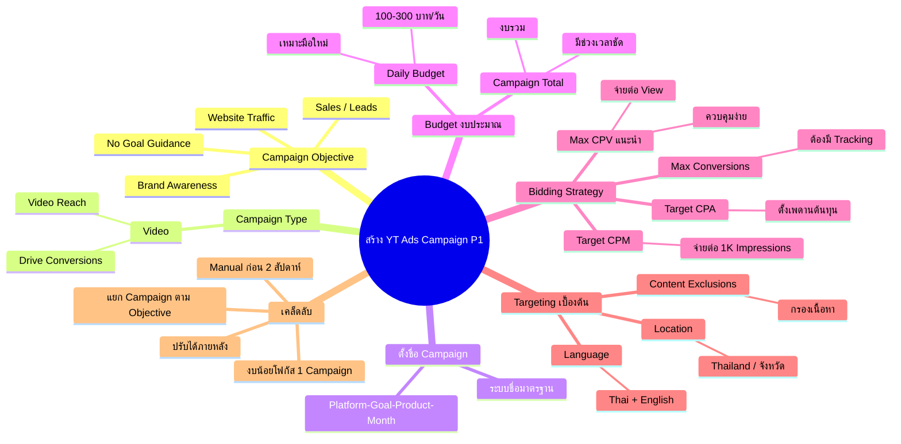

# วิธีสร้าง Youtube Ads Campaign 1 — YTCAMP-006
> **Format:** Mind Map (Text + Mermaid)
> **Source:** SWP3 Ch19 Youtube Ads Campaign ตอนที่ 6
> **Production:** PinkCastle Academy | จูล่ง CTO
> **Date:** 2026-02-17

---

## Text Mind Map

```
สร้าง Youtube Ads Campaign Part 1
├── 1. Campaign Objective (เป้าหมาย)
│   ├── Brand Awareness & Reach
│   ├── Website Traffic
│   ├── Sales / Leads
│   └── Create without goal guidance
├── 2. Campaign Type
│   ├── เลือก "Video"
│   └── Subtype
│       ├── Video Reach Campaign
│       └── Drive Conversions
├── 3. ตั้งชื่อ Campaign
│   ├── ระบบชื่อ: แพลตฟอร์ม-เป้าหมาย-สินค้า-เดือน
│   └── ตัวอย่าง: YT-Awareness-ProductA-Feb2026
├── 4. Budget (งบประมาณ)
│   ├── Daily Budget
│   │   ├── ตั้งจ่ายต่อวัน
│   │   ├── เหมาะมือใหม่
│   │   └── แนะนำ 100-300 บาท/วัน
│   └── Campaign Total Budget
│       ├── ตั้งงบรวมทั้ง Campaign
│       └── เหมาะ Campaign มีช่วงเวลาชัดเจน
├── 5. Bidding Strategy (กลยุทธ์เสนอราคา)
│   ├── Maximum CPV ★ แนะนำมือใหม่
│   │   ├── จ่ายต่อ View
│   │   └── ควบคุมต้นทุนง่าย
│   ├── Target CPM
│   │   ├── จ่ายต่อ 1,000 Impressions
│   │   └── เน้น Reach
│   ├── Maximize Conversions
│   │   ├── อัตโนมัติ
│   │   └── ต้องมี Conversion Tracking
│   └── Target CPA
│       ├── ตั้งเพดาน Cost/Conversion
│       └── ต้องมีข้อมูลเพียงพอ
├── 6. Targeting เบื้องต้น
│   ├── Location
│   │   ├── ประเทศ / จังหวัด
│   │   └── สำหรับไทย: เลือก Thailand
│   ├── Language ★ สำคัญมาก
│   │   ├── เลือกทั้ง Thai + English
│   │   └── คนไทยตั้งเครื่องเป็น EN เยอะ
│   └── Content Exclusions
│       ├── เนื้อหาไม่เหมาะสม
│       └── Live Streaming
└── เคล็ดลับ
    ├── แยก Campaign ตาม Objective
    ├── งบน้อย → โฟกัส 1 Campaign
    ├── Manual → Automated (2 สัปดาห์)
    └── ทุกอย่างปรับได้ภายหลัง
```

---

## Mermaid Diagram



---

**Node count: 42**

*Mind Map Nodes: 42 | Depth: 4 levels | Focus: Campaign Creation Steps & Options*
