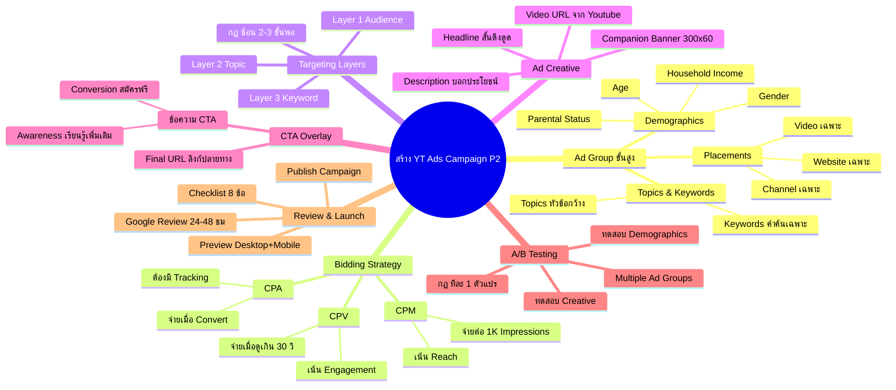

# วิธีสร้าง Youtube Ads Campaign 2 — YTCAMP-007 Mind Map
> **Format:** Mind Map (Text + Mermaid)
> **Source:** SWP3 Ch19 Youtube Ads Campaign ตอนที่ 7
> **Production:** PinkCastle Academy | จูล่ง CTO
> **Date:** 2026-02-18 | **Duration:** 0:13:28

---

## Text Mind Map

```
สร้าง Youtube Ads Campaign Part 2
├── 1. Ad Group Settings ขั้นสูง
│   ├── Demographics
│   │   ├── Gender (เพศ)
│   │   ├── Age (อายุ)
│   │   ├── Parental Status
│   │   └── Household Income
│   ├── Placements
│   │   ├── เลือก Channel เฉพาะ
│   │   ├── เลือก Video เฉพาะ
│   │   └── เลือก Website เฉพาะ
│   └── Topics & Keywords
│       ├── Topics = หัวข้อกว้าง
│       └── Keywords = คำค้นหาเฉพาะ
├── 2. Bidding Strategy เลือก
│   ├── CPV (Cost Per View)
│   │   ├── จ่ายเมื่อดูเกิน 30 วินาที
│   │   └── เหมาะเน้น Engagement
│   ├── CPM (Cost Per Mille)
│   │   ├── จ่ายต่อ 1,000 Impressions
│   │   └── เหมาะเน้น Reach
│   └── CPA (Cost Per Acquisition)
│       ├── จ่ายเมื่อเกิด Conversion
│       └── ต้องมี Tracking + ข้อมูลเพียงพอ
├── 3. Targeting Layers ซ้อน
│   ├── Layer 1: Audience (กลุ่มเป้าหมาย)
│   ├── Layer 2: Topic (หัวข้อ)
│   ├── Layer 3: Keyword (คำค้นหา)
│   └── กฎ: ซ้อน 2-3 ชั้นพอ
│       └── มากกว่านี้ Reach แคบเกิน
├── 4. Ad Creative Setup
│   ├── Video URL (จาก Youtube)
│   │   └── ต้อง Upload ลง YT ก่อน
│   ├── Headline (สั้น ดึงดูด)
│   ├── Description (บอกประโยชน์)
│   └── Companion Banner
│       ├── ขนาด 300x60 px
│       └── Auto-generate ได้ถ้าไม่มี
├── 5. Call-to-Action Overlay
│   ├── ข้อความ CTA
│   │   ├── Awareness: "เรียนรู้เพิ่มเติม"
│   │   └── Conversion: "สมัครฟรี" / "ซื้อเลย"
│   └── Final URL (ลิงก์ปลายทาง)
├── 6. Multiple Ad Groups (A/B Testing)
│   ├── ทดสอบ Demographics ต่างกัน
│   ├── ทดสอบ Creative ต่างกัน
│   ├── ทดสอบ CTA ต่างกัน
│   └── กฎทอง: ทีละ 1 ตัวแปร
└── 7. Review & Launch
    ├── Campaign Settings Review
    │   └── Checklist 8 ข้อ
    ├── Preview
    │   ├── Desktop
    │   └── Mobile
    └── Publish
        └── Google Review 24-48 ชั่วโมง
```

---

## Mermaid Diagram



---

**Node count: 52**

*Mind Map Nodes: 52 | Depth: 4 levels | Focus: Campaign Creation Advanced Steps & Launch*

---

> ทบทวนต่อ: **YTCAMP-008** — ข้อสรุปการทำ Youtube Ads Campaign
> Series: SWP3 Ch19 Youtube Ads Campaign
> PinkCastle Academy © 2026
