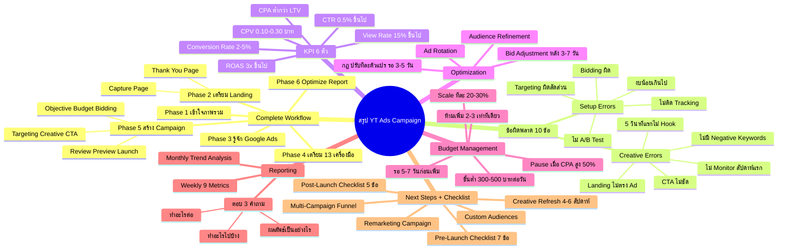

# ข้อสรุปการทำ Youtube Ads Campaign — YTCAMP-008 Mind Map
> **Format:** Mind Map (Text + Mermaid)
> **Source:** SWP3 Ch19 Youtube Ads Campaign ตอนที่ 8
> **Production:** PinkCastle Academy | จูล่ง CTO
> **Date:** 2026-02-18 | **Duration:** 0:21:26

---

## Text Mind Map

```
ข้อสรุปการทำ Youtube Ads Campaign
├── 1. Complete Workflow (6 Phases)
│   ├── Phase 1: เข้าใจภาพรวม (YTCAMP-001)
│   ├── Phase 2: เตรียม Landing Page (YTCAMP-002)
│   │   ├── Capture Page
│   │   └── Thank You Page
│   ├── Phase 3: รู้จักแพลตฟอร์ม Google Ads (YTCAMP-003)
│   ├── Phase 4: เตรียมเครื่องมือ 13 ตัว (YTCAMP-004-005)
│   │   ├── GA4
│   │   ├── GTM
│   │   ├── Youtube Channel
│   │   └── Tracking Pixel ฯลฯ
│   ├── Phase 5: สร้าง Campaign (YTCAMP-006-007)
│   │   ├── Objective → Budget → Bidding
│   │   ├── Targeting → Creative → CTA
│   │   └── Review → Preview → Launch
│   └── Phase 6: Optimize + Report (YTCAMP-008)
├── 2. ข้อผิดพลาดที่พบบ่อย 10 ข้อ
│   ├── Setup Errors (ข้อ 1-5)
│   │   ├── 1. ไม่ติด Conversion Tracking
│   │   ├── 2. เลือก Bidding Strategy ผิด
│   │   ├── 3. ตั้งงบน้อยเกินไป
│   │   ├── 4. Targeting กว้าง/แคบเกิน
│   │   └── 5. ไม่ทำ A/B Testing
│   └── Creative & Monitoring Errors (ข้อ 6-10)
│       ├── 6. 5 วินาทีแรกไม่ดึงดูด
│       ├── 7. Landing Page ไม่ตรงกับ Ad
│       ├── 8. CTA ไม่ชัดเจน
│       ├── 9. ไม่ดู Campaign สัปดาห์แรก
│       └── 10. ไม่มี Negative Keywords
├── 3. KPI 6 ตัวหลัก
│   ├── CPV (Cost Per View)
│   │   ├── ค่าที่ดี: 0.10-0.30 บาท
│   │   └── ต่ำ = Targeting/Creative ดี
│   ├── View Rate
│   │   ├── ค่าที่ดี: 15%+
│   │   └── ต่ำ = วิดีโอไม่ดึงดูด
│   ├── CTR (Click-Through Rate)
│   │   ├── ค่าที่ดี: 0.5%+
│   │   └── ต่ำ = CTA ไม่ชัด
│   ├── Conversion Rate
│   │   ├── ค่าที่ดี: 2-5%
│   │   └── ต่ำ = Landing Page มีปัญหา
│   ├── CPA (Cost Per Acquisition)
│   │   ├── ต้องต่ำกว่ามูลค่าลูกค้า
│   │   └── สูงเกิน 50% = Pause
│   └── ROAS (Return On Ad Spend)
│       ├── ค่าที่ดี: 3x+
│       └── จ่าย 1 บาทได้กลับ 3 บาท
├── 4. Optimization Tips
│   ├── Bid Adjustment
│   │   ├── เพิ่ม Bid กลุ่มที่ดี
│   │   ├── ลด Bid กลุ่มที่ไม่ดี
│   │   └── เริ่มหลังวิ่ง 3-7 วัน
│   ├── Audience Refinement
│   │   ├── Lookalike Audience
│   │   └── Similar Audience
│   ├── Ad Rotation
│   │   ├── หมุนเวียน Creative
│   │   └── ปิดตัวที่ผลไม่ดี
│   └── กฎเหล็ก
│       ├── ปรับทีละ 1 ตัวแปร
│       └── รอ 3-5 วันก่อนปรับต่อ
├── 5. Budget Management
│   ├── งบขั้นต่ำ: 300-500 บาท/วัน
│   ├── Gradual Scaling
│   │   ├── เพิ่มทีละ 20-30%
│   │   ├── รอ 5-7 วัน
│   │   └── ห้ามเพิ่มทีเดียว 2-3 เท่า
│   ├── เริ่ม Scale: หลังดี 7-14 วัน
│   └── Pause Signals
│       ├── CPA สูงกว่าเป้า 50%+
│       └── วิเคราะห์: Targeting/Creative/Landing
├── 6. Reporting
│   ├── Weekly Report
│   │   ├── 9 Metrics
│   │   └── เทียบรายสัปดาห์
│   ├── Monthly Report
│   │   ├── Trend Analysis
│   │   ├── Budget Utilization
│   │   ├── Top Performing Ad Groups
│   │   ├── Recommendations
│   │   └── Learnings
│   └── Report ที่ดีตอบ 3 คำถาม
│       ├── ทำอะไรไปบ้าง?
│       ├── ผลลัพธ์เป็นอย่างไร?
│       └── เดือนหน้าทำอะไรต่อ?
└── 7. Next Steps + Checklist
    ├── Next Steps
    │   ├── 1. Remarketing Campaign (ROI สูงสุด)
    │   ├── 2. Custom/Lookalike Audiences
    │   ├── 3. Multi-Campaign Strategy (Funnel)
    │   └── 4. Creative Refresh ทุก 4-6 สัปดาห์
    ├── Pre-Launch Checklist
    │   ├── GTM + Conversion Tracking
    │   ├── Landing Page พร้อม
    │   ├── Video Upload ลง Youtube
    │   ├── Settings ตรวจสอบครบ
    │   ├── A/B Test 2+ Ad Groups
    │   ├── Budget 300+ บาท/วัน
    │   └── Negative Keywords
    └── Post-Launch Checklist
        ├── เช็คทุกวัน (สัปดาห์แรก)
        ├── KPI 6 ตัว ทุกสัปดาห์
        ├── Optimize หลัง 3-7 วัน
        ├── Scale Budget หลัง 14 วัน
        └── Creative Refresh 4-6 สัปดาห์
```

---

## Mermaid Diagram



---

**Node count: 78**

*Mind Map Nodes: 78 | Depth: 4 levels | Focus: Complete Campaign Summary, Optimization, KPI & Reporting*

---

> ทบทวนต่อ: **YTCAMP-009** — ช่วงตอบคำถาม
> Series: SWP3 Ch19 Youtube Ads Campaign
> PinkCastle Academy © 2026
