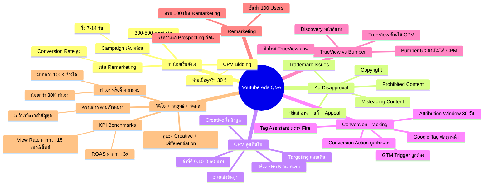

# ช่วงตอบคำถาม — YTCAMP-009 Mind Map
> **Format:** Mind Map (Text + Mermaid)
> **Source:** SWP3 Ch19 Youtube Ads Campaign ตอนที่ 9
> **Production:** PinkCastle Academy | จูล่ง CTO
> **Date:** 2026-02-18 | **Duration:** 0:23:21

---

## Text Mind Map

```
Youtube Ads Q&A — 10 คำถามยอดฮิต
├── 1. งบน้อยเริ่มยังไง
│   ├── งบเริ่มต้น 300-500 บาท/วัน
│   ├── ใช้ CPV Bidding
│   │   └── จ่ายเมื่อดูจริง > 30 วินาที
│   ├── Campaign เดียวก่อน
│   │   └── วิ่ง 7-14 วัน เก็บข้อมูล
│   └── งบจำกัด → เน้น Remarketing
│       └── Conversion Rate สูงกว่า
├── 2. Ad Disapproval แก้ยังไง
│   ├── สาเหตุ 4 ข้อ
│   │   ├── Misleading Content (เกินจริง)
│   │   ├── Trademark Issues (แบรนด์คนอื่น)
│   │   ├── Copyright (ลิขสิทธิ์)
│   │   └── Prohibited Content (ต้องมีเอกสาร)
│   └── วิธีแก้
│       ├── อ่าน Policy Violation ที่แจ้ง
│       ├── แก้ไขตรงจุด
│       └── ยื่น Appeal (1-2 วัน)
├── 3. CPV สูงเกินไป
│   ├── CPV ที่ดี: 0.10-0.50 บาท
│   ├── สาเหตุ
│   │   ├── Targeting แคบเกิน
│   │   ├── Creative ไม่ดึงดูด
│   │   └── ช่วงแข่งขันสูง (เทศกาล)
│   └── วิธีลด CPV
│       ├── ขยาย Targeting
│       ├── ปรับ 5 วินาทีแรก
│       └── A/B Test Audience
├── 4. Conversion Tracking ไม่ทำงาน
│   ├── Checklist 4 จุด
│   │   ├── Google Tag ติดถูกหน้า
│   │   ├── Conversion Action ถูกประเภท
│   │   ├── Google Tag Assistant ตรวจ Fire
│   │   └── GTM Trigger + Published Version
│   └── Attribution Window
│       ├── ปกติตั้ง 30 วัน
│       └── ตั้งสั้นเกิน → Conversion น้อยผิดปกติ
├── 5. เลือก TrueView หรือ Bumper
│   ├── TrueView In-stream
│   │   ├── ข้ามได้หลัง 5 วินาที
│   │   ├── CPV Bidding
│   │   └── เหมาะ Awareness + Consideration
│   ├── Bumper Ads
│   │   ├── 6 วินาที ข้ามไม่ได้
│   │   ├── CPM Bidding
│   │   └── เหมาะ Brand Recall
│   ├── TrueView Discovery
│   │   └── แสดงในหน้าค้นหา/แนะนำ
│   └── มือใหม่ → TrueView ก่อน → Bumper เสริม
├── 6. Remarketing รอนานแค่ไหน
│   ├── ขั้นต่ำ 100 Users
│   ├── ระยะเวลาสะสม
│   │   ├── 50 คน/วัน → 2-3 วัน
│   │   ├── 20 คน/วัน → 5-7 วัน
│   │   └── 10 คน/วัน → 10-14 วัน
│   └── ระหว่างรอ → Prospecting Campaign ก่อน
└── 7. วิดีโอ + คู่แข่ง + ทำเอง/จ้าง + วัดผล
    ├── วิดีโอยาวแค่ไหน
    │   ├── Bumper: 6 วินาที
    │   ├── Awareness: 15-30 วินาที
    │   ├── Consideration: 1-2 นาที
    │   └── 5 วินาทีแรกสำคัญที่สุด
    ├── คู่แข่งยิง Ads เหมือนกัน
    │   ├── Creative Quality (Hook 5 วินาที)
    │   ├── Differentiation (ทำให้ต่าง)
    │   └── Custom Intent Audiences
    ├── ทำเอง vs จ้างเอเจนซี่
    │   ├── < 30K/เดือน → ทำเอง
    │   ├── 30K-100K → ตามเวลา+ความรู้
    │   ├── > 100K/เดือน → พิจารณาจ้าง
    │   └── ต้องเข้าใจพื้นฐานเสมอ
    └── วัดผลสำเร็จ (KPI)
        ├── View Rate > 15%
        ├── CPV < 1 บาท
        ├── CTR > 0.5%
        └── ROAS > 3x = คุ้มค่า
```

---

## Mermaid Diagram



---

**Node count: 58**

*Mind Map Nodes: 58 | Depth: 4 levels | Focus: YouTube Ads Q&A — 10 Common Questions & Solutions*

---

> ทบทวนต่อ: **YTCAMP-010** — ตรวจการบ้าน
> Series: SWP3 Ch19 Youtube Ads Campaign
> PinkCastle Academy © 2026
