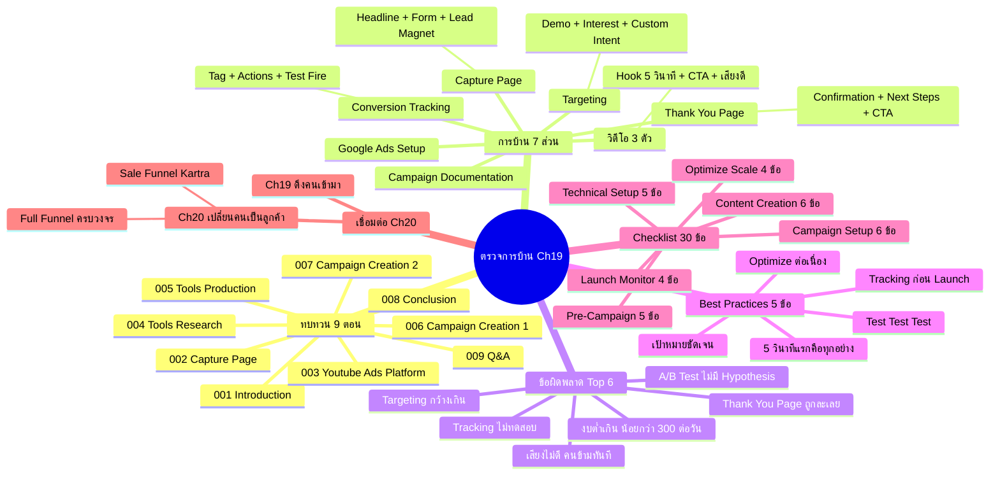

# ตรวจการบ้าน — YTCAMP-010 Mind Map
> **Format:** Mind Map (Text + Mermaid)
> **Source:** SWP3 Ch19 Youtube Ads Campaign ตอนที่ 10
> **Production:** PinkCastle Academy | จูล่ง CTO
> **Date:** 2026-02-18 | **Duration:** 1:40:27

---

## Text Mind Map

```
ตรวจการบ้าน — Ch19 Youtube Ads Campaign สรุป
├── 1. ทบทวน Ch19 ทั้ง 9 ตอน
│   ├── YTCAMP-001 Introduction
│   │   └── ภาพรวม Youtube Ads + ทำไมต้องทำ
│   ├── YTCAMP-002 Capture Page
│   │   └── Headline + Form + Lead Magnet + Autoresponder
│   ├── YTCAMP-003 Youtube Ads Platform
│   │   └── Dashboard + Account Structure + Ad Formats + Bidding
│   ├── YTCAMP-004 Tools 1 (Research)
│   │   └── Keyword Planner / Analytics / Trends / VidIQ
│   ├── YTCAMP-005 Tools 2 (Production)
│   │   └── Canva / CapCut / GTM / Tag Assistant
│   ├── YTCAMP-006 Campaign Creation 1
│   │   └── Objective / Budget / Bidding / Targeting
│   ├── YTCAMP-007 Campaign Creation 2
│   │   └── Ad Group / Video / CTA / A/B Test
│   ├── YTCAMP-008 Conclusion
│   │   └── Campaign Lifecycle / Optimization / Scaling
│   └── YTCAMP-009 Q&A
│       └── 10 คำถามยอดฮิต (งบ/CPV/Tracking/ROAS)
├── 2. การบ้าน 7 ส่วน
│   ├── Capture Page
│   │   └── Headline + Form + Lead Magnet + Autoresponder
│   ├── Thank You Page
│   │   └── Confirmation + Next Steps + CTA เพิ่ม
│   ├── วิดีโอ 3 ตัว
│   │   ├── Hook 5 วินาทีแรก
│   │   ├── CTA ชัดเจน
│   │   └── คุณภาพเสียงดี
│   ├── Google Ads Setup
│   │   └── Campaign Type + Budget + Bidding
│   ├── Targeting
│   │   └── Demographics + Interests + Custom Intent
│   ├── Conversion Tracking
│   │   └── Google Tag + Actions + Test Fire
│   └── Campaign Documentation
│       └── Screenshots + Settings + Preview
├── 3. เกณฑ์ตรวจ 4 ระดับ
│   ├── A = ครบ 7/7 + คุณภาพดี + อธิบายได้
│   ├── B = ครบ 5-6/7 + พอใช้
│   ├── C = ครบ 3-4/7 + มีจุดขาด
│   └── D = < 3/7 + ต้องทำใหม่
├── 4. ข้อผิดพลาดที่พบบ่อย (Top 6)
│   ├── #1 Conversion Tracking ไม่ครบ
│   │   └── ติด Tag แล้วไม่ทดสอบ Fire
│   ├── #2 Targeting กว้างเกิน
│   │   └── ไม่ใช้ Custom Intent / ไม่กำหนด Demographics
│   ├── #3 คุณภาพเสียงไม่ดี
│   │   └── เสียงรบกวน → คนข้ามทันที
│   ├── #4 งบต่ำเกิน (< 300 บาท/วัน)
│   │   └── Algorithm เรียนรู้ไม่ทัน
│   ├── #5 Thank You Page ถูกละเลย
│   │   └── แค่ "ขอบคุณ" ไม่มี CTA เพิ่ม
│   └── #6 A/B Test ไม่มี Hypothesis
│       └── ทำหลายตัวไม่มีจุดประสงค์
├── 5. Best Practices สรุป (5 ข้อ)
│   ├── เริ่มจากเป้าหมายชัดเจน
│   │   └── Awareness / Leads / Sales
│   ├── ลงทุนกับ 5 วินาทีแรก
│   │   └── Hook ดี = View Rate สูง = CPV ต่ำ
│   ├── Test Test Test
│   │   └── วิดีโอ / Targeting / Bidding
│   ├── ติดตั้ง Tracking ก่อนเปิด Campaign
│   │   └── Tag + GTM + Actions พร้อมก่อน Launch
│   └── Optimize อย่างต่อเนื่อง
│       └── Monitor ทุกวัน / Optimize ทุกสัปดาห์
├── 6. Complete Campaign Checklist (30 ข้อ)
│   ├── Pre-Campaign (5 ข้อ)
│   │   └── Objective / Research / Persona / Budget / Policy
│   ├── Content Creation (6 ข้อ)
│   │   └── Capture Page / Autoresponder / Thank You / Video 3 ตัว / Hook / CTA
│   ├── Technical Setup (5 ข้อ)
│   │   └── Google Tag / Conversion Actions / Tag Assistant / Attribution / GTM
│   ├── Campaign Setup (6 ข้อ)
│   │   └── Type / Structure / Budget / Bidding / Targeting / Video+CTA
│   ├── Launch & Monitor (4 ข้อ)
│   │   └── Monitor ทุกวัน / ดู KPIs / ปรับ / เก็บข้อมูล 7-14 วัน
│   └── Optimize & Scale (4 ข้อ)
│       └── หยุด Ad ไม่ดี / Scale Ad ดี / Remarketing / ROAS > 3x
└── 7. เชื่อมต่อ Ch20
    ├── Ch19 = "ดึงคนเข้ามา" (Youtube Ads)
    ├── Ch20 = "เปลี่ยนคนเป็นลูกค้า" (Sale Funnel Kartra)
    └── Full Funnel
        ├── Landing Page
        ├── Sales Page
        ├── Order Form
        ├── Upsell
        └── Downsell
```

---

## Mermaid Diagram



---

**Node count: 72**

*Mind Map Nodes: 72 | Depth: 4 levels | Focus: YouTube Ads Campaign — Complete Ch19 Homework Review & Summary*

---

> จบ **Ch19 Youtube Ads Campaign** — ต่อ Ch20: Cloning Sale Funnel Kartra
> Series: SWP3 Ch19 Youtube Ads Campaign
> PinkCastle Academy © 2026
