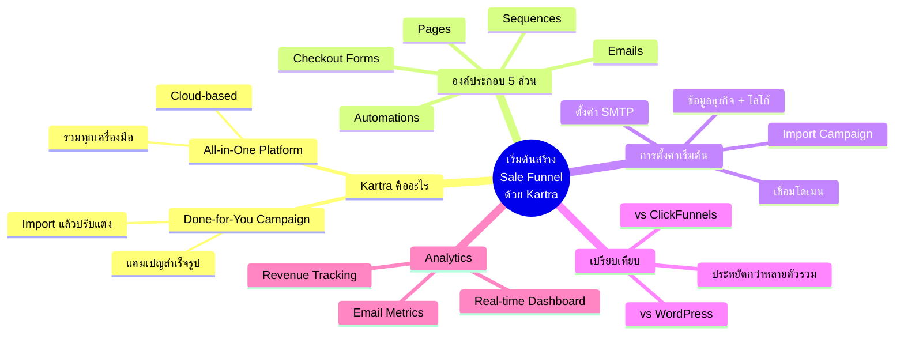

# Mind Map: เริ่มต้นสร้าง Sale Funnel ด้วย Kartra — CLONE-001
> **Format:** Mind Map (Text-based)
> **Source:** SWP3 Ch20 Cloning Sale Funnel Kartra ตอนที่ 1
> **Production:** PinkCastle Academy | จูล่ง CTO
> **Date:** 2026-02-17

---

## Center Node: เริ่มต้นสร้าง Sale Funnel ด้วย Kartra

### Branch 1: Kartra คืออะไร
- All-in-One Platform
  - รวมทุกเครื่องมือในที่เดียว
  - ไม่ต้องเชื่อมต่อภายนอก
  - Cloud-based ใช้งานผ่านเบราว์เซอร์
- Done-for-You Campaign
  - แคมเปญสำเร็จรูป
  - ออกแบบโดยผู้เชี่ยวชาญ
  - Import แล้วปรับแต่งได้

### Branch 2: องค์ประกอบ 5 ส่วน
- Pages
  - Capture Page (เก็บอีเมล)
  - Sales Page (หน้าขาย)
  - Thank You Page (ขอบคุณ)
- Emails
  - ระบบอีเมลอัตโนมัติ
  - Broadcast / Sequence
- Sequences
  - ลำดับขั้นตอนที่กำหนดไว้
  - ส่งอีเมลตามวันที่ตั้ง
- Automations
  - ทำงานตาม Trigger
  - If/Then Rules
- Checkout Forms
  - ฟอร์มชำระเงิน
  - เชื่อมกับ Payment Gateway

### Branch 3: การตั้งค่าเริ่มต้น
- ข้อมูลธุรกิจ
  - ชื่อธุรกิจ
  - โลโก้
- โดเมน
  - เชื่อมต่อ Custom Domain
- SMTP
  - ตั้งค่าส่งอีเมล
- Import Campaign
  - เลือกจาก Marketplace

### Branch 4: เปรียบเทียบกับเครื่องมืออื่น
- vs ClickFunnels
  - ClickFunnels = เฉพาะ Page Builder
  - Kartra = ครบวงจร
- vs WordPress
  - WordPress = ต้องลง Plugin เยอะ
  - Kartra = พร้อมใช้ทันที
- vs หลายเครื่องมือรวม
  - หลายตัว = แพง + ซับซ้อน
  - Kartra = ถูกกว่า + ง่ายกว่า

### Branch 5: Analytics
- Real-time Dashboard
  - จำนวนผู้เข้าชม
  - Conversion Rate
- Email Metrics
  - Open Rate
  - Click Rate
- Revenue Tracking
  - ยอดขาย
  - ROI

---

---

**จำนวน Nodes ทั้งหมด: 38 nodes**

| ระดับ | จำนวน |
|-------|-------|
| Center Node | 1 |
| Branch (ระดับ 1) | 5 |
| Sub-branch (ระดับ 2) | 17 |
| Leaf (ระดับ 3) | 15 |
| **รวม** | **38** |
