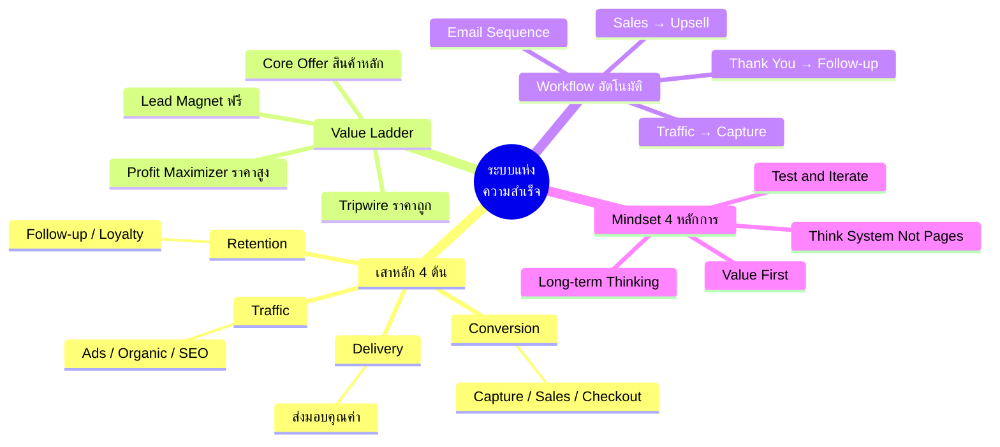

# Mind Map: ระบบแห่งความสำเร็จ — CLONE-002
> **Format:** Mind Map (Text-based)
> **Source:** SWP3 Ch20 Cloning Sale Funnel Kartra ตอนที่ 2
> **Production:** PinkCastle Academy | จูล่ง CTO
> **Date:** 2026-02-17

---

## Center Node: ระบบแห่งความสำเร็จ (Success System)

### Branch 1: เสาหลัก 4 ต้น
- Traffic
  - Facebook Ads
  - Google Ads
  - YouTube / SEO
- Conversion
  - Capture Page เก็บ Lead
  - Sales Page ปิดการขาย
  - Checkout ชำระเงิน
- Delivery
  - ส่งมอบสินค้า/บริการ
  - คุณภาพตามสัญญา
  - ประสบการณ์ที่ดี
- Retention
  - Follow-up อีเมล
  - ชุมชนสมาชิก
  - โปรแกรม Loyalty

### Branch 2: Value Ladder (บันไดคุณค่า)
- Lead Magnet (ฟรี)
  - eBook / Checklist
  - วิดีโอสอนฟรี
  - แลกกับอีเมล
- Tripwire (100-500 บาท)
  - Mini Course / Template
  - ลดกำแพงการจ่ายเงิน
- Core Offer (1,000-10,000 บาท)
  - สินค้าหลัก
  - รายได้หลักของธุรกิจ
- Profit Maximizer (10,000+ บาท)
  - Coaching / VIP
  - กำไรสูงสุดต่อลูกค้า

### Branch 3: Workflow อัตโนมัติ
- Traffic Source
  - โฆษณา / Organic
- Capture Page
  - เก็บอีเมล
- Email Sequence
  - สร้างความไว้วางใจ
- Sales Page
  - เสนอ Core Offer
- One-Time Offer
  - Upsell ทันทีหลังซื้อ
- Thank You Page
  - ขอบคุณ + ส่งมอบ
- Follow-up System
  - ดูแลระยะยาว

### Branch 4: Mindset
- Think System Not Pages
  - มองเป็นระบบ
  - ทุกส่วนเชื่อมกัน
- Test and Iterate
  - ไม่ต้องสมบูรณ์ 100%
  - ปรับปรุงจากข้อมูลจริง
- Value First
  - ให้คุณค่าก่อนขาย
  - ลูกค้าต้องได้ประโยชน์
- Long-term Thinking
  - มองผลระยะยาว
  - Customer Lifetime Value

---

---

**จำนวน Nodes ทั้งหมด: 40 nodes**

| ระดับ | จำนวน |
|-------|-------|
| Center Node | 1 |
| Branch (ระดับ 1) | 4 |
| Sub-branch (ระดับ 2) | 18 |
| Leaf (ระดับ 3) | 17 |
| **รวม** | **40** |
