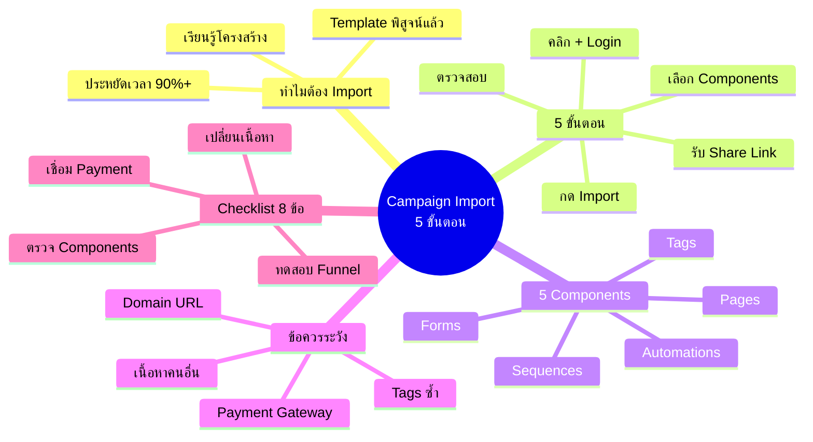
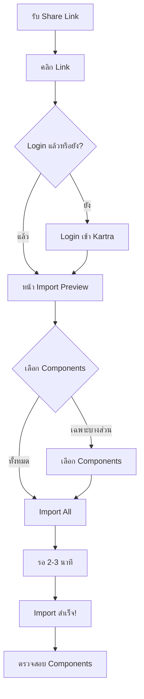
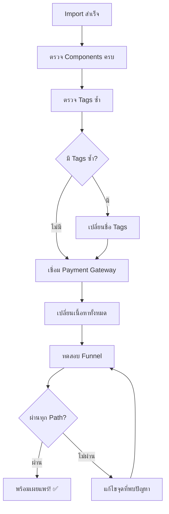

# วิธีอิมพอร์ต Campaign — CLONE-003 Mind Map
> Format: Mind Map (7 Parts)
> Source: SWP3 Ch20 Cloning Sale Funnel Kartra ตอนที่ 3
> Production: PinkCastle Academy | จูล่ง CTO
> Date: 2026-02-18 | Duration: 0:15:53

---

## Part 1: Text-Based Mind Map (Tree Format)

```
วิธีอิมพอร์ต Campaign (CLONE-003)
│
├── 1. ทำไมต้อง Import?
│   ├── ประหยัดเวลา 90%+ (5 นาที vs 2-4 สัปดาห์)
│   ├── Template ที่พิสูจน์แล้ว
│   └── เรียนรู้จากโครงสร้างคนเก่ง
│
├── 2. 5 ขั้นตอน Import
│   ├── 1. รับ Share Link
│   ├── 2. คลิก Link + Login
│   ├── 3. เลือก Components
│   ├── 4. กด Import (2-3 นาที)
│   └── 5. ตรวจสอบความครบถ้วน
│
├── 3. 5 Components ที่ได้
│   ├── Pages (Capture, Sales, Thank You, Checkout)
│   ├── Forms (แบบฟอร์ม)
│   ├── Email Sequences (อีเมลอัตโนมัติ)
│   ├── Automations (กฎ IF→THEN)
│   └── Tags (แท็กจัดกลุ่ม)
│
├── 4. ข้อควรระวัง
│   ├── Tags ซ้ำ → ตรวจก่อน Import
│   ├── เนื้อหาคนอื่น → ต้องเปลี่ยนทั้งหมด
│   ├── Payment Gateway → ต้องเชื่อมเอง
│   ├── Domain/URL → ตรวจ Custom Domain
│   └── ต้องทดสอบ → ไม่รับประกัน 100%
│
├── 5. Post-Import Checklist (8 ข้อ)
│   ├── ตรวจ Pages ครบ
│   ├── ตรวจ Forms เชื่อมถูก
│   ├── ตรวจ Sequences ครบ
│   ├── ตรวจ Automations ถูกต้อง
│   ├── ตรวจ Tags ไม่ซ้ำ
│   ├── เปลี่ยนเนื้อหาเป็นของเรา ⭐
│   ├── เชื่อม Payment Gateway
│   └── ทดสอบ Funnel ทั้งหมด ⭐
│
└── KEY RULES
    ├── Import ทั้งหมดสำหรับมือใหม่
    ├── ห้ามใช้เนื้อหาคนอื่นโดยตรง
    ├── ตรวจ Tags ก่อน Import
    └── ทดสอบก่อนเผยแพร่เสมอ
```

---

## Part 2: Mermaid Mind Map



---

## Part 3: Mermaid Flowcharts

### Flowchart 1: Campaign Import Process



### Flowchart 2: Post-Import Workflow



### Flowchart 3: Component Connection Map

```mermaid
flowchart LR
    A[Capture Page] -->|มี Form| B[Form]
    B -->|กรอกข้อมูล| C[Automation]
    C -->|ติด Tag| D[Tags]
    C -->|ส่ง Email| E[Email Sequence]
    E -->|Link ไป| F[Sales Page]
    F -->|มี Form| G[Checkout Form]
    G -->|ชำระเงิน| H[Payment Gateway]
    H -->|สำเร็จ| I[Thank You Page]
    I -->|Automation| J[ติด Tag "buyer"]
```

---

## Part 4: Comparison Chart

### Import vs สร้างใหม่

| เกณฑ์ | สร้างใหม่ | Import |
|-------|----------|--------|
| เวลา | 2-4 สัปดาห์ | 5 นาที + 1-2 วันปรับแต่ง |
| ความยาก | สูง | ต่ำ |
| ความเสี่ยง | สูง (ยังไม่พิสูจน์) | ต่ำ (Template ที่ได้ผล) |
| ยืดหยุ่น | 100% | 100% (ปรับได้ทุกส่วน) |
| เรียนรู้ | ช้า | เร็ว (เห็นโครงสร้างดี) |
| เหมาะกับ | Expert | ทุกระดับ |

---

## Part 5: Summary Table

| # | หัวข้อ | สาระสำคัญ | Action Item |
|---|--------|----------|-------------|
| 1 | Campaign Import | นำเข้า Campaign สำเร็จรูปผ่าน Share Link | หา Campaign ที่ตรงกับธุรกิจ |
| 2 | ประหยัดเวลา 90%+ | จาก 2-4 สัปดาห์เหลือ 5 นาที | ใช้ Import เป็นจุดเริ่มต้นเสมอ |
| 3 | 5 ขั้นตอน Import | Link → Login → เลือก → Import → ตรวจ | ทำตามขั้นตอนอย่างเคร่งครัด |
| 4 | 5 Components | Pages, Forms, Sequences, Automations, Tags | Import ทั้งหมดสำหรับมือใหม่ |
| 5 | Tags ซ้ำ | อาจทำให้ระบบสับสน | ตรวจ Tags ก่อน Import |
| 6 | เนื้อหาคนอื่น | ห้ามใช้โดยตรง ต้องเปลี่ยน | วางแผนเปลี่ยนเนื้อหาเป็นขั้นแรก |
| 7 | Payment Gateway | ไม่มากับ Import | เชื่อม Stripe/PayPal ทันที |
| 8 | ทดสอบ Funnel | ไม่รับประกัน 100% หลัง Import | เดินผ่าน Funnel เหมือนลูกค้าจริง |
| 9 | Checklist 8 ข้อ | ครอบคลุมทุกจุดที่ต้องตรวจ | Print ติดข้างจอ ทำทีละข้อ |
| 10 | เรียนรู้จากโครงสร้าง | นอกจากได้ Campaign ยังได้ความรู้ | ศึกษาโครงสร้างก่อนปรับแต่ง |

---

## Part 6: Implementation Roadmap

```
นาทีที่ 1-5: Import Campaign
├── รับ Share Link จากผู้แชร์
├── คลิก Link → Login → เลือก Components
├── กด Import → รอ 2-3 นาที
└── ตรวจว่า Components เข้ามาครบ

ชั่วโมงที่ 1-2: ตรวจสอบเบื้องต้น
├── ตรวจ Tags ซ้ำ → เปลี่ยนชื่อถ้าจำเป็น
├── เชื่อม Payment Gateway (Stripe/PayPal)
├── ตรวจ Domain/URL ถูกต้อง
└── ตรวจ Internal Links ระหว่าง Pages

วันที่ 1-2: ปรับแต่งเนื้อหา
├── เปลี่ยน Text ทั้งหมด (Headlines, Body, CTA)
├── เปลี่ยนรูปภาพและวิดีโอ
├── แก้ Email Sequences (เนื้อหา, ชื่อผู้ส่ง, Timing)
└── ปรับ Branding (สี, Logo, Font)

วันที่ 2: ทดสอบ + เผยแพร่
├── ทดสอบ Funnel ตั้งแต่ต้นจนจบ
├── ทดสอบ Payment (ถ้ามี)
├── แก้ไขจุดที่พบปัญหา
└── ✅ พร้อมเผยแพร่!
```

---

## Part 7: Key Formulas & Frameworks

### สูตร Campaign Import
```
Share Link + Kartra Account = Campaign พร้อมใช้ใน 5 นาที
```

### สูตรเวลาจริง
```
เวลาทั้งหมด = Import (5 นาที) + ตรวจสอบ (1-2 ชม.) + ปรับแต่ง (1-2 วัน) + ทดสอบ (2-3 ชม.)
```

### สูตร Components เชื่อมกัน
```
Page → Form → Automation → Tag + Sequence
(ขาดชิ้นใด = ระบบไม่สมบูรณ์)
```

### สูตร Post-Import
```
ตรวจ Components + ตรวจ Tags + เปลี่ยนเนื้อหา + เชื่อม Payment + ทดสอบ = Campaign พร้อม
```

### สูตร Import vs Build
```
มือใหม่ = Import เสมอ
ระดับกลาง = Import + ปรับแต่งเยอะ
Expert = Import เป็น Reference + สร้างเอง
```

---

> ทบทวนต่อ: **CLONE-004** — วิธีปรับแต่งแคมเปญ Kartra
> Series: SWP3 Ch20 Cloning Sale Funnel Kartra
> PinkCastle Academy © 2026
