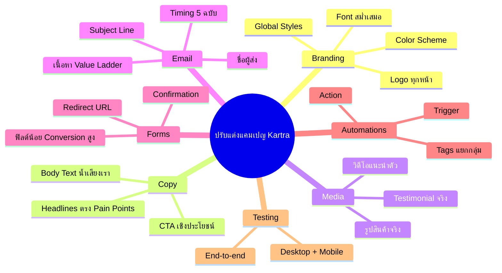
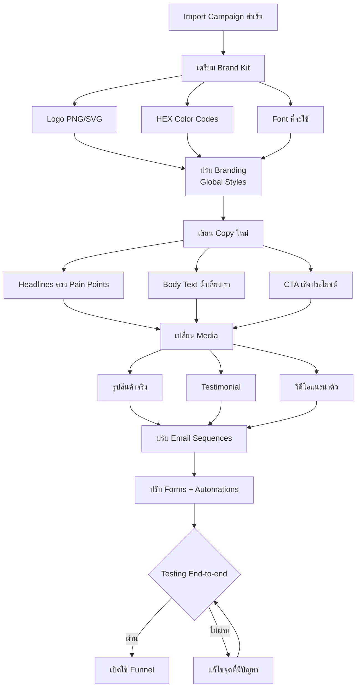
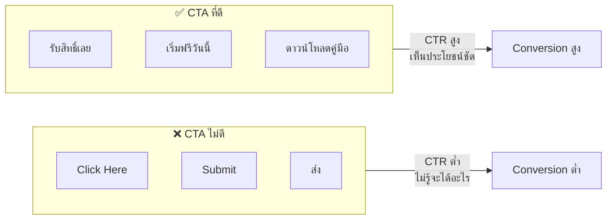
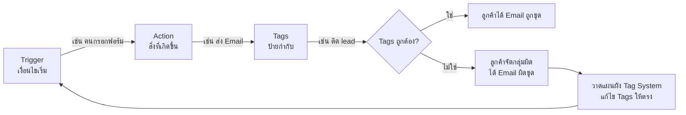
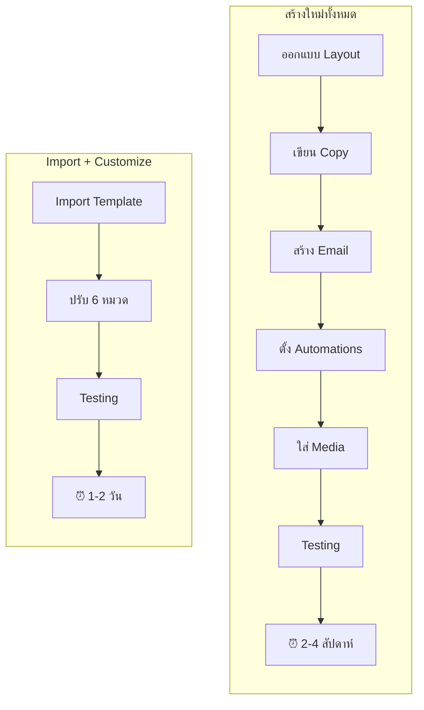

# วิธีปรับแต่งแคมเปญ Kartra — CLONE-004 Mind Map
> Format: Mind Map (7 Parts)
> Source: SWP3 Ch20 Cloning Sale Funnel Kartra ตอนที่ 4
> Production: PinkCastle Academy | จูล่ง CTO
> Date: 2026-02-18 | Duration: 0:16:30

---

## Part 1: Text-based Mind Map

```
วิธีปรับแต่งแคมเปญ Kartra
│
├── ทำไมต้องปรับแต่ง?
│   ├── Template ยังเป็นของคนอื่น
│   ├── ใช้ตรงๆ ทำลายความน่าเชื่อถือ
│   ├── Conversion Rate จะต่ำ
│   └── ต้องปรับ 6 หมวดก่อนเปิดใช้
│
├── 1. Branding
│   ├── Logo → ทุกหน้า (PNG/SVG)
│   ├── Color Scheme → HEX Codes สม่ำเสมอ
│   ├── Font → เดียวกันทุกหน้า
│   └── Tip: ใช้ Global Styles เปลี่ยนทีเดียว
│
├── 2. Copy
│   ├── Headlines → ตรง Pain Points
│   ├── Body Text → น้ำเสียงของเรา
│   └── CTAs → เชิงประโยชน์ (CTR สูงกว่า)
│       ├── ❌ Click Here / Submit / ส่ง
│       └── ✅ รับสิทธิ์เลย / เริ่มฟรีวันนี้
│
├── 3. Images/Videos
│   ├── หลัก: ของจริง ชนะ Stock Photo
│   ├── รูปสินค้าจริง (ถ่ายมือถือก็ได้)
│   ├── Testimonial จากลูกค้าจริง
│   └── วิดีโอแนะนำตัวสั้นๆ
│
├── 4. Email Sequences
│   ├── ชื่อผู้ส่ง → เปลี่ยนเป็นชื่อเรา
│   ├── Subject Line → น่าเปิดอ่าน
│   ├── เนื้อหา → ตรง Value Ladder
│   └── Timing
│       ├── ทันที → Welcome
│       ├── Day 1 → ให้คุณค่า
│       ├── Day 3 → เสนอขาย
│       ├── Day 5 → Follow-up
│       └── Day 7 → Last Chance
│
├── 5. Forms
│   ├── ฟิลด์ → ขอแค่ชื่อ+อีเมล (Lead Magnet)
│   ├── Confirmation → เปลี่ยนข้อความ
│   ├── Redirect URL → ชี้หน้าถูกต้อง
│   └── หลัก: ขอน้อย = Conversion สูง
│
├── 6. Automations
│   ├── Trigger → เงื่อนไขเริ่มทำงาน
│   ├── Action → สิ่งที่เกิดขึ้น
│   ├── Tags → ป้ายกำกับแยกกลุ่ม
│   └── ⚠️ Tags ผิด = ระบบทั้งหมดสับสน
│
└── Testing End-to-end
    ├── กรอกฟอร์ม
    ├── ตรวจอีเมล
    ├── คลิกลิงก์ทุกจุด
    ├── ตรวจ Automations + Tags
    ├── เช็ค Desktop
    └── เช็ค Mobile (70% ใช้ Mobile)
```

---

## Part 2: Mermaid Mind Map



---

## Part 3: Flowchart — ขั้นตอนการปรับแต่ง



---

## Part 4: Flowchart — CTA เปรียบเทียบ



---

## Part 5: Flowchart — Automation 3 องค์ประกอบ



---

## Part 6: Comparison — Build vs Import+Customize



---

## Part 7: สรุป — สูตรสำเร็จ

```
╔══════════════════════════════════════════════════╗
║                                                  ║
║  สูตร: โครงสร้างประหยัดเวลา                        ║
║        แต่เนื้อหาต้องเป็นของเรา                     ║
║                                                  ║
╠══════════════════════════════════════════════════╣
║                                                  ║
║  6 หมวด + Testing = Campaign พร้อมใช้            ║
║                                                  ║
║  Branding → Copy → Media → Email                 ║
║  → Forms → Automations → Testing                 ║
║                                                  ║
║  5 กฎเหล็ก:                                      ║
║  1. ปรับ 6 หมวดให้ครบก่อนเปิด Funnel              ║
║  2. ของจริง ดีกว่า Stock Photo เสมอ               ║
║  3. CTA บอกประโยชน์ ไม่ใช่คำสั่ง                   ║
║  4. วาดแผนผัง Tag System ก่อนปรับ Automations     ║
║  5. Testing End-to-end ห้ามข้าม Desktop+Mobile   ║
║                                                  ║
╚══════════════════════════════════════════════════╝
```

---

> ทบทวนต่อ: **CLONE-005** — ปรับแต่งหน้า Capture Page
> Series: SWP3 Ch20 Cloning Sale Funnel Kartra
> PinkCastle Academy © 2026
