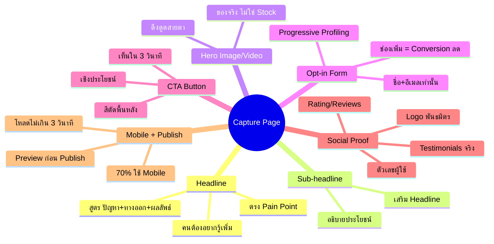
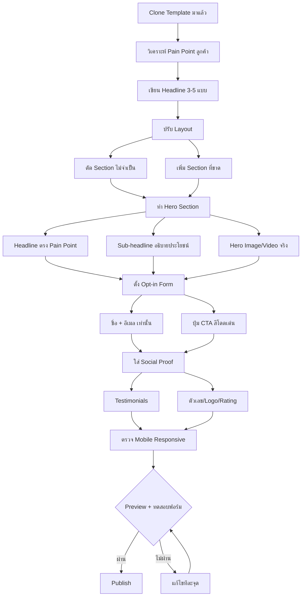
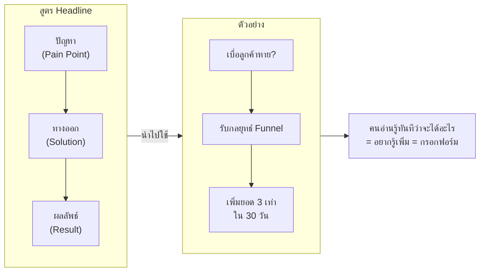
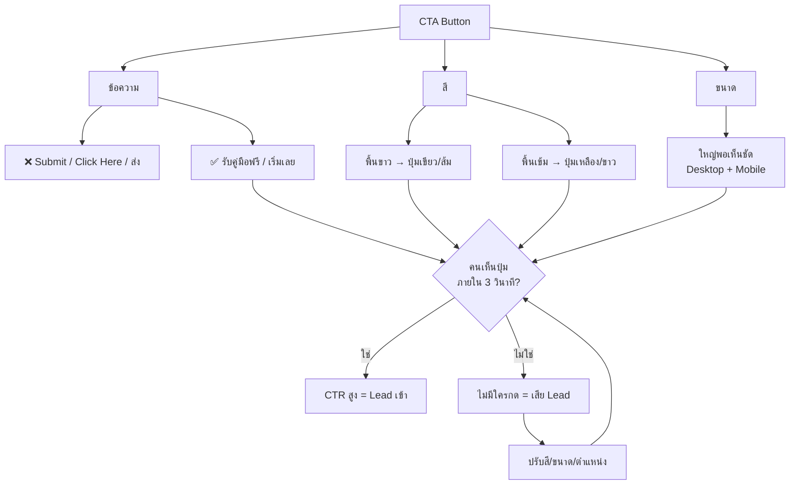
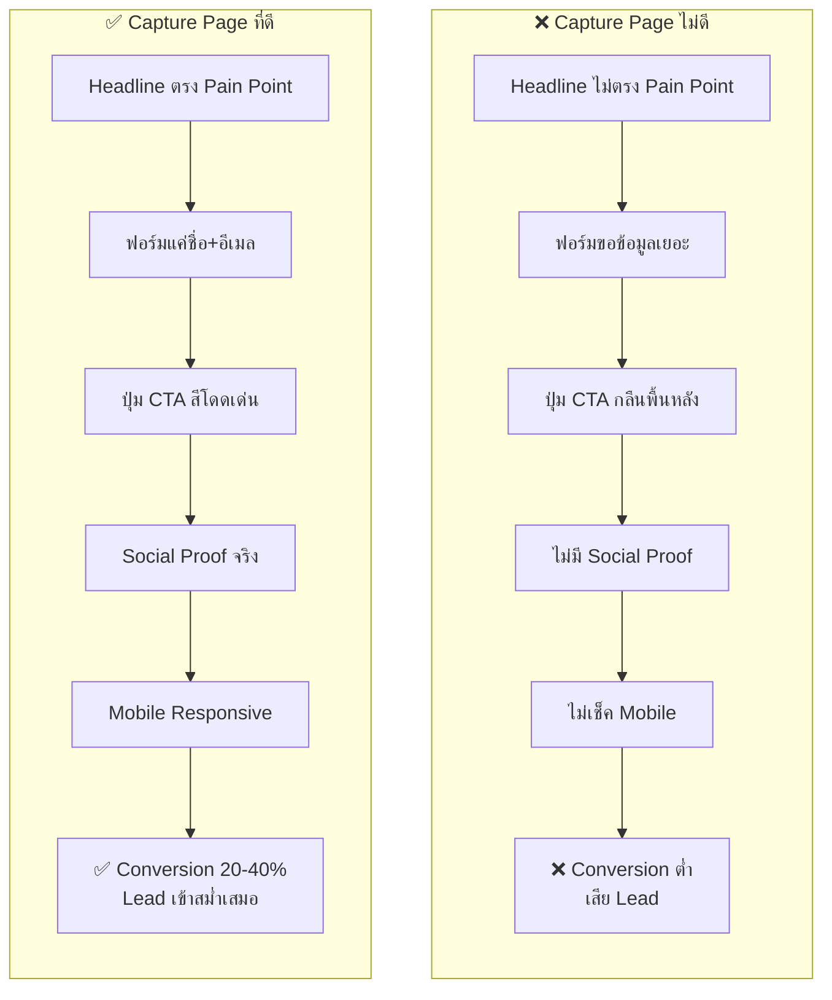

# ปรับแต่งหน้า Capture Page — CLONE-005 Mind Map
> Format: Mind Map (7 Parts)
> Source: SWP3 Ch20 Cloning Sale Funnel Kartra ตอนที่ 5
> Production: PinkCastle Academy | จูล่ง CTO
> Date: 2026-02-18 | Duration: 0:12:58

---

## Part 1: Text-based Mind Map

```
ปรับแต่งหน้า Capture Page
│
├── Capture Page คืออะไร?
│   ├── หน้าแรกของ Funnel ที่ลูกค้าเห็น
│   ├── เป้าหมายเดียว = เก็บ Lead (ชื่อ+อีเมล)
│   ├── เหมือน "ประตูหน้าบ้าน"
│   └── Conversion Rate ที่ดี: 20-40%
│
├── 1. Headline
│   ├── ตรง Pain Point ของลูกค้า
│   ├── สูตร: ปัญหา + ทางออก + ผลลัพธ์
│   └── คนอ่านแล้วต้อง "อยากรู้เพิ่ม"
│
├── 2. Sub-headline
│   ├── อธิบายประโยชน์ที่จะได้รับ
│   └── เสริม Headline ให้แข็งแกร่ง
│
├── 3. Hero Image/Video
│   ├── ดึงดูดสายตา
│   ├── ใช้รูป/วิดีโอจริง ไม่ใช่ Stock
│   └── สื่อสารตัวตนของแบรนด์
│
├── 4. Opt-in Form
│   ├── ขอแค่ชื่อ + อีเมล
│   ├── ทุกช่องเพิ่ม = Conversion ลด 10-15%
│   └── ข้อมูลอื่นเก็บทีหลัง (Progressive Profiling)
│
├── 5. CTA Button
│   ├── ข้อความ → เชิงประโยชน์ (ไม่ใช่ Submit)
│   ├── สี → ตัดกับพื้นหลัง
│   ├── ขนาด → ใหญ่พอเห็นชัด
│   └── หลัก: เห็นภายใน 3 วินาที
│
├── 6. Social Proof
│   ├── Testimonials (ลูกค้าจริง ชื่อ+รูป)
│   ├── ตัวเลข ("5,000+ คน")
│   ├── Logo พันธมิตร
│   ├── Rating/Reviews
│   └── ⚠️ ห้ามแต่งขึ้นมา
│
├── Layout
│   ├── ตัด Section ที่ไม่จำเป็นออก
│   ├── ยิ่งสะอาดเรียบง่ายยิ่งดี
│   └── ทุกอย่างช่วยให้คนกรอกฟอร์ม
│
├── Mobile Responsive
│   ├── 70% ใช้ Mobile
│   ├── ปุ่ม CTA กดง่ายด้วยนิ้วหัวแม่มือ
│   ├── ฟอนต์อ่านได้ไม่ต้องซูม
│   ├── ฟอร์มกรอกง่าย
│   └── รูปไม่ถูกครอป
│
└── Preview & Publish
    ├── Preview ทั้ง Desktop + Mobile
    ├── ตรวจลิงก์ทุกจุด
    ├── ทดสอบฟอร์มจริง
    └── หน้าโหลดไม่เกิน 3 วินาที
```

---

## Part 2: Mermaid Mind Map



---

## Part 3: Flowchart — ขั้นตอนปรับแต่ง Capture Page



---

## Part 4: Flowchart — Headline สูตร "ปัญหา + ทางออก + ผลลัพธ์"



---

## Part 5: Flowchart — CTA Button 3 จุดสำคัญ



---

## Part 6: Comparison — Capture Page ดี vs ไม่ดี



---

## Part 7: สรุป — สูตรสำเร็จ

```
╔══════════════════════════════════════════════════╗
║                                                  ║
║  Capture Page = ด่านแรกของ Funnel                 ║
║  ถ้าด่านแรกไม่ดี ทุกอย่างหลังจากนี้ไม่มีความหมาย    ║
║                                                  ║
╠══════════════════════════════════════════════════╣
║                                                  ║
║  เป้าหมายเดียว = เก็บ Lead (ชื่อ+อีเมล)           ║
║                                                  ║
║  6 องค์ประกอบ:                                    ║
║  Headline → Sub-headline → Hero Image/Video      ║
║  → Opt-in Form → CTA Button → Social Proof       ║
║                                                  ║
║  5 กฎเหล็ก:                                      ║
║  1. Headline ตรง Pain Point (ปัญหา+ทางออก+ผลลัพธ์) ║
║  2. Opt-in Form ขอแค่ชื่อ+อีเมล                   ║
║  3. ปุ่ม CTA ต้องเห็นใน 3 วินาที สีตัดพื้นหลัง      ║
║  4. Social Proof ของจริงเท่านั้น ห้ามแต่ง           ║
║  5. ตรวจ Mobile + Preview ก่อน Publish ทุกครั้ง    ║
║                                                  ║
╚══════════════════════════════════════════════════╝
```

---

> ทบทวนต่อ: **CLONE-006** — แก้ไข Headline
> Series: SWP3 Ch20 Cloning Sale Funnel Kartra
> PinkCastle Academy © 2026
