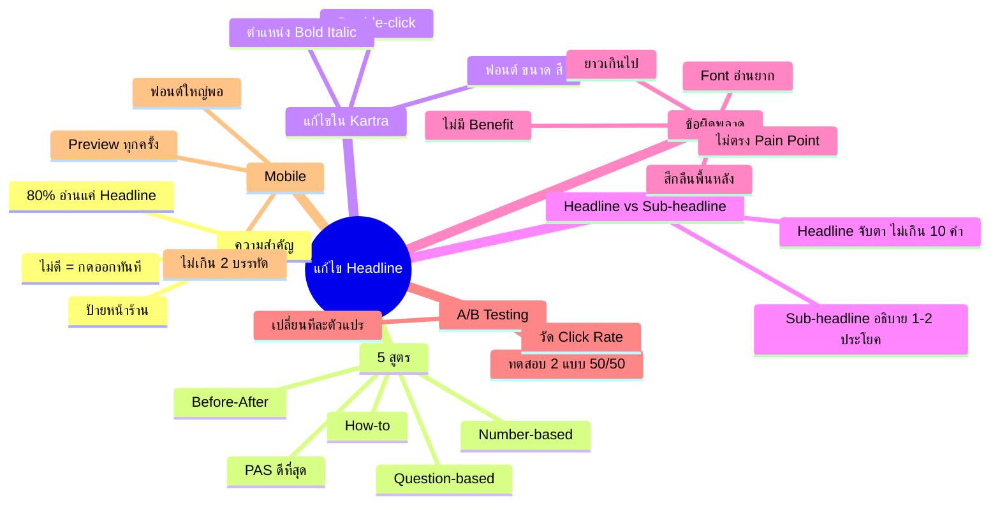
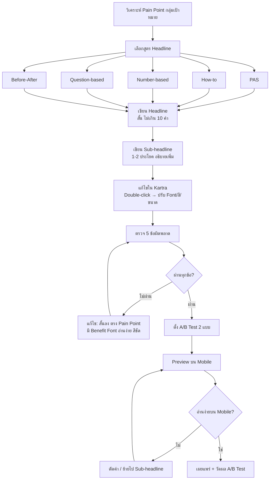
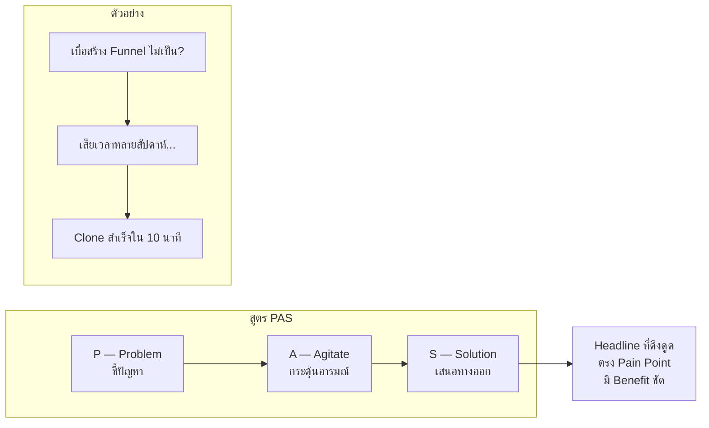
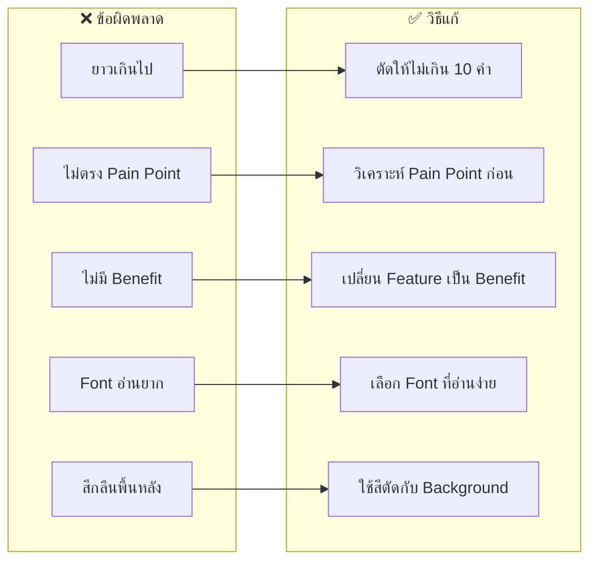
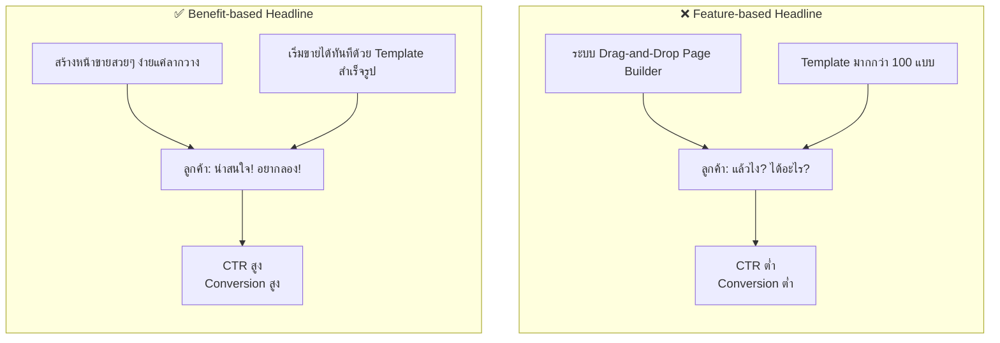

# แก้ไข Headline — CLONE-006 Mind Map
> Format: Mind Map (7 Parts)
> Source: SWP3 Ch20 Cloning Sale Funnel Kartra ตอนที่ 6
> Production: PinkCastle Academy | จูล่ง CTO
> Date: 2026-02-18 | Duration: 0:11:41

---

## Part 1: Text-based Mind Map

```
แก้ไข Headline
│
├── ความสำคัญของ Headline
│   ├── สิ่งแรกที่ลูกค้าเห็น
│   ├── 80% อ่านแค่ Headline
│   ├── ถ้าไม่ดึงดูด = กดออกทันที
│   └── เปรียบเหมือนป้ายหน้าร้าน
│
├── 5 สูตร Headline
│   ├── PAS (Problem-Agitate-Solution)
│   │   └── ดีที่สุดสำหรับ Sales Funnel
│   ├── How-to → บอกวิธีทำ
│   ├── Number-based → ใช้ตัวเลขดึงดูด
│   ├── Question-based → ตั้งคำถามตรงใจ
│   └── Before-After → แสดงการเปลี่ยนแปลง
│
├── วิธีแก้ไขใน Kartra
│   ├── Double-click → เข้าโหมดแก้ไข
│   ├── เปลี่ยนฟอนต์ → อ่านง่าย
│   ├── ปรับขนาด → ใหญ่พอที่จะเด่น
│   ├── เลือกสี → ตัดกับพื้นหลัง
│   ├── จัดตำแหน่ง → ซ้าย/กลาง/ขวา
│   └── Bold/Italic → เน้นแค่ 2-3 คำ
│
├── Headline vs Sub-headline
│   ├── Headline → สั้น กระชับ ไม่เกิน 10 คำ
│   ├── Sub-headline → 1-2 ประโยค อธิบายเพิ่ม
│   └── ทั้งสองทำงานร่วมกัน
│
├── 5 ข้อผิดพลาดที่พบบ่อย
│   ├── ยาวเกินไป (3-4 บรรทัด)
│   ├── ไม่ตรง Pain Point
│   ├── ไม่มี Benefit (บอกแต่ Feature)
│   ├── Font อ่านยาก
│   └── สีกลืนกับพื้นหลัง
│
├── A/B Testing
│   ├── ทดสอบ 2 แบบพร้อมกัน
│   ├── ส่งทราฟฟิก 50/50
│   ├── วัด Click Rate / Conversion Rate
│   ├── ใช้ตัวชนะเป็นถาวร
│   └── กฎ: เปลี่ยนทีละตัวแปรเดียว
│
└── Mobile Optimization
    ├── ฟอนต์ใหญ่พอ (ไม่ต้องซูม)
    ├── ไม่เกิน 2 บรรทัดบน Mobile
    ├── Preview ทุกครั้งก่อนเผยแพร่
    └── ถ้ายาวเกิน → ตัดคำ / ย้ายไป Sub-headline
```

---

## Part 2: Mermaid Mind Map



---

## Part 3: Flowchart — ขั้นตอนแก้ไข Headline



---

## Part 4: Flowchart — สูตร PAS



---

## Part 5: Flowchart — 5 ข้อผิดพลาด + วิธีแก้



---

## Part 6: Comparison — Feature vs Benefit Headline



---

## Part 7: สรุป — สูตรสำเร็จ

```
╔══════════════════════════════════════════════════╗
║                                                  ║
║  Headline คือ 80% ของความสำเร็จ                  ║
║                                                  ║
╠══════════════════════════════════════════════════╣
║                                                  ║
║  5 สูตร: PAS / How-to / Number-based            ║
║          Question-based / Before-After           ║
║                                                  ║
║  วิธีแก้ไข: Double-click → Font → ขนาด → สี     ║
║             → ตำแหน่ง → Bold เฉพาะ 2-3 คำ       ║
║                                                  ║
║  7 กฎเหล็ก:                                      ║
║  1. 80% อ่านแค่ Headline — ทุ่มเวลาให้มาก        ║
║  2. ใช้สูตร PAS เป็นหลัก                          ║
║  3. สั้น ไม่เกิน 10 คำ                            ║
║  4. ตรง Pain Point + มี Benefit ชัด               ║
║  5. แยก Headline กับ Sub-headline                ║
║  6. A/B Test ทุกครั้ง เปลี่ยนทีละตัวแปร            ║
║  7. Preview Mobile เสมอ ไม่เกิน 2 บรรทัด         ║
║                                                  ║
╚══════════════════════════════════════════════════╝
```

---

> ทบทวนต่อ: **CLONE-007** — วิธีปรับแต่งรูป
> Series: SWP3 Ch20 Cloning Sale Funnel Kartra
> PinkCastle Academy © 2026
