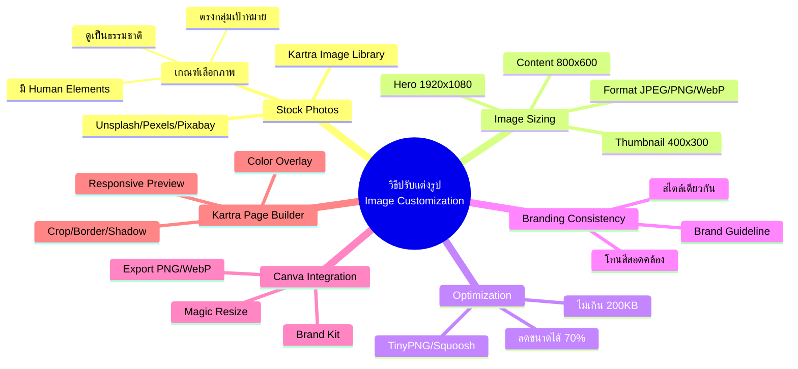

# วิธีปรับแต่งรูป — CLONE-007
> **Format:** Mind Map (Text-based)
> **Source:** SWP3 Ch20 Cloning Sale Funnel Kartra ตอนที่ 7
> **Production:** PinkCastle Academy | จูล่ง CTO
> **Date:** 2026-02-17

---

```
                    วิธีปรับแต่งรูป
                  (Image Customization)
                          |
        ┌─────────────────┼─────────────────┐
        |                 |                 |
   [Stock Photos]   [Sizing & Optimize]  [Branding]
        |                 |                 |
        |                 |        ┌────┬────┐
        |                 |        |    |    |
```

## Center Node: วิธีปรับแต่งรูป (Image Customization)

### Branch 1: Stock Photos
- แหล่งภาพฟรี
  - Unsplash (ภาพถ่ายคุณภาพสูง)
  - Pexels (ภาพ + วิดีโอ)
  - Pixabay (ภาพ + Illustration)
- Kartra Image Library
  - ภาพในตัว
  - อัพโหลดเอง
- เกณฑ์เลือกภาพ
  - ตรงกลุ่มเป้าหมาย
  - ดูเป็นธรรมชาติ
  - มีคนจริง (Human Elements)
  - ลิขสิทธิ์ถูกต้อง

### Branch 2: Image Sizing
- ขนาดมาตรฐาน
  - Hero Image: 1920x1080px
  - Content Image: 800x600px
  - Thumbnail: 400x300px
- ฟอร์แมตไฟล์
  - JPEG (ภาพถ่าย)
  - PNG (พื้นใส/โลโก้)
  - WebP (เล็กกว่า JPEG 30%)

### Branch 3: Image Optimization
- เครื่องมือ Compress
  - TinyPNG
  - Squoosh (Google)
- เป้าหมาย
  - ไม่เกิน 200KB ต่อรูป
  - ลดได้ถึง 70%
- ผลกระทบ
  - ความเร็วโหลดหน้าเว็บ
  - User Experience
  - SEO Ranking

### Branch 4: Branding Consistency
- Brand Guideline
  - โทนสีหลัก
  - สไตล์ภาพ
  - บรรยากาศ/Mood
- ข้อห้าม
  - ไม่ปนการ์ตูนกับภาพจริง
  - ไม่ใช้โทนสีขัดแย้ง
  - ไม่ใช้รูปเดิมจาก Template

### Branch 5: Canva Integration
- Brand Kit
  - โลโก้สำเร็จรูป
  - สีแบรนด์
  - ฟอนต์
- Magic Resize
  - ปรับขนาดอัตโนมัติ
  - หลายตำแหน่งในคลิกเดียว
- Export
  - PNG/WebP
  - พร้อมอัพโหลด Kartra

### Branch 6: Kartra Page Builder
- เครื่องมือในตัว
  - Crop ตัดภาพ
  - Border Radius (วงกลม)
  - Shadow เงา
  - Color Overlay
- Responsive Preview
  - Desktop View
  - Mobile View
  - ตรวจสอบก่อน Publish

---



---

**จำนวน Nodes ทั้งหมด: 38 nodes**

| ระดับ | จำนวน |
|-------|-------|
| Center Node | 1 |
| Branch (ระดับ 1) | 6 |
| Sub-branch (ระดับ 2) | 17 |
| Leaf (ระดับ 3) | 14 |
| **รวม** | **38** |
