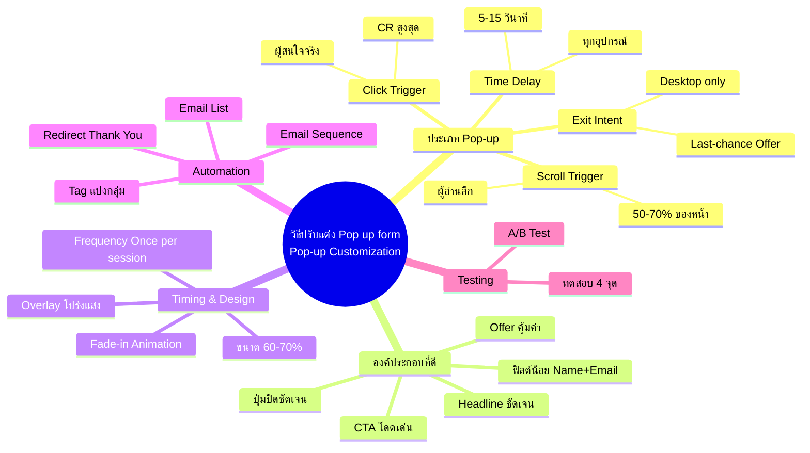
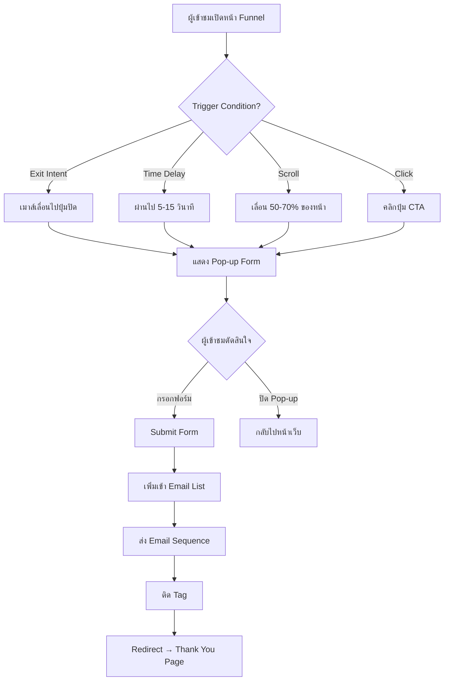
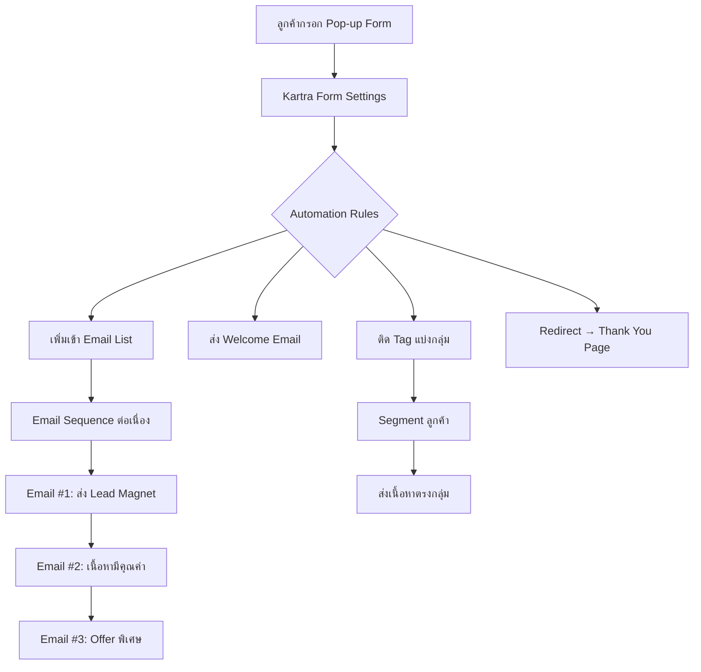
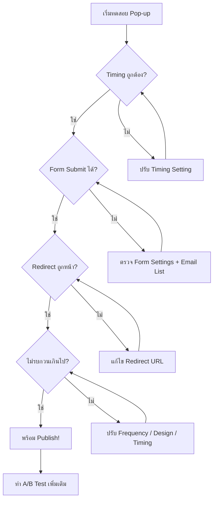

# วิธีปรับแต่ง Pop up form — CLONE-008
> **Format:** Mind Map (Text-based)
> **Source:** SWP3 Ch20 Cloning Sale Funnel Kartra ตอนที่ 8
> **Production:** PinkCastle Academy | จูล่ง CTO
> **Date:** 2026-02-18 | **Duration:** 0:14:26

---

## Part 1: Text Tree

```
                  วิธีปรับแต่ง Pop up form
                 (Pop-up Form Customization)
                            |
        ┌───────────┬───────┼───────┬───────────┐
        |           |       |       |           |
  [ประเภท Pop-up] [องค์ประกอบ] [Timing] [Design] [Automation]
        |           |       |       |           |
```

### Branch 1: ประเภท Pop-up (Types)
- Exit Intent
  - เมาส์เลื่อนไปปุ่มปิด
  - Last-chance Offer
  - Desktop only (ไม่ทำงานบนมือถือ)
- Time Delay
  - แสดงหลังผ่านไปตามเวลาที่ตั้ง
  - แนะนำ 5-15 วินาที
  - ใช้ได้ทุกอุปกรณ์
- Scroll Trigger
  - แสดงเมื่อเลื่อนถึงจุดที่กำหนด
  - แนะนำ 50-70% ของหน้า
  - เหมาะกับผู้อ่านลึก
- Click Trigger
  - แสดงเมื่อคลิกปุ่ม/ลิงก์
  - Conversion Rate สูงสุด
  - ผู้เข้าชมสนใจจริง

### Branch 2: องค์ประกอบที่ดี (Good Elements)
- Headline
  - ชัดเจน บอกประโยชน์ทันที
  - ตัวอย่าง: "รับ E-book ฟรี 50 เทคนิค"
- Offer
  - คุ้มค่า แลกกับข้อมูลที่ขอ
  - E-book / คูปอง / เนื้อหาพิเศษ
- ฟิลด์
  - น้อยที่สุด (Name + Email)
  - ทุกฟิลด์ที่เพิ่ม ลด CR 10-15%
- ปุ่ม CTA
  - สีโดดเด่น ตัดกับพื้นหลัง
  - ข้อความกระตุ้น: "รับเลยฟรี!"
- ปุ่มปิด
  - มองเห็นชัดเจน [X]
  - อย่าซ่อน (ลูกค้าหงุดหงิด)

### Branch 3: Timing & Trigger
- Time Delay
  - 5-15 วินาที
- Scroll Trigger
  - 50-70% ของหน้า
- Frequency Setting
  - Once per session (แนะนำ)
  - Once per visitor
  - ป้องกันเด้งซ้ำรบกวน

### Branch 4: Design
- ขนาด
  - 60-70% ของหน้าจอ
  - ไม่ใหญ่เกินจนบังทั้งหน้า
- ตำแหน่ง
  - กลางหน้าจอ
  - มุมล่างขวา
  - Slide-in จากด้านข้าง
- Animation
  - Fade-in (จางเข้า)
  - Slide-up (เลื่อนขึ้น)
  - นุ่มนวลกว่าเด้งทันที
- Overlay
  - สีดำ 50% โปร่งแสง
  - ช่วยโฟกัสที่ Pop-up

### Branch 5: Automation (หลัง Submit)
- เพิ่มเข้า Email List
  - กำหนดลิสต์ที่ต้องการ
- ส่ง Email Sequence
  - Welcome Email ทันที
  - Follow-up ตามลำดับ
- ติด Tag
  - แบ่งกลุ่มลูกค้า
  - เช่น "Lead จาก Funnel A"
- Redirect
  - ไปหน้า Thank You Page
  - ยืนยันว่ากรอกสำเร็จ

### Branch 6: Testing
- ทดสอบ 4 จุด
  - Timing ถูกต้อง
  - Form Submit ได้จริง
  - Redirect ถูกหน้า
  - ไม่รบกวนมากเกิน
- A/B Test
  - เปลี่ยน Headline
  - เปลี่ยนเวลาแสดง
  - เปลี่ยนสี CTA

---

## Part 2: Mermaid Mind Map



---

## Part 3: Pop-up Workflow Flowchart



---

## Part 4: Pop-up Type Comparison

```mermaid
flowchart LR
    subgraph Desktop
        A[Exit Intent<br>CR: สูงมาก<br>รบกวน: ต่ำ]
    end
    subgraph ทุกอุปกรณ์
        B[Time Delay<br>CR: สูง<br>รบกวน: กลาง]
        C[Scroll Trigger<br>CR: กลาง-สูง<br>รบกวน: ต่ำ]
        D[Click Trigger<br>CR: สูงมาก<br>รบกวน: ต่ำมาก]
    end
```

| เกณฑ์ | Exit Intent | Time Delay | Scroll Trigger | Click Trigger |
|-------|:---:|:---:|:---:|:---:|
| Conversion Rate | สูงมาก | สูง | กลาง-สูง | สูงมาก |
| ความรบกวน | ต่ำ | กลาง | ต่ำ | ต่ำมาก |
| ใช้กับมือถือ | ไม่ได้ | ได้ | ได้ | ได้ |
| ตั้งค่า | ง่าย | ง่าย | ปานกลาง | ง่าย |
| เหมาะกับ | Last-chance | ผู้สนใจ | ผู้อ่านลึก | CTA ชัดเจน |

---

## Part 5: Automation Flow



---

## Part 6: Testing Checklist Flowchart



---

## Part 7: Summary

**จำนวน Nodes ทั้งหมด: 42 nodes**

| ระดับ | จำนวน |
|-------|-------|
| Center Node | 1 |
| Branch (ระดับ 1) | 6 |
| Sub-branch (ระดับ 2) | 20 |
| Leaf (ระดับ 3) | 15 |
| **รวม** | **42** |

**หลักการสำคัญ:**
- Pop-up ที่ดี = ให้คุณค่า ไม่ใช่รบกวน
- เลือกประเภทให้ตรงพฤติกรรม ฟิลด์น้อย CTA ชัด
- ตั้ง Frequency + Timing ให้เหมาะสม
- เชื่อม Automation ครบวงจร
- ทดสอบทุกอย่างก่อน Publish

---

> ทบทวนต่อ: **CLONE-009** — ปรับแต่งหน้า Thank You Page
> Series: SWP3 Ch20 Cloning Sale Funnel Kartra
> PinkCastle Academy © 2026
