# ปรับแต่งหน้า Thank You Page — CLONE-009 Mind Map
> **Format:** Mind Map (Text-based + Mermaid)
> **Source:** SWP3 Ch20 Cloning Sale Funnel Kartra ตอนที่ 9
> **Production:** PinkCastle Academy | จูล่ง CTO
> **Date:** 2026-02-18 | **Duration:** 0:15:02

---

## Part 1: Text Tree — ภาพรวมหัวข้อ

```
                ปรับแต่งหน้า Thank You Page
               (Thank You Page Customization)
                          |
        ┌────────┬────────┼────────┬────────┐
        |        |        |        |        |
   [ความสำคัญ] [องค์ประกอบ] [Upsell] [วิดีโอ] [Automation]
        |        |        |        |        |
```

### Branch 1: ความสำคัญของ Thank You Page
- ทำไมถึงเป็นโอกาสทอง
  - Engagement สูงที่สุดใน Funnel
  - ลูกค้าเพิ่งตัดสินใจ สมองโหมดตอบรับ
  - โอกาสคลิก Offer ต่อ 30-40%
- เป้าหมาย 4 ข้อ
  - ยืนยันว่า Action สำเร็จ
  - บอกขั้นตอนต่อไป
  - เสนอ Upsell/Cross-sell
  - สร้างความสัมพันธ์

### Branch 2: องค์ประกอบที่ต้องมี
- ข้อความขอบคุณ
  - ใช้ภาษาของลูกค้า (ไทย)
  - เปลี่ยนจาก Template เดิม
  - โทนเสียงตรงกับแบรนด์
- คำแนะนำขั้นตอนต่อไป
  - เช็คอีเมล
  - ดาวน์โหลดไฟล์
  - เข้าสู่ระบบ/คอร์ส
- ปุ่ม Social Sharing
  - Facebook / LINE / Twitter
  - ข้อความสำเร็จรูป

### Branch 3: Upsell Strategy
- One-Time Offer (OTO)
  - ราคาพิเศษไม่มีอีก
  - สร้าง Urgency สูง
  - เหมาะ: สินค้า Premium
- Cross-sell
  - สินค้าเสริมเกี่ยวข้อง
  - ราคาไม่สูง
  - เพิ่ม Average Order Value
- Limited Time Offer
  - Countdown Timer 10-20 นาที
  - Scarcity Effect
  - ใช้ได้ทุกประเภทสินค้า

### Branch 4: วิดีโอต้อนรับ
- ความยาว 1-2 นาที
- เนื้อหา 3 ส่วน
  - ขอบคุณที่สมัคร/ซื้อ
  - บอกสิ่งที่จะได้รับ
  - สร้างความตื่นเต้น
- Video Embed ใน Kartra
  - YouTube / Vimeo
  - อัพโหลดโดยตรง
  - ถ่ายจากมือถือก็ได้

### Branch 5: Automation & Testing
- การเชื่อม Automation
  - Redirect จาก Capture Page ถูกหน้า
  - Trigger ถูก Tag (subscriber/customer)
  - Email Sequence ทำงานตามลำดับ
- ข้อผิดพลาดที่ต้องหลีกเลี่ยง
  - ไม่ใส่ขั้นตอนต่อไป
  - ไม่เปลี่ยนข้อความจาก Template
  - ไม่มี Upsell Offer
  - ลิงก์/ปุ่มผิด
- QA Checklist
  - ทดสอบทุกลิงก์
  - Preview Desktop + Mobile
  - ทดสอบ Flow ทั้งหมด

---

## Part 2: Mermaid Mind Map


---

## Part 3: Mermaid Flowchart — Thank You Page Flow


---

## Part 4: Mermaid Flowchart — Upsell Decision Tree

```mermaid
flowchart TD
    A[Thank You Page] --> B{ประเภท Action ที่ลูกค้าทำ?}

    B -->|สมัครฟรี| C[Cross-sell: E-book / Template ราคาถูก]
    B -->|ซื้อสินค้า| D[OTO: Premium Package -50%]
    B -->|ดาวน์โหลด| E[Limited Time: คอร์สเรียน ลด 40%]

    C --> F{ใช้ Countdown Timer?}
    D --> F
    E --> F

    F -->|ใช่| G[ตั้ง 10-20 นาที สร้าง Urgency]
    F -->|ไม่| H[ใช้ปุ่ม CTA ข้อความชัดเจน]

    G --> I[Preview + Test ทุกลิงก์]
    H --> I
    I --> J[Publish!]

    style A fill:#FF69B4,color:#fff
    style J fill:#32CD32,color:#fff
```



---

## Part 5: Comparison — Thank You Page ดี vs ไม่ดี

| เกณฑ์ | Thank You Page ที่ดี | Thank You Page ที่ไม่ดี |
|-------|:---:|:---:|
| ข้อความ | ภาษาไทยของแบรนด์ ชัดเจน | ภาษาอังกฤษ Template เดิม |
| ขั้นตอนต่อไป | บอกชัด 1-3 บรรทัด | ไม่มี ลูกค้างง |
| Upsell | OTO/Cross-sell ที่เกี่ยวข้อง | ไม่มี Offer เลย |
| วิดีโอ | 1-2 นาที สร้างความผูกพัน | ไม่มี หรือยาวเกินไป |
| CTA | บอกคุณค่าชัด "รับส่วนลด 50%" | แค่ "คลิกที่นี่" |
| Automation | Redirect ถูก Tag ถูกต้อง | ไม่ได้ตั้งค่า ลูกค้าหลุด |
| ทดสอบ | Preview ทั้ง Desktop + Mobile | ไม่ทดสอบก่อน Publish |
| ผลลัพธ์ | Conversion สูง + รายได้เพิ่ม | เสียโอกาสทั้งหมด |

---

## Part 6: Mermaid Flowchart — QA Checklist Flow


---

## Part 7: สรุป Node Count

**จำนวน Nodes ทั้งหมด: 42 nodes**

| ระดับ | จำนวน |
|-------|-------|
| Center Node | 1 |
| Branch (ระดับ 1) | 6 |
| Sub-branch (ระดับ 2) | 18 |
| Leaf (ระดับ 3) | 17 |
| **รวม** | **42** |

---

> ทบทวนต่อ: **CLONE-010** — แนะนำระบบ Sequence ใน Kartra
> Series: SWP3 Ch20 Cloning Sale Funnel Kartra
> PinkCastle Academy © 2026
