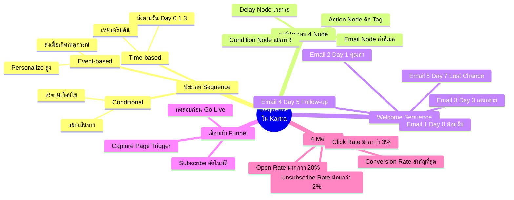
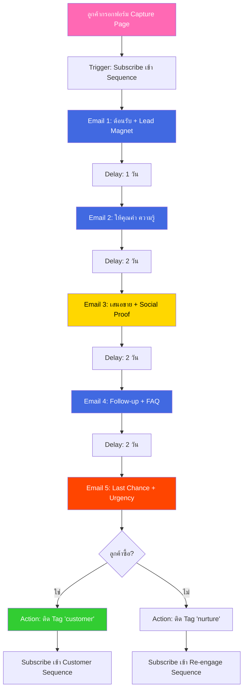
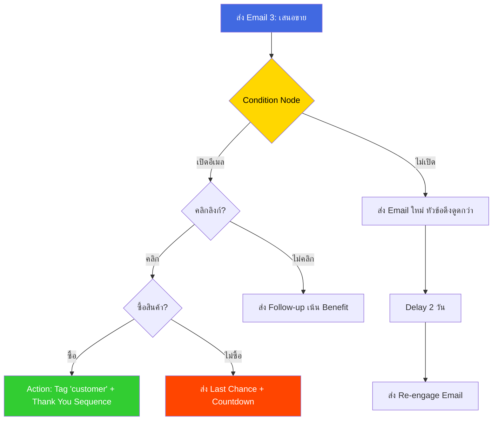
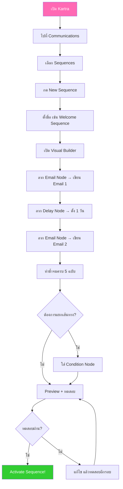

# แนะนำระบบ Sequence ใน Kartra — CLONE-010 Mind Map
> **Format:** Mind Map (Text-based + Mermaid)
> **Source:** SWP3 Ch20 Cloning Sale Funnel Kartra ตอนที่ 10
> **Production:** PinkCastle Academy | จูล่ง CTO
> **Date:** 2026-02-18 | **Duration:** 0:10:21

---

## Part 1: Text Tree — ภาพรวมหัวข้อ

```
                ระบบ Sequence ใน Kartra
               (Kartra Sequence System)
                          |
        ┌────────┬────────┼────────┬────────┐
        |        |        |        |        |
   [ประเภท]  [องค์ประกอบ] [Welcome] [Funnel] [Metrics]
        |        |        |        |        |
```

### Branch 1: ประเภทของ Sequence
- Time-based
  - ส่งตามวัน/เวลาที่กำหนด
  - Day 0, Day 1, Day 3
  - เข้าใจง่าย เหมาะเริ่มต้น
- Event-based
  - ส่งเมื่อเกิดเหตุการณ์
  - คลิกลิงก์ เข้าชมหน้าเว็บ
  - Personalize ได้มาก
- Conditional
  - ส่งตามเงื่อนไข
  - เปิด/ไม่เปิดอีเมล
  - แยกเส้นทางลูกค้าแต่ละคน

### Branch 2: องค์ประกอบ (Node Types)
- Email Node
  - ตัวอีเมลที่ส่งออกไป
  - หัวข้อ + เนื้อหา + CTA
  - เป็น Node หลักของ Sequence
- Delay Node
  - กำหนดระยะเวลารอ
  - ถี่เกินไป → ลูกค้ารำคาญ
  - ห่างเกินไป → ลูกค้าลืม
- Condition Node
  - แยกเส้นทาง A / B
  - ตามพฤติกรรมจริง
  - ทำ Sequence ฉลาดขึ้น
- Action Node
  - ติด Tag จัดกลุ่ม
  - ย้ายกลุ่มลูกค้า
  - Subscribe เข้า Sequence อื่น

### Branch 3: Welcome Sequence 5 ฉบับ
- Email 1 (Day 0)
  - ต้อนรับ + ส่ง Lead Magnet
  - ส่งทันทีเลย อย่าให้รอ
- Email 2 (Day 1)
  - ให้คุณค่า ความรู้
  - ยังไม่ขาย สร้างเชื่อถือ
- Email 3 (Day 3)
  - เสนอขาย
  - Social Proof + CTA ชัดเจน
- Email 4 (Day 5)
  - Follow-up
  - ตอบ FAQ แก้ข้อโต้แย้ง
- Email 5 (Day 7)
  - Last Chance
  - Urgency ปิดการขาย

### Branch 4: การเชื่อมกับ Funnel
- Capture Page กรอกฟอร์ม
  - Trigger → Subscribe เข้า Sequence
  - อัตโนมัติ 100%
- วิธีสร้างใน Kartra
  - Communications > Sequences
  - New Sequence → Visual Builder
  - ลาก Node มาวาง ต่อกัน
- ทดสอบก่อน Go Live
  - กรอกฟอร์มทดลอง
  - ตรวจ Email 1 ส่งทันทีไหม
  - ตรวจ Delay ทำงานถูกต้องไหม

### Branch 5: Metrics ที่ต้องติดตาม
- Open Rate
  - เกณฑ์ > 20%
  - วัด Subject Line
  - ถ้าต่ำ → ปรับหัวข้อ
- Click Rate
  - เกณฑ์ > 3%
  - วัดเนื้อหา + CTA
  - ถ้าต่ำ → ปรับปุ่ม CTA
- Unsubscribe Rate
  - เกณฑ์ < 2%
  - วัดความถี่/ตรงกลุ่ม
  - ถ้าสูง → ลดความถี่
- Conversion Rate
  - เกณฑ์ > 1-3%
  - Metric สำคัญที่สุด
  - วัดเป้าหมายสุดท้าย

---

## Part 2: Mermaid Mind Map



---

## Part 3: Mermaid Flowchart — Sequence Flow



---

## Part 4: Mermaid Flowchart — Condition Node Decision Tree



---

## Part 5: Comparison — 3 ประเภท Sequence

| เกณฑ์ | Time-based | Event-based | Conditional |
|-------|:---:|:---:|:---:|
| วิธี Trigger | ส่งตามวัน/เวลา | ส่งเมื่อเกิดเหตุการณ์ | ส่งตามเงื่อนไข |
| ความยากง่าย | ง่าย | ปานกลาง | ยาก |
| ความยืดหยุ่น | ต่ำ | สูง | สูงมาก |
| Personalize | พื้นฐาน | ตามพฤติกรรม | ตามพฤติกรรม + เงื่อนไข |
| เหมาะกับ | Welcome Sequence | Engaged Leads | A/B Testing ขั้นสูง |
| ตัวอย่าง | Day 0 1 3 5 7 | คลิกลิงก์ → ส่ง Offer | เปิด/ไม่เปิด → แยกทาง |
| แนะนำ | เริ่มจากอันนี้ | เพิ่มทีหลัง | ขั้นสูง |

---

## Part 6: Mermaid Flowchart — สร้าง Sequence ใน Kartra



---

## Part 7: สรุป Node Count

**จำนวน Nodes ทั้งหมด: 48 nodes**

| ระดับ | จำนวน |
|-------|-------|
| Center Node | 1 |
| Branch (ระดับ 1) | 5 |
| Sub-branch (ระดับ 2) | 19 |
| Leaf (ระดับ 3) | 23 |
| **รวม** | **48** |

---

> ทบทวนต่อ: **CLONE-011** — ตรวจการบ้าน
> Series: SWP3 Ch20 Cloning Sale Funnel Kartra
> PinkCastle Academy © 2026
