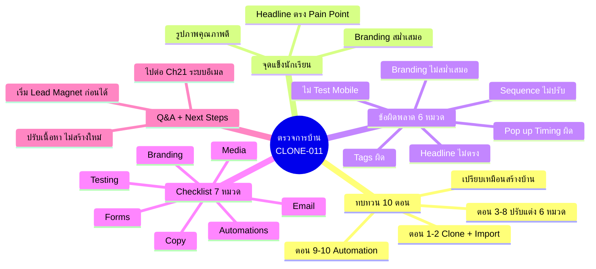
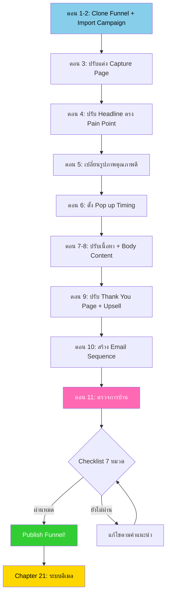
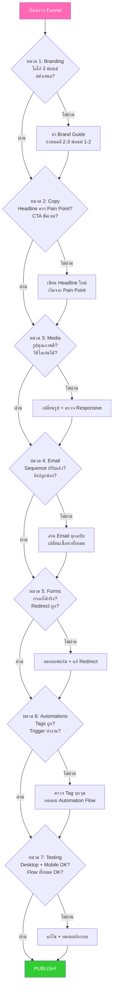
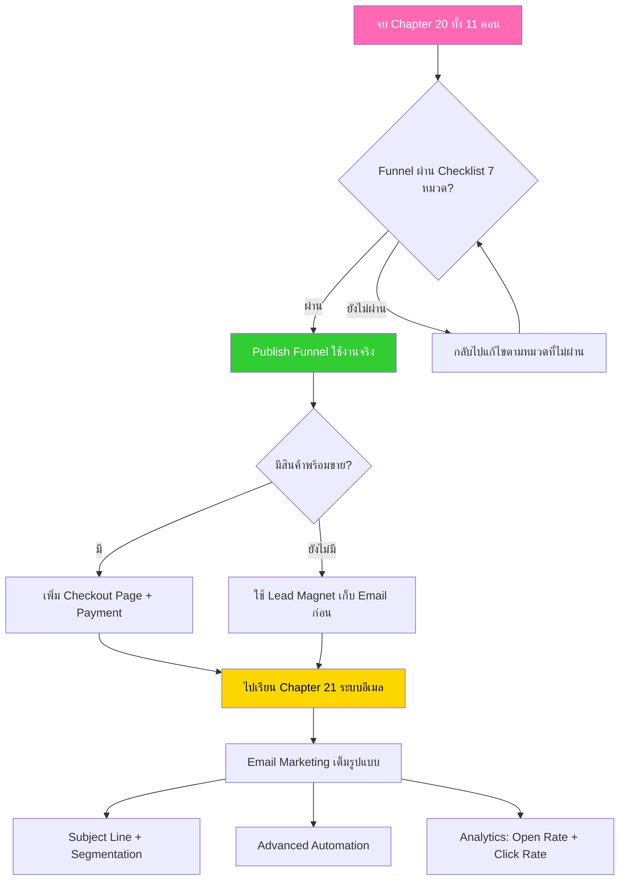

# ตรวจการบ้าน — CLONE-011 Mind Map
> **Format:** Mind Map (Text-based + Mermaid)
> **Source:** SWP3 Ch20 Cloning Sale Funnel Kartra ตอนที่ 11
> **Production:** PinkCastle Academy | จูล่ง CTO
> **Date:** 2026-02-18 | **Duration:** 2:05:15

---

## Part 1: Text Tree — ภาพรวมหัวข้อ

```
                    ตรวจการบ้าน
           (Homework Review — CLONE-011)
                        |
      ┌─────────┬───────┼───────┬─────────┐
      |         |       |       |         |
 [ทบทวน    [จุดแข็ง  [ข้อผิด  [Check-  [Q&A +
  10 ตอน]   นักเรียน] พลาด]    list]    Next]
      |         |       |       |         |
```

### Branch 1: ทบทวน 10 ตอนที่ผ่านมา
- ตอน 1-2: Clone + Import
  - Clone Funnel Template
  - Import Campaign เข้า Kartra
- ตอน 3-8: ปรับแต่ง 6 หมวด
  - Capture Page
  - Headline
  - รูปภาพ
  - Pop up
  - Thank You Page
  - เนื้อหาอื่นๆ
- ตอน 9-10: Automation
  - Thank You Page Customization
  - Email Sequence
- เปรียบเหมือนสร้างบ้าน
  - วางโครงสร้าง → ตกแต่งภายใน → ติดตั้งระบบ → ตรวจรับบ้าน

### Branch 2: จุดแข็งของนักเรียนที่ทำได้ดี
- Branding สม่ำเสมอ
  - สีเดียวกันทุกหน้า
  - โลโก้ตำแหน่งเดียวกัน
  - ฟอนต์สไตล์เดียวกัน
- Headline ตรง Pain Point
  - พูดปัญหาลูกค้า
  - เสนอ Solution
  - ลูกค้าสนใจทันที
- รูปภาพคุณภาพดี
  - ใช้รูปของตัวเอง
  - เกี่ยวข้องกับธุรกิจจริง
  - ไม่ใช้รูป Template เดิม

### Branch 3: ข้อผิดพลาดที่พบบ่อย 6 หมวด
- Branding ไม่สม่ำเสมอ
  - สีต่างกันแต่ละหน้า
  - แก้: ทำ Brand Guide สี 2-3 ฟอนต์ 1-2
- Headline ไม่ตรง Pain Point
  - เขียนแนวบรรยาย
  - แก้: เริ่มจากปัญหาลูกค้า ตามด้วย Solution
- ไม่ Test บน Mobile
  - Desktop สวย Mobile เละ
  - แก้: กด Mobile Preview ทุกครั้ง
- Pop up Timing ไม่เหมาะ
  - ขึ้นทันทีไม่มี Delay
  - แก้: Delay 5-10 วินาที หรือ Exit Intent
- Sequence ไม่ปรับ
  - ชื่อแบรนด์อื่น ลิงก์คนอื่น
  - แก้: อ่านทุกฉบับ เปลี่ยนทั้งหมด
- Tags ผิด
  - Automation Assign ผิด Tag
  - แก้: ตรวจ Tag ทุกจุด ทดสอบ Flow

### Branch 4: Checklist 7 หมวดก่อน Publish
- Branding
  - โลโก้ สี ฟอนต์สม่ำเสมอ
- Copy
  - Headline ตรง Pain Point, CTA ชัดเจน
- Media
  - รูปคุณภาพดี วิดีโอเล่นได้ Responsive
- Email
  - Sequence ปรับแล้ว ลิงก์ถูกต้อง
- Forms
  - กรอกได้จริง Redirect ถูกหน้า
- Automations
  - Tags ถูก Trigger ทำงาน
- Testing
  - Desktop + Mobile + Flow ทั้งหมด

### Branch 5: คำถาม-ตอบ + Next Steps
- Funnel ไม่เหมาะ → ปรับเนื้อหา ไม่ต้องสร้างใหม่
- ไม่มีสินค้า → เริ่มจาก Lead Magnet ก่อน
- จบ Ch20 → ไปต่อ Chapter 21 ระบบอีเมล
  - Subject Line
  - Segmentation
  - Automation ซับซ้อน
  - Open Rate / Click Rate Analysis

---

## Part 2: Mermaid Mind Map



---

## Part 3: Mermaid Flowchart — กระบวนการสร้าง Funnel ครบวงจร (Chapter 20)



---

## Part 4: Mermaid Flowchart — Checklist QA Flow



---

## Part 5: Comparison — Funnel ที่ตรวจแล้ว vs ยังไม่ตรวจ

| เกณฑ์ | Funnel ที่ตรวจแล้ว (ดี) | Funnel ที่ยังไม่ตรวจ (ไม่ดี) |
|-------|:---:|:---:|
| Branding | สม่ำเสมอทุกหน้า สี ฟอนต์ โลโก้เดียวกัน | สีต่างกัน ฟอนต์ต่างกัน ดูคนละเว็บ |
| Headline | ตรง Pain Point พูดปัญหาลูกค้า | แนวบรรยาย ลูกค้าไม่สนใจ |
| รูปภาพ | ใช้รูปของตัวเอง คุณภาพดี | ใช้รูป Template เดิม ไม่เกี่ยวกับธุรกิจ |
| Mobile | Responsive ทดสอบแล้วทุกจอ | ไม่เคย Test ข้อความล้น ปุ่มเล็ก |
| Pop up | Delay 5-10 วินาที หรือ Exit Intent | ขึ้นทันที ลูกค้ารำคาญ |
| Sequence | ปรับเนื้อหาครบทุกฉบับ | ใช้ข้อความ Template ชื่อแบรนด์อื่น |
| Tags | ตรวจทุกจุด ทดสอบ Flow แล้ว | ไม่ตรวจ Automation ทำงานผิด |
| ผลลัพธ์ | มืออาชีพ Conversion สูง น่าเชื่อถือ | เสียโอกาส เสียลูกค้า เสียความน่าเชื่อถือ |

---

## Part 6: Mermaid Flowchart — Decision Tree หลังจบ Chapter 20



---

## Part 7: สรุป Node Count

**จำนวน Nodes ทั้งหมด: 58 nodes**

| ระดับ | จำนวน |
|-------|-------|
| Center Node | 1 |
| Branch (ระดับ 1) | 5 |
| Sub-branch (ระดับ 2) | 24 |
| Leaf (ระดับ 3) | 28 |
| **รวม** | **58** |

---

> จบ Chapter 20: Cloning Sale Funnel Kartra — 11 ตอน
> Series: SWP3 Ch20 Cloning Sale Funnel Kartra
> PinkCastle Academy © 2026
