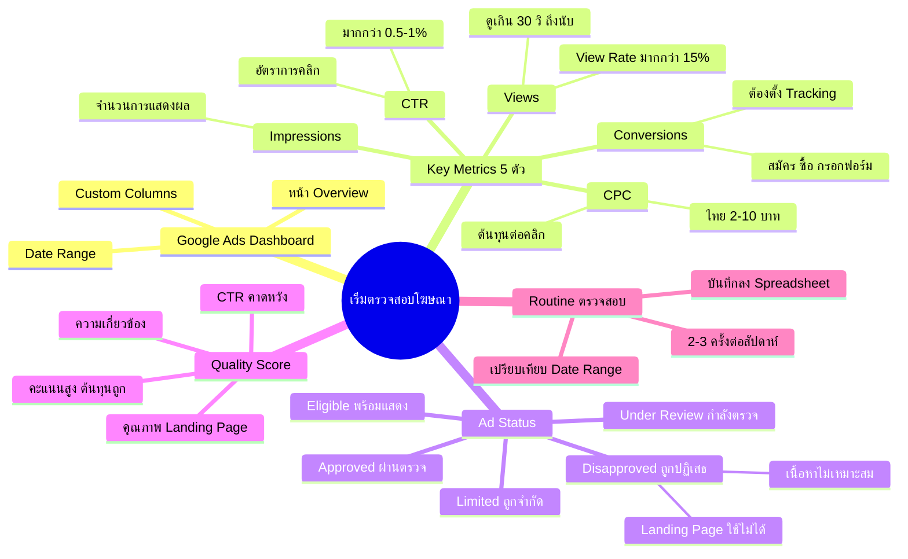

# เริ่มตรวจสอบโฆษณา — YTOPT-001
> **Format:** Mind Map
> **Source:** SWP3 Ch22 วิธีปรับแต่งแคมเปญ Youtube Ads ตอนที่ 1
> **Production:** PinkCastle Academy | จูล่ง CTO
> **Date:** 2026-02-17

---

## Text-based Mind Map

```
เริ่มตรวจสอบโฆษณา
├── Google Ads Dashboard
│   ├── หน้า Overview (ภาพรวม)
│   ├── Custom Columns ปรับแต่งคอลัมน์
│   └── Date Range เลือกช่วงเวลา
├── Key Metrics 5 ตัวหลัก
│   ├── Impressions (จำนวนการแสดงผล)
│   │   └── บอกว่าโฆษณาถูกแสดงกี่ครั้ง
│   ├── Views (จำนวนการดู)
│   │   ├── ดูเกิน 30 วินาทีถึงนับ
│   │   └── View Rate > 15% = ดี
│   ├── CTR (Click-Through Rate)
│   │   ├── อัตราการคลิก
│   │   └── > 0.5-1% = ดี
│   ├── CPC (Cost Per Click)
│   │   ├── ต้นทุนต่อคลิก
│   │   └── ไทย: 2-10 บาท
│   └── Conversions (การแปลงผล)
│       ├── สมัคร/ซื้อ/กรอกฟอร์ม
│       └── ต้องตั้ง Tracking ก่อน
├── Ad Status (สถานะโฆษณา)
│   ├── Eligible — พร้อมแสดง
│   ├── Approved — ผ่านตรวจสอบ
│   ├── Under Review — กำลังตรวจ
│   ├── Disapproved — ถูกปฏิเสธ
│   │   ├── เนื้อหาไม่เหมาะสม
│   │   ├── คำต้องห้าม
│   │   ├── Landing Page ใช้ไม่ได้
│   │   └── อ้างสรรพคุณเกินจริง
│   └── Limited — ถูกจำกัด
├── Quality Score
│   ├── ความเกี่ยวข้องของโฆษณา
│   ├── CTR ที่คาดหวัง
│   ├── คุณภาพ Landing Page
│   └── คะแนนสูง = ต้นทุนถูก
├── วิธีจัดการ Disapproval
│   ├── อ่านเหตุผลจาก Google
│   ├── แก้ไขตรงจุด
│   └── ส่งอุทธรณ์ (Appeal)
└── Routine การตรวจสอบ
    ├── อย่างน้อย 2-3 ครั้ง/สัปดาห์
    ├── งบสูง → ดูทุกวัน
    ├── เปรียบเทียบ Date Range
    └── บันทึกลง Spreadsheet
```

---

## Mermaid Mind Map



---

*Node count: 42 | Depth: 3 levels*
