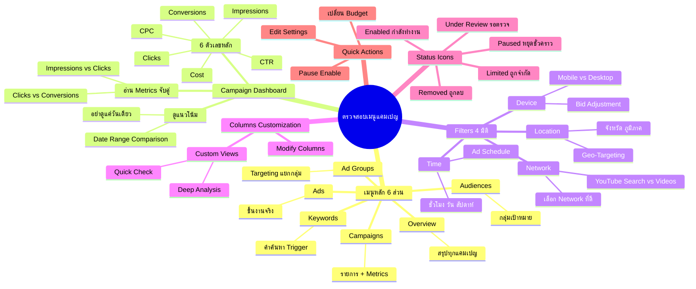

# ตรวจสอบเมนูแคมเปญ — YTOPT-002
> **Format:** Mind Map
> **Source:** SWP3 Ch22 วิธีปรับแต่งแคมเปญ Youtube Ads ตอนที่ 2
> **Production:** PinkCastle Academy | จูล่ง CTO
> **Date:** 2026-02-18

---

## Text-based Mind Map

```
ตรวจสอบเมนูแคมเปญ
├── เมนูหลัก 6 ส่วน
│   ├── Overview (ภาพรวม)
│   │   ├── สรุปทุกแคมเปญในหน้าเดียว
│   │   └── ดูเป็นสิ่งแรกทุกครั้ง
│   ├── Campaigns (แคมเปญ)
│   │   ├── รายการแคมเปญ + Metrics
│   │   └── เปรียบเทียบแต่ละตัว
│   ├── Ad Groups (กลุ่มโฆษณา)
│   │   ├── Targeting + Bid แยกกลุ่ม
│   │   └── ทดสอบหลายกลุ่มพร้อมกัน
│   ├── Ads (ชิ้นงานโฆษณา)
│   │   ├── รูป/วิดีโอ/ข้อความ
│   │   └── สถานะ Approved/Disapproved
│   ├── Keywords (คำค้นหา)
│   │   └── คำที่ Trigger โฆษณา
│   └── Audiences (กลุ่มเป้าหมาย)
│       ├── Custom Intent
│       ├── Affinity
│       └── In-Market
├── Campaign Dashboard
│   ├── 6 ตัวเลขหลัก
│   │   ├── Impressions (จำนวนแสดงผล)
│   │   ├── Clicks (จำนวนคลิก)
│   │   ├── CTR (อัตราการคลิก)
│   │   ├── Cost (ค่าใช้จ่ายรวม)
│   │   ├── CPC (ต้นทุนต่อคลิก)
│   │   └── Conversions (ผลลัพธ์)
│   ├── การดูแนวโน้ม
│   │   ├── Date Range Comparison
│   │   ├── This Week vs Last Week
│   │   └── อย่าดูแค่วันเดียว
│   └── การอ่าน Metrics แบบจับคู่
│       ├── Impressions เพิ่ม + Clicks ไม่เพิ่ม = โฆษณาไม่ดึงดูด
│       └── Clicks เพิ่ม + Conversions ไม่เพิ่ม = Landing Page
├── Filters & Segments
│   ├── Device
│   │   ├── Mobile vs Desktop vs Tablet
│   │   └── ปรับ Bid Adjustment
│   ├── Network
│   │   ├── YouTube Search vs Videos vs Display
│   │   └── เลือก Network ที่ดีที่สุด
│   ├── Time
│   │   ├── ชั่วโมง/วัน/สัปดาห์
│   │   └── ตั้ง Ad Schedule
│   └── Location
│       ├── จังหวัด/ภูมิภาค
│       └── ปรับ Geo-Targeting
├── Columns Customization
│   ├── Modify Columns
│   │   ├── Performance
│   │   ├── Conversions
│   │   └── Attributes
│   └── Custom Views (บันทึกไว้)
│       ├── Quick Check (5 Metrics หลัก)
│       └── Deep Analysis (+ Conversion + Quality)
├── Status Icons
│   ├── Enabled (วงกลมสีเขียว) — กำลังทำงาน
│   ├── Paused (ไอคอนหยุด) — หยุดชั่วคราว
│   ├── Removed — ถูกลบแล้ว
│   ├── Under Review — รอตรวจสอบ
│   └── Limited — ถูกจำกัด
│       ├── งบหมดสำหรับวัน
│       └── Bid ต่ำเกินไป
└── Quick Actions
    ├── เปลี่ยน Budget — กดที่ตัวเลขงบ
    ├── Pause/Enable — กดปุ่มสถานะ
    └── Edit Settings — กดจุดสามจุด
        ├── แก้ Targeting
        ├── เปลี่ยน Bid Strategy
        └── ปรับ Schedule
```

---

## Mermaid Mind Map



---

> ทบทวนต่อ: **YTOPT-003** — ลิงก์ช่อง Youtube กับ Google Ads
> Series: SWP3 Ch22 วิธีปรับแต่งแคมเปญ Youtube Ads
> PinkCastle Academy © 2026

---

*Node count: 68 | Depth: 4 levels*
