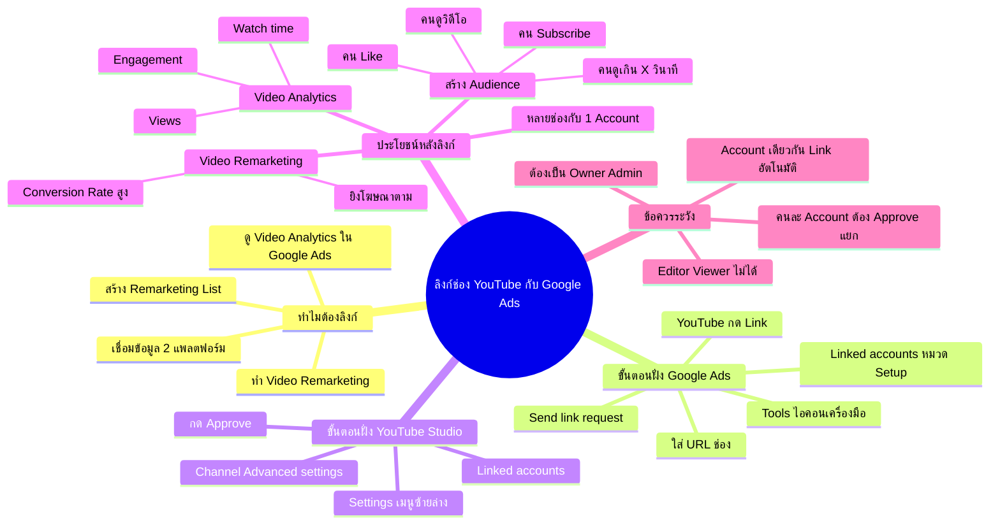

# ลิงก์ช่อง Youtube กับ Google Ads — YTOPT-003
> **Format:** Mind Map
> **Source:** SWP3 Ch22 วิธีปรับแต่งแคมเปญ Youtube Ads ตอนที่ 3
> **Production:** PinkCastle Academy | จูล่ง CTO
> **Date:** 2026-02-18 | **Duration:** 0:05:42

---

## Text-based Mind Map

```
ลิงก์ช่อง YouTube กับ Google Ads
├── ทำไมต้องลิงก์
│   ├── เชื่อมข้อมูลระหว่าง 2 แพลตฟอร์ม
│   ├── ดู Video Analytics ใน Google Ads
│   ├── สร้าง Remarketing List จากคนดูวิดีโอ
│   └── ทำ Video Remarketing ยิงโฆษณาตาม
├── ขั้นตอนฝั่ง Google Ads
│   ├── ล็อกอิน Google Ads
│   ├── Tools (ไอคอนเครื่องมือ ขวาบน)
│   ├── Linked accounts (หมวด Setup)
│   ├── หา YouTube → กด Link
│   ├── ใส่ URL ช่อง YouTube
│   └── กด Send link request
├── ขั้นตอนฝั่ง YouTube Studio
│   ├── เข้า YouTube Studio
│   ├── Settings (เมนูซ้ายล่าง)
│   ├── Channel → Advanced settings
│   ├── เลื่อนลงหา Linked accounts
│   └── กด Approve
├── ประโยชน์หลังลิงก์
│   ├── Video Analytics ใน Google Ads
│   │   ├── Views (จำนวนดู)
│   │   ├── Watch time (เวลาดู)
│   │   └── Engagement (การมีส่วนร่วม)
│   ├── สร้าง Audience จากผู้ชม
│   │   ├── คนที่ดูวิดีโอ
│   │   ├── คนที่ดูเกิน X วินาที
│   │   ├── คนที่กด Like
│   │   └── คนที่ Subscribe
│   ├── Video Remarketing
│   │   ├── ยิงโฆษณาตามคนที่เคยดู
│   │   ├── เตือนให้กลับมาทำ Action
│   │   └── Conversion Rate สูงกว่าปกติ
│   └── จัดการหลายช่อง
│       └── ลิงก์หลายช่องกับ 1 Google Ads
└── ข้อควรระวัง
    ├── สิทธิ์การ Approve
    │   ├── ต้องเป็น Owner หรือ Admin
    │   └── Editor / Viewer ไม่สามารถ Approve
    ├── Google Account เดียวกัน
    │   └── อาจ Link อัตโนมัติ
    └── คนละ Account
        └── ต้องส่งคำขอ + Approve แยก
```

---

## Mermaid Mind Map



---

> ทบทวนต่อ: **YTOPT-004** — ตรวจสอบหน้า Landing Page
> Series: SWP3 Ch22 วิธีปรับแต่งแคมเปญ Youtube Ads
> PinkCastle Academy © 2026

---

*Node count: 48 | Depth: 4 levels*
