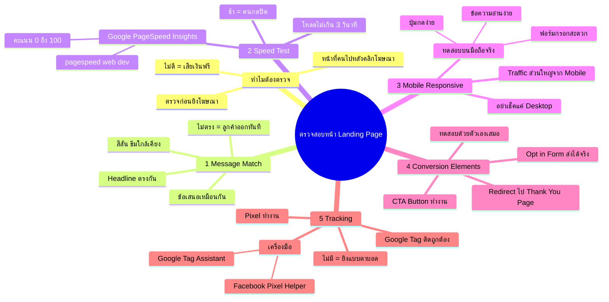

# ตรวจสอบหน้า Landing Page — YTOPT-004
> **Format:** Mind Map
> **Source:** SWP3 Ch22 วิธีปรับแต่งแคมเปญ Youtube Ads ตอนที่ 4
> **Production:** PinkCastle Academy | จูล่ง CTO
> **Date:** 2026-02-18

---

## Text-based Mind Map

```
ตรวจสอบหน้า Landing Page
├── ทำไมต้องตรวจ?
│   ├── Landing Page = หน้าที่คนไปหลังคลิกโฆษณา
│   ├── ถ้าไม่ดี เงินค่าโฆษณาสูญเปล่า
│   ├── เหมือนร้านที่ประตูเปิดไม่ได้
│   └── ต้องตรวจก่อนจ่ายเงินยิงโฆษณา
├── 1. Message Match
│   ├── ข้อความ Ad ต้องตรงกับ Landing Page
│   │   ├── Headline ตรงกัน
│   │   ├── สีสัน/ธีมใกล้เคียง
│   │   └── ข้อเสนอเหมือนกัน
│   ├── ลูกค้าต้องเห็นสิ่งที่คาดหวัง
│   ├── ไม่ตรง = สับสน = ออกทันที
│   └── เทคนิค: เทียบ Headline Ad กับ Landing Page
├── 2. Speed Test
│   ├── โหลดไม่เกิน 3 วินาที
│   ├── ช้ากว่า = คนกดปิด
│   ├── เครื่องมือ: Google PageSpeed Insights
│   │   ├── URL: pagespeed.web.dev
│   │   ├── ใส่ URL → กด Analyze
│   │   └── คะแนน 0-100 (ต่ำกว่า 50 = ต้องแก้)
│   └── ทุกวินาทีที่เพิ่ม = Conversion ลดลง
├── 3. Mobile Responsive
│   ├── Traffic จาก YouTube ส่วนใหญ่มาจาก Mobile
│   ├── ต้องทดสอบบนมือถือจริง
│   │   ├── ข้อความอ่านง่าย?
│   │   ├── ปุ่มกดง่าย?
│   │   ├── ฟอร์มกรอกสะดวก?
│   │   └── รูปภาพแสดงผลถูกต้อง?
│   ├── อย่าเช็คแค่บน Desktop
│   └── สวยบน Desktop อาจพังบน Mobile
├── 4. Conversion Elements
│   ├── Opt-in Form
│   │   ├── กรอกข้อมูลทดสอบจริง
│   │   └── ข้อมูลเข้าระบบถูกต้อง?
│   ├── CTA Button
│   │   ├── กดแล้วทำงาน?
│   │   └── ไม่ใช่กดแล้วไม่เกิดอะไร
│   ├── Redirect
│   │   ├── ไป Thank You Page ถูกต้อง?
│   │   └── อีเมลถูกส่งจริง?
│   └── ต้องทดสอบด้วยตัวเองทุกขั้นตอน
├── 5. Tracking
│   ├── Google Tag / Pixel ติดตั้งถูกต้อง
│   ├── ไม่มี Tracking = ยิงโฆษณาแบบตาบอด
│   ├── เครื่องมือตรวจสอบ (Chrome Extension ฟรี)
│   │   ├── Google Tag Assistant
│   │   └── Facebook Pixel Helper
│   └── เปิดหน้า Landing Page → ดู Tag Fire
└── สรุป
    ├── 5 จุดตรวจ: Message Match, Speed, Mobile, Elements, Tracking
    ├── ใช้เวลา 15-30 นาที
    ├── ต้องทำเป็นกิจวัตร ไม่ใช่ครั้งเดียว
    └── Landing Page = ด่านสุดท้ายก่อน Conversion
```

---

## Mermaid Mind Map



---

> ทบทวนต่อ: **YTOPT-005** — ตรวจสอบคีย์เวิร์ดและกลุ่มเป้าหมาย
> Series: SWP3 Ch22 วิธีปรับแต่งแคมเปญ Youtube Ads
> PinkCastle Academy © 2026

---

*Node count: 58 | Depth: 4 levels*
