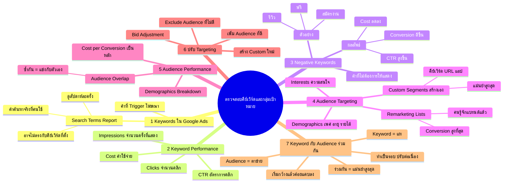

# ตรวจสอบคีย์เวิร์ดและกลุ่มเป้าหมาย — YTOPT-005
> **Format:** Mind Map
> **Source:** SWP3 Ch22 วิธีปรับแต่งแคมเปญ Youtube Ads ตอนที่ 5
> **Production:** PinkCastle Academy | จูล่ง CTO
> **Date:** 2026-02-18

---

## Text-based Mind Map

```
ตรวจสอบคีย์เวิร์ดและกลุ่มเป้าหมาย
├── 1. Keywords ใน Google Ads
│   ├── คีย์เวิร์ด = คำที่ Trigger โฆษณา
│   ├── Search Terms Report
│   │   ├── คำค้นหาจริงที่คนใช้
│   │   ├── อาจไม่ตรงกับคีย์เวิร์ดที่ตั้ง
│   │   ├── Google Match คำที่เกี่ยวข้องด้วย
│   │   └── ดูอย่างน้อยสัปดาห์ละครั้ง
│   └── ตัวอย่าง
│       ├── ตั้ง "เรียนทำเว็บ"
│       └── คนอาจค้นหา "สอนทำเว็บฟรี"
├── 2. Keyword Performance
│   ├── 4 ตัวเลขสำคัญ
│   │   ├── Impressions — จำนวนครั้งที่แสดง
│   │   ├── Clicks — จำนวนคลิก
│   │   ├── CTR — อัตราการคลิก
│   │   └── Cost — ค่าใช้จ่าย
│   ├── Impressions สูง + CTR ต่ำ = ข้อความไม่ดึงดูด
│   └── Cost สูง + Conversion ต่ำ = คีย์เวิร์ดไม่คุ้ม
├── 3. Negative Keywords
│   ├── คำที่ไม่ต้องการให้โฆษณาแสดง
│   ├── ตัวอย่าง
│   │   ├── "ฟรี" — ถ้าขายของเสียเงิน
│   │   ├── "สมัครงาน" — ถ้าไม่รับสมัคร
│   │   └── "รีวิว" — ถ้าต้องการคนพร้อมซื้อ
│   ├── หาจาก Search Terms Report
│   └── ผลลัพธ์
│       ├── CTR สูงขึ้น
│       ├── Cost ลดลง
│       └── Conversion Rate ดีขึ้น
├── 4. Audience Targeting
│   ├── Demographics
│   │   ├── เพศ
│   │   ├── อายุ
│   │   ├── รายได้
│   │   └── ต้องตรงกับลูกค้าจริง
│   ├── Interests
│   │   ├── ความสนใจตามพฤติกรรมท่องเว็บ
│   │   ├── Digital Marketing
│   │   ├── E-commerce
│   │   └── เลือกให้ตรงกับสินค้า
│   ├── Custom Segments
│   │   ├── สร้างเองได้
│   │   ├── ใส่คีย์เวิร์ดที่กลุ่มเป้าหมายค้นหา
│   │   ├── URL ของเว็บที่เข้าชม
│   │   ├── แอปที่ใช้
│   │   └── แม่นยำสูงกว่า Audience สำเร็จรูป
│   └── Remarketing Lists
│       ├── คนที่เคยเข้าเว็บ
│       ├── คนที่เคยดูวิดีโอ
│       ├── คนที่เคยมีปฏิสัมพันธ์กับแบรนด์
│       └── Conversion Rate สูงที่สุด
├── 5. Audience Performance
│   ├── ดูจาก Cost per Conversion
│   │   ├── เรียงจากน้อยไปมาก
│   │   ├── ด้านบน = คุ้มค่า → เพิ่มงบ
│   │   └── ด้านล่าง = ไม่คุ้ม → ตัดหรือลดงบ
│   ├── Audience Overlap
│   │   ├── กลุ่มซ้ำกัน = แข่งกับตัวเอง
│   │   ├── ราคา Bid สูงขึ้นฟรี
│   │   └── รวมกลุ่มที่ซ้อนกัน
│   └── Demographics Breakdown
│       └── แยกดูเพศ/อายุภายในแต่ละ Audience
├── 6. ปรับ Targeting
│   ├── เพิ่ม Audience ที่ดี
│   │   └── หากลุ่มคล้ายกับกลุ่มที่ทำงานดี
│   ├── Exclude Audience ที่ไม่ดี
│   │   └── ตัดกลุ่มที่เสียเงินเยอะแต่ไม่ได้ผล
│   ├── สร้าง Custom Audience ใหม่
│   │   └── ใช้ข้อมูลจากการวิเคราะห์
│   └── Bid Adjustment
│       ├── ลด Bid สำหรับกลุ่มไม่ดี
│       └── เพิ่ม Bid สำหรับกลุ่มที่ดี
└── 7. Keyword + Audience ร่วมกัน
    ├── Keyword = แห (จับจากคำค้นหา)
    ├── Audience = ตาข่าย (คัดกรองกลุ่มเป้าหมาย)
    ├── ใช้ร่วมกัน = แม่นยำสูงสุด
    ├── ตัวอย่าง
    │   ├── Keyword: "เรียน YouTube Ads"
    │   ├── Audience: เจ้าของธุรกิจ SME อายุ 25-44
    │   └── ผลลัพธ์: เจาะเฉพาะเจ้าของธุรกิจที่กำลังหาเรียน
    └── วงจรการปรับ
        ├── เริ่มกว้าง
        ├── ดูข้อมูล
        ├── ปรับแคบลง
        ├── ตัดสิ่งที่ไม่ดี
        ├── เพิ่มสิ่งที่ดี
        └── ทำซ้ำเป็นรอบๆ
```

---

## Mermaid Mind Map



---

> ทบทวนต่อ: **YTOPT-007** — ตรวจสอบตำแหน่งที่แสดงโฆษณา
> Series: SWP3 Ch22 วิธีปรับแต่งแคมเปญ Youtube Ads
> PinkCastle Academy © 2026

---

*Node count: 82 | Depth: 4 levels*
