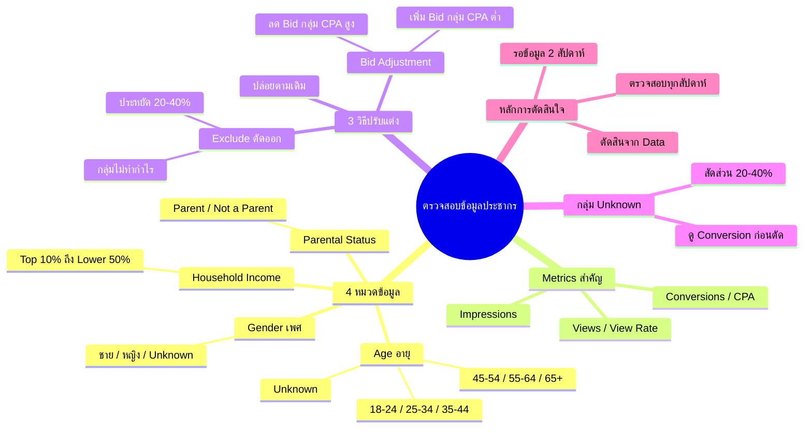

# ตรวจสอบข้อมูลประชากร — YTOPT-006
> **Format:** Mind Map
> **Source:** SWP3 Ch22 วิธีปรับแต่งแคมเปญ Youtube Ads ตอนที่ 6
> **Production:** PinkCastle Academy | จูล่ง CTO
> **Date:** 2026-02-17

---

## Text-based Mind Map

```
ตรวจสอบข้อมูลประชากร (Demographics)
├── 4 หมวดข้อมูลหลัก
│   ├── Age (อายุ)
│   │   ├── 18-24, 25-34, 35-44
│   │   ├── 45-54, 55-64, 65+
│   │   └── Unknown
│   ├── Gender (เพศ)
│   │   ├── ชาย
│   │   ├── หญิง
│   │   └── Unknown
│   ├── Household Income (รายได้)
│   │   ├── Top 10% ถึง 41-50%
│   │   ├── Lower 50%
│   │   └── Unknown
│   └── Parental Status (สถานะพ่อแม่)
│       ├── Parent (มีลูก)
│       ├── Not a Parent
│       └── Unknown
├── Metrics ที่ต้องดู
│   ├── Impressions (จำนวนการแสดง)
│   ├── Views (จำนวนการดู)
│   ├── View Rate (อัตราการดู)
│   ├── Conversions (จำนวน Conversion)
│   └── CPA (ต้นทุนต่อ Conversion)
├── 3 วิธีปรับแต่ง
│   ├── Exclude (ตัดออก)
│   │   ├── กลุ่ม Impression สูง Conversion ศูนย์
│   │   └── ประหยัดงบ 20-40%
│   ├── Bid Adjustment (ปรับราคาประมูล)
│   │   ├── เพิ่ม Bid +20-50% กลุ่ม CPA ต่ำ
│   │   ├── ลด Bid -30-50% กลุ่ม CPA สูง
│   │   └── ละเอียดกว่าการ Exclude
│   └── ปล่อยตามเดิม
│       └── กลุ่ม CPA ใกล้เคียงค่าเฉลี่ย
├── กลุ่ม Unknown
│   ├── สัดส่วน 20-40% ของผู้ชมทั้งหมด
│   ├── ดู Conversion ก่อนตัดสินใจ
│   └── อย่า Exclude โดยไม่ดูข้อมูล
├── การตัดสินใจจากข้อมูล
│   ├── รอข้อมูลอย่างน้อย 2 สัปดาห์
│   ├── Impression ขั้นต่ำ 1,000-5,000 ต่อกลุ่ม
│   ├── เปรียบเทียบ CPA ต่อกลุ่ม
│   └── ตัดสินจาก Data ไม่ใช่ความรู้สึก
└── ความถี่ในการตรวจสอบ
    ├── สัปดาห์ละ 1 ครั้งเป็นอย่างน้อย
    ├── ดูร่วมกับ Device + Location
    └── ปรับตามฤดูกาล/ช่วงเวลา
```

---

## Mermaid Mind Map



---

*Node count: 37 | Depth: 3 levels*
