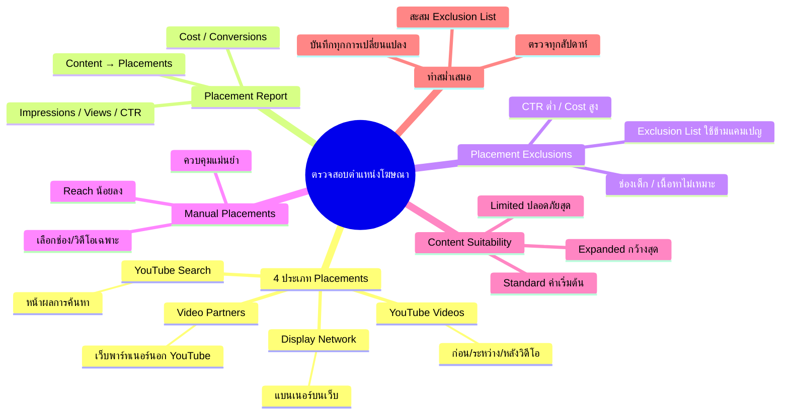

# ตรวจสอบตำแหน่งที่แสดงโฆษณา — YTOPT-007 Mind Map
> **Format:** Mind Map
> **Source:** SWP3 Ch22 วิธีปรับแต่งแคมเปญ Youtube Ads ตอนที่ 7
> **Production:** PinkCastle Academy | จูล่ง CTO
> **Date:** 2026-02-18 | **Duration:** 0:08:12

---

## Text-based Mind Map

```
ตรวจสอบตำแหน่งที่แสดงโฆษณา (Placements)
├── 4 ประเภท Placements
│   ├── YouTube Search
│   │   └── แสดงในหน้าค้นหา YouTube
│   ├── YouTube Videos
│   │   └── ก่อน/ระหว่าง/หลังวิดีโอ
│   ├── Video Partners
│   │   └── เว็บไซต์พาร์ทเนอร์นอก YouTube
│   └── Display Network
│       └── แบนเนอร์บนเว็บต่างๆ
├── Placement Report
│   ├── เข้าที่ Content → Placements → Where Ads Showed
│   ├── ดู Impressions / Views / CTR
│   ├── ดู Cost / Conversions
│   └── เปรียบเทียบแต่ละตำแหน่ง
├── Placement Exclusions
│   ├── ยกเว้นตำแหน่งที่ไม่ดี
│   │   ├── ช่องเด็ก (Impression สูง, Conversion ศูนย์)
│   │   ├── เนื้อหาไม่เหมาะสม
│   │   └── CTR ต่ำมาก / Cost สูง
│   └── Exclusion List
│       ├── สร้างรายการกลาง
│       └── ใช้ร่วมหลายแคมเปญ
├── Manual Placements
│   ├── เลือกช่อง/วิดีโอ/เว็บเฉพาะ
│   ├── ข้อดี: ควบคุมแม่นยำ 100%
│   ├── ข้อเสีย: Reach น้อยลงมาก
│   └── แนะนำ: ใช้เป็นแคมเปญเสริม
├── Content Suitability
│   ├── Expanded Inventory
│   │   └── กว้างสุด Reach สูง เสี่ยงแบรนด์
│   ├── Standard Inventory
│   │   └── ค่าเริ่มต้น กรองบางส่วน
│   └── Limited Inventory
│       └── จำกัดสุด ปลอดภัยสูงสุด
├── วิเคราะห์ Performance
│   ├── เปรียบเทียบ CTR ของแต่ละตำแหน่ง
│   ├── เปรียบเทียบ Cost ต่อ Conversion
│   ├── เพิ่มงบตำแหน่งที่ดี
│   └── Exclude ตำแหน่งที่ไม่ดี
└── ทำสม่ำเสมอ
    ├── ตรวจสอบอย่างน้อยสัปดาห์ละครั้ง
    ├── Google กระจายตำแหน่งใหม่ตลอด
    ├── สะสม Exclusion List ไปเรื่อยๆ
    └── บันทึกการเปลี่ยนแปลงทุกครั้ง
```

---

## Mermaid Mind Map



---

> ทบทวนต่อ: **YTOPT-008** — เริ่มต้นทำแคมเปญใหม่
> Series: SWP3 Ch22 วิธีปรับแต่งแคมเปญ Youtube Ads
> PinkCastle Academy © 2026

---

*Node count: 38 | Depth: 3 levels*
