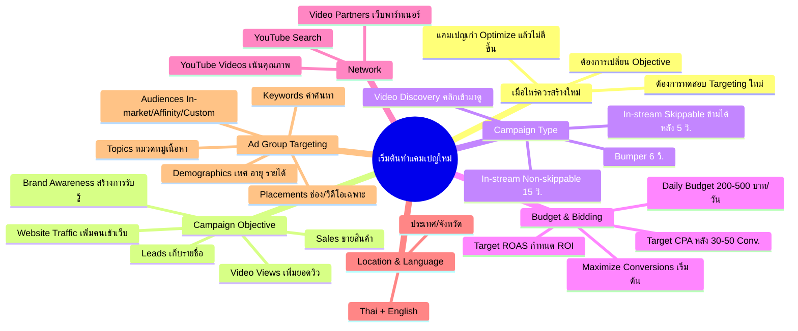

# เริ่มต้นทำแคมเปญใหม่ — YTOPT-008 Mind Map
> **Format:** Mind Map
> **Source:** SWP3 Ch22 วิธีปรับแต่งแคมเปญ Youtube Ads ตอนที่ 8
> **Production:** PinkCastle Academy | จูล่ง CTO
> **Date:** 2026-02-18 | **Duration:** 0:09:23

---

## Text-based Mind Map

```
เริ่มต้นทำแคมเปญใหม่ (New Campaign Setup)
├── เมื่อไหร่ควรสร้างใหม่
│   ├── แคมเปญเก่า Optimize แล้วไม่ดีขึ้น
│   ├── ต้องการทดสอบ Targeting ใหม่ทั้งหมด
│   └── ต้องการเปลี่ยน Objective
│       └── Objective เปลี่ยนภายหลังไม่ได้
├── Campaign Objective (5 ตัว)
│   ├── Sales — ขายสินค้า/บริการ
│   ├── Leads — เก็บรายชื่อ
│   ├── Website Traffic — เพิ่มคนเข้าเว็บ
│   ├── Brand Awareness — สร้างการรับรู้
│   └── Video Views — เพิ่มยอดวิว
├── Campaign Type (4 รูปแบบ)
│   ├── In-stream Skippable
│   │   └── ข้ามได้หลัง 5 วินาที
│   ├── In-stream Non-skippable
│   │   └── 15 วินาที ข้ามไม่ได้
│   ├── Bumper
│   │   └── 6 วินาที ข้ามไม่ได้
│   └── Video Discovery
│       └── ผู้ชมคลิกเข้ามาดูเอง
├── Budget & Bidding
│   ├── Daily Budget
│   │   └── เริ่มต้น 200-500 บาท/วัน
│   ├── Maximize Conversions
│   │   └── เริ่มต้น ยังไม่มีข้อมูล
│   ├── Target CPA
│   │   └── หลังสะสม 30-50 Conversions
│   └── Target ROAS
│       └── ต้องการ ROI เฉพาะ
├── Network (3 ตัวเลือก)
│   ├── YouTube Search
│   │   └── แสดงในหน้าค้นหา
│   ├── YouTube Videos
│   │   └── ก่อน/ระหว่าง/หลังวิดีโอ
│   └── Video Partners
│       └── เว็บพาร์ทเนอร์นอก YouTube
├── Location & Language
│   ├── Location
│   │   ├── เลือกระดับประเทศหรือจังหวัด
│   │   └── เจาะจังหวัดเฉพาะถ้ารู้กลุ่มเป้าหมาย
│   └── Language
│       ├── Thai เป็นหลัก
│       └── เพิ่ม English (คนไทยตั้งภาษาเครื่องเป็น EN)
└── Ad Group Settings (5 มิติ)
    ├── Demographics
    │   └── เพศ อายุ รายได้ สถานะผู้ปกครอง
    ├── Audiences
    │   ├── In-market (กำลังหาซื้อ)
    │   ├── Affinity (สนใจระยะยาว)
    │   └── Custom (สร้างเอง)
    ├── Keywords
    │   └── คำค้นหา/เนื้อหาที่เกี่ยวข้อง
    ├── Topics
    │   └── หมวดหมู่ Business/Marketing/Tech
    └── Placements
        └── ช่อง/วิดีโอเฉพาะเจาะจง
```

---

## Mermaid Mind Map



---

> ทบทวนต่อ: **YTOPT-009** — Set Conversion
> Series: SWP3 Ch22 วิธีปรับแต่งแคมเปญ Youtube Ads
> PinkCastle Academy © 2026

---

*Node count: 48 | Depth: 3 levels*
