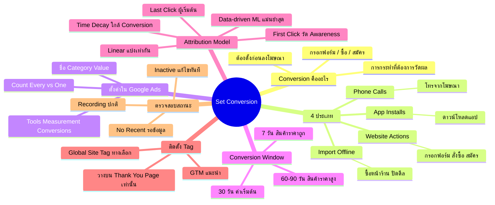

# Set Conversion — YTOPT-009 Mind Map
> **Format:** Mind Map
> **Source:** SWP3 Ch22 วิธีปรับแต่งแคมเปญ Youtube Ads ตอนที่ 9
> **Production:** PinkCastle Academy | จูล่ง CTO
> **Date:** 2026-02-18 | **Duration:** 0:11:11

---

## Text-based Mind Map

```
Set Conversion (ตั้งค่า Conversion Tracking)
├── Conversion คืออะไร
│   ├── การกระทำที่ต้องการให้ลูกค้าทำ
│   ├── กรอกฟอร์ม / ซื้อสินค้า / สมัครสมาชิก
│   └── ต้องตั้งก่อนเริ่มลงโฆษณาเสมอ
├── 4 ประเภท Conversion
│   ├── Website Actions
│   │   └── กรอกฟอร์ม, สั่งซื้อ, สมัคร (ใช้บ่อยสุด)
│   ├── Phone Calls
│   │   └── โทรจากเบอร์ในโฆษณา
│   ├── App Installs
│   │   └── ดาวน์โหลดแอปมือถือ
│   └── Import (Offline)
│       └── ซื้อหน้าร้าน / ปิดดีล CRM
├── ตั้งค่าใน Google Ads
│   ├── Tools → Measurement → Conversions
│   ├── New Conversion Action
│   ├── ตั้งชื่อ + Category
│   ├── Value (มูลค่าต่อ Conversion)
│   └── Count
│       ├── Every → E-commerce (นับทุกครั้ง)
│       └── One → Lead Gen (นับ 1 ครั้งต่อคน)
├── Conversion Window
│   ├── 7 วัน → สินค้าราคาถูก ตัดสินใจเร็ว
│   ├── 30 วัน → ค่าเริ่มต้น ครอบคลุมทั่วไป
│   ├── 60 วัน → สินค้าราคาสูง
│   └── 90 วัน → อสังหาริมทรัพย์ รถยนต์
├── Attribution Model
│   ├── Last Click
│   │   └── เครดิต → คลิกสุดท้าย (แนะนำผู้เริ่มต้น)
│   ├── First Click
│   │   └── เครดิต → คลิกแรก (วัด Awareness)
│   ├── Linear
│   │   └── แบ่งเท่ากันทุกจุดสัมผัส
│   ├── Time Decay
│   │   └── เครดิตมากกว่า → จุดใกล้ Conversion
│   └── Data-driven
│       └── Google ML วิเคราะห์ (แม่นยำสุด)
├── ติดตั้ง Conversion Tag
│   ├── วิธีที่ 1: Google Tag Manager (แนะนำ)
│   │   ├── สร้าง Tag → Conversion Tracking
│   │   ├── ใส่ Conversion ID + Label
│   │   └── Trigger → Thank You Page URL
│   ├── วิธีที่ 2: Global Site Tag
│   │   └── วางโค้ด JavaScript ลงเว็บตรง
│   └── สำคัญ: วางบน Thank You Page เท่านั้น
│       └── ห้ามวางบนหน้าแรก / หน้าสินค้า
└── ตรวจสอบ Conversion
    ├── Recording → ทำงานปกติ
    ├── No Recent Conversions → ยังไม่มีข้อมูล
    ├── Inactive → มีปัญหา ต้องแก้ไข
    └── แก้ไข Inactive
        ├── ตรวจ Tag วางถูกหน้า
        ├── ใช้ Google Tag Assistant
        ├── ทำ Test Conversion ด้วยตัวเอง
        └── ตรวจ Conversion ID / Label
```

---

## Mermaid Mind Map



---

> ทบทวนต่อ: **YTOPT-010** — Google กับ Kartra ทำงานร่วมกัน
> Series: SWP3 Ch22 วิธีปรับแต่งแคมเปญ Youtube Ads
> PinkCastle Academy © 2026

---

*Node count: 48 | Depth: 3 levels*
