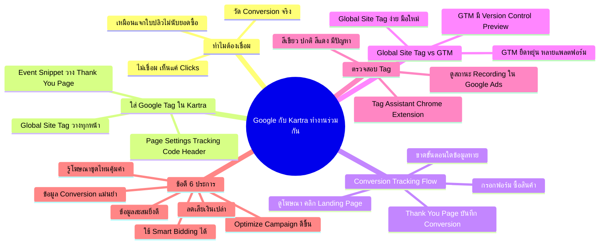

# Google กับ Kartra ทำงานร่วมกัน — YTOPT-010 Mind Map
> **Format:** Mind Map
> **Source:** SWP3 Ch22 วิธีปรับแต่งแคมเปญ Youtube Ads ตอนที่ 10
> **Production:** PinkCastle Academy | จูล่ง CTO
> **Date:** 2026-02-18 | **Duration:** 0:06:52

---

## Text-based Mind Map

```
Google กับ Kartra ทำงานร่วมกัน
├── ทำไมต้องเชื่อม
│   ├── วัด Conversion จริง (กรอกฟอร์ม/ซื้อ)
│   ├── ถ้าไม่เชื่อม → Google เห็นแค่ Clicks
│   └── เหมือนแจกใบปลิวแต่ไม่รู้ว่าใครมาซื้อ
├── วิธีใส่ Google Tag ใน Kartra
│   ├── Kartra → Page Settings → Tracking Code → Header
│   ├── Tag ส่วนที่ 1: Global Site Tag
│   │   └── วางทุกหน้าที่เกี่ยวข้อง
│   └── Tag ส่วนที่ 2: Event Snippet
│       └── วางเฉพาะ Thank You Page
├── Conversion Tracking Flow
│   ├── 1. คนดูโฆษณา (YouTube / Google Search)
│   ├── 2. คลิกโฆษณา
│   ├── 3. เข้า Kartra Landing Page
│   ├── 4. กรอกฟอร์ม / ซื้อสินค้า
│   ├── 5. Thank You Page (มี Tag) → บันทึก Conversion
│   └── ขาดขั้นตอนใด → ข้อมูลหาย
├── Global Site Tag vs GTM
│   ├── Global Site Tag
│   │   ├── ง่าย วางโค้ดตรง
│   │   ├── เหมาะมือใหม่ มี Tag 1-2 ตัว
│   │   └── ไม่มี Version Control
│   └── Google Tag Manager (GTM)
│       ├── ยืดหยุ่น จัดการหลาย Tag จากที่เดียว
│       ├── เหมาะใช้หลายแพลตฟอร์มโฆษณา
│       ├── มี Version Control
│       └── มี Preview Mode
├── ตรวจสอบว่า Tag ทำงาน
│   ├── Google Tag Assistant (Chrome Extension ฟรี)
│   │   ├── สีเขียว = ปกติ
│   │   ├── สีเหลือง = มีข้อเตือน
│   │   └── สีแดง = มีปัญหา
│   └── ดูสถานะ Conversion ใน Google Ads
│       ├── Recording = ปกติ
│       └── Inactive = ต้องตรวจ Tag ใหม่
└── ข้อดีของการเชื่อม (6 ประการ)
    ├── 1. ข้อมูล Conversion แม่นยำ
    ├── 2. Optimize Campaign ได้ดีขึ้น
    ├── 3. ใช้ Smart Bidding ได้
    ├── 4. รู้ว่าโฆษณาชุดไหนคุ้มค่า
    ├── 5. ลดการเสียเงินเปล่า
    └── 6. ข้อมูลสะสมยิ่ง Optimize ดีขึ้น
```

---

## Mermaid Mind Map



---

> ทบทวนต่อ: **YTOPT-012** — ลงโฆษณา Google Ads ตอนที่ 2
> Series: SWP3 Ch22 วิธีปรับแต่งแคมเปญ Youtube Ads
> PinkCastle Academy © 2026

---

*Node count: 42 | Depth: 3 levels*
