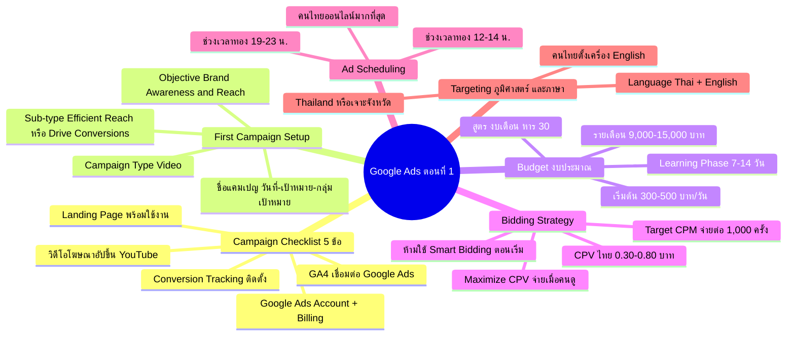
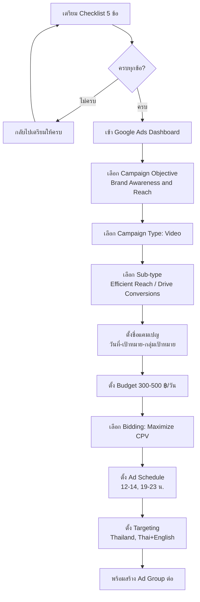
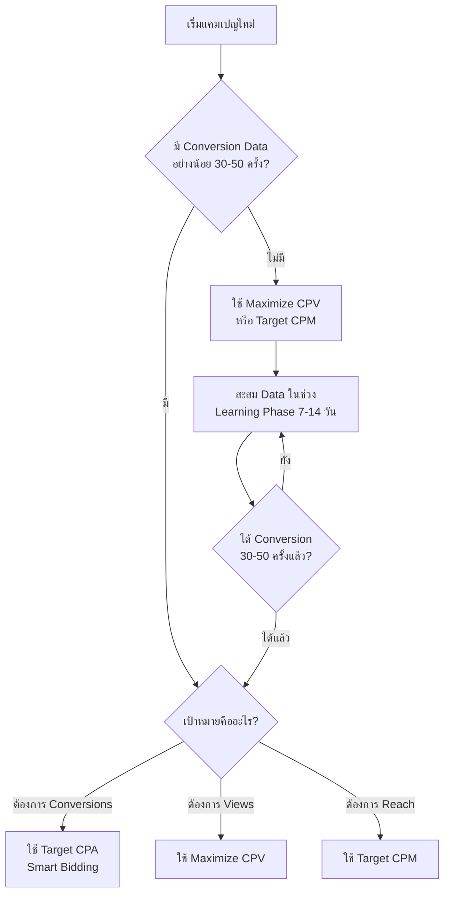
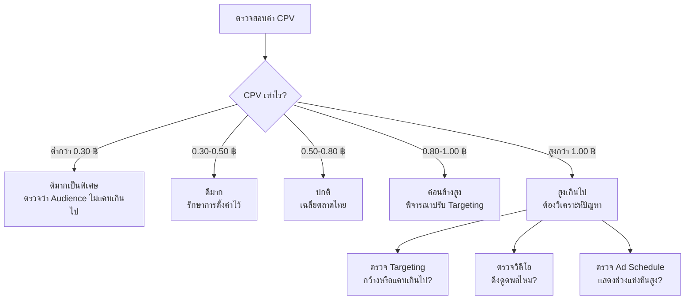

# ลงโฆษณา Google Ads ตอนที่ 1 — YTOPT-011 Mind Map
> **Format:** Mind Map
> **Source:** SWP3 Ch22 วิธีปรับแต่งแคมเปญ Youtube Ads ตอนที่ 11
> **Production:** PinkCastle Academy | จูล่ง CTO
> **Date:** 2026-02-18 | **Duration:** 0:43:01

---

## Part 1: Text-based Mind Map

```
ลงโฆษณา Google Ads ตอนที่ 1 (Setup → Budget → Bidding → Targeting)
├── Campaign Launch Checklist (5 ข้อ)
│   ├── 1. Google Ads Account + Billing พร้อม
│   ├── 2. GA4 เชื่อมต่อ Google Ads แล้ว
│   ├── 3. Conversion Tracking ติดตั้งแล้ว
│   │   └── ห้ามข้ามเด็ดขาด = เหมือนขับรถไม่มีมาตรวัด
│   ├── 4. วิดีโอโฆษณาอัปขึ้น YouTube แล้ว
│   └── 5. Landing Page พร้อมใช้งาน
├── First Campaign Setup
│   ├── เลือก Campaign Objective
│   │   ├── แนะนำ: "Brand Awareness and Reach"
│   │   └── ทดสอบว่าวิดีโอดึงดูดคนได้แค่ไหน
│   ├── เลือก Campaign Type
│   │   ├── เลือก "Video"
│   │   ├── Sub-type: Efficient Reach (ดูจบ)
│   │   └── Sub-type: Drive Conversions (คลิกไปเว็บ)
│   └── ตั้งชื่อแคมเปญเป็นระบบ
│       └── รูปแบบ: [วันที่]-[เป้าหมาย]-[กลุ่มเป้าหมาย]
├── Budget Allocation (งบประมาณ)
│   ├── งบเริ่มต้น: 300-500 บาท/วัน
│   ├── งบรายเดือน: 9,000-15,000 บาท
│   ├── สูตร: งบรายเดือน ÷ 30 = งบรายวัน
│   └── Learning Phase 7-14 วัน
│       ├── ห้ามเปลี่ยนงบ
│       ├── ห้ามเปลี่ยน Targeting
│       ├── ห้ามเปลี่ยน Bid
│       └── ปล่อยให้ระบบเรียนรู้
├── Bidding Strategy (กลยุทธ์ประมูล)
│   ├── Maximize CPV (Cost Per View)
│   │   └── จ่ายเมื่อคนดูวิดีโอจริง
│   ├── Target CPM (Cost Per Mille)
│   │   └── จ่ายต่อการแสดงผล 1,000 ครั้ง
│   ├── CPV เฉลี่ยตลาดไทย: 0.30-0.80 ฿/วิว
│   │   ├── < 0.50 ฿ = ดีมาก
│   │   └── > 1.00 ฿ = ต้องปรับ
│   └── Smart Bidding
│       ├── ห้ามใช้ตอนเริ่มต้น
│       └── รอ Conversion 30-50 ครั้งก่อน
├── Ad Scheduling (ตั้งเวลาโฆษณา)
│   ├── ช่วงเวลาทองตลาดไทย
│   │   ├── 12:00-14:00 น. (พักเที่ยง)
│   │   └── 19:00-23:00 น. (หลังเลิกงาน)
│   └── คนไทยออนไลน์เยอะที่สุด
└── Geographic & Language Targeting
    ├── Geographic: Thailand
    │   └── เจาะจังหวัดได้ เช่น กรุงเทพฯ และปริมณฑล
    └── Language: Thai + English
        └── คนไทยหลายคนตั้งเครื่องเป็น English
```

---

## Part 2: Mermaid Mind Map



---

## Part 3: Flowcharts

### Flowchart 1 — ขั้นตอนการสร้างแคมเปญแรก



### Flowchart 2 — การเลือก Bidding Strategy



### Flowchart 3 — การวิเคราะห์ค่า CPV



---

## Part 4: เปรียบเทียบ Bidding Strategies

| หัวข้อ | Maximize CPV | Target CPM | Smart Bidding (Target CPA) |
|--------|-------------|-----------|--------------------------|
| จ่ายเมื่อ | คนดูวิดีโอจริง (30 วิ หรือดูจบ) | แสดงผล 1,000 ครั้ง | คลิก/Conversion |
| เหมาะกับ | ผู้เริ่มต้น ต้องการวิว | ต้องการ Reach สูงสุด | มี Conversion Data แล้ว |
| ข้อมูลที่ต้องมี | ไม่ต้องมี Conversion ย้อนหลัง | ไม่ต้องมี Conversion ย้อนหลัง | Conversion 30-50 ครั้งขึ้นไป |
| ค่าเฉลี่ยตลาดไทย | 0.30-0.80 ฿/วิว | 30-80 ฿/1,000 ครั้ง | ขึ้นอยู่กับ Industry |
| ความซับซ้อน | ต่ำ | ต่ำ | สูง |
| แนะนำตอนเริ่ม | ใช่ | ใช่ | ไม่ — รอมี Data ก่อน |

---

## Part 5: เปรียบเทียบช่วงเวลา Ad Scheduling

| ช่วงเวลา | ระดับ Traffic | เหมาะกับ | งบที่ใช้ |
|-----------|-------------|----------|---------|
| 06:00-09:00 | ปานกลาง | คนเดินทางไปทำงาน | ปานกลาง |
| 09:00-12:00 | ปานกลาง | คนทำงานออฟฟิศ | ปานกลาง |
| 12:00-14:00 | สูง (ช่วงทอง) | ทุกกลุ่มเป้าหมาย | แนะนำ |
| 14:00-17:00 | ปานกลาง | คนทำงานออฟฟิศ | ปานกลาง |
| 17:00-19:00 | ปานกลาง-สูง | คนเดินทางกลับบ้าน | คุ้มค่า |
| 19:00-23:00 | สูงมาก (ช่วงทอง) | ทุกกลุ่มเป้าหมาย | แนะนำ |
| 23:00-01:00 | ปานกลาง | Night Owl | เฉพาะกลุ่ม |
| 01:00-06:00 | ต่ำมาก | ไม่แนะนำ | เปลืองงบ |

---

## Part 6: สรุปภาพรวม

```
┌─────────────────────────────────────────────┐
│  ลงโฆษณา Google Ads ตอนที่ 1 — สรุป 5 เรื่อง  │
├─────────────────────────────────────────────┤
│                                             │
│  1. Checklist 5 ข้อ → ต้องครบก่อนเริ่ม       │
│  2. Campaign Setup → Awareness + Video       │
│  3. Budget → 300-500 ฿/วัน                   │
│  4. Bidding → Maximize CPV / Target CPM     │
│  5. Targeting → เวลาทอง + Thai/EN + พื้นที่   │
│                                             │
│  กฎเหล็ก: ห้ามแตะแคมเปญ 7-14 วันแรก         │
│                                             │
└─────────────────────────────────────────────┘
```

---

## Part 7: Key Takeaway

> **"เตรียมให้พร้อม ตั้งค่าให้ถูก แล้วปล่อยให้ระบบเรียนรู้"**

1. **Checklist ครบ 5 ข้อ** = รากฐานที่แข็งแกร่ง
2. **งบ 300-500 ฿/วัน** = จุดเริ่มต้นที่สมดุล
3. **Maximize CPV** = Bidding ที่เหมาะกับผู้เริ่มต้น
4. **ช่วงเวลาทอง** = 12-14 น. และ 19-23 น.
5. **Learning Phase** = ห้ามเปลี่ยนแปลงอะไร 7-14 วัน

---

> ทบทวนต่อ: **YTOPT-012** — ลงโฆษณา Google Ads ตอนที่ 2
> Series: SWP3 Ch22 วิธีปรับแต่งแคมเปญ Youtube Ads
> PinkCastle Academy © 2026

---

*Node count: 56 | Depth: 3-4 levels | Flowcharts: 3 | Comparisons: 2*
