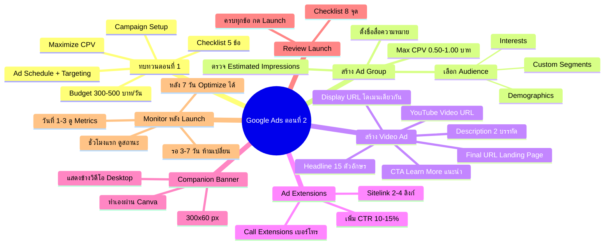

# ลงโฆษณา Google Ads ตอนที่ 2 — YTOPT-012 Mind Map
> **Format:** Mind Map
> **Source:** SWP3 Ch22 วิธีปรับแต่งแคมเปญ Youtube Ads ตอนที่ 12
> **Production:** PinkCastle Academy | จูล่ง CTO
> **Date:** 2026-02-18 | **Duration:** 0:44:29

---

## Text-based Mind Map

```
ลงโฆษณา Google Ads ตอนที่ 2 (Ad Group → Launch → Monitor)
├── ทบทวนตอนที่ 1
│   ├── Checklist 5 ข้อ
│   ├── Campaign Setup (Objective + Type)
│   ├── Budget 300-500 ฿/วัน
│   ├── Bidding Strategy (Maximize CPV)
│   └── Ad Schedule + Geographic Targeting
├── สร้าง Ad Group
│   ├── ตั้งชื่อ
│   │   └── "Awareness-Entrepreneur-25-45"
│   ├── เลือก Audience
│   │   ├── Demographics (อายุ เพศ)
│   │   ├── Interests (ความสนใจ)
│   │   └── Custom Segments (กำหนดเอง)
│   ├── ตั้ง Max CPV Bid
│   │   └── 0.50-1.00 ฿/วิว สำหรับตลาดไทย
│   └── ตรวจ Estimated Impressions
│       └── "Too Narrow" → ขยาย Audience
├── สร้าง Video Ad
│   ├── YouTube Video URL
│   │   └── วิดีโอต้อง Public/Unlisted
│   ├── Final URL
│   │   └── Landing Page (ห้ามใช้ Homepage)
│   ├── Display URL
│   │   └── โดเมนเดียวกับ Final URL
│   ├── CTA (Call-to-Action)
│   │   ├── Awareness → "Learn More"
│   │   ├── Consideration → "Sign Up"
│   │   └── Conversion → "Shop Now"
│   ├── Headline
│   │   └── จำกัด 15 ตัวอักษร
│   └── Description
│       └── 2 บรรทัดเสริม
├── Ad Extensions
│   ├── Sitelink Extensions
│   │   ├── ลิงก์เพิ่มเติม 2-4 ลิงก์
│   │   └── หน้าราคา / รีวิว / สมัครทดลอง
│   ├── Call Extensions
│   │   └── แสดงเบอร์โทรศัพท์
│   └── เพิ่ม CTR ได้ 10-15%
├── Companion Banner
│   ├── ขนาด 300x60 พิกเซล
│   ├── แสดงข้างวิดีโอบน Desktop
│   ├── ทำเองผ่าน Canva (แนะนำ)
│   └── ถ้าไม่อัปโหลด → Google ดึงจาก YouTube
├── Review & Launch
│   ├── Checklist 8 จุด
│   │   ├── Budget ตรงตามแผน
│   │   ├── Bidding Strategy ถูกต้อง
│   │   ├── Audience ไม่แคบ/กว้างเกินไป
│   │   ├── Video Ad URL ถูกต้อง
│   │   ├── Final URL ไปที่ Landing Page
│   │   ├── CTA เหมาะสม
│   │   ├── Conversion Tracking Active
│   │   └── Ad Extensions ใส่ครบ
│   └── ครบทุกข้อ → กด Launch!
└── Monitor หลัง Launch
    ├── ชั่วโมงที่ 1
    │   └── ดูสถานะ Active / Under Review
    ├── วันที่ 1
    │   └── ดู Impressions, Views
    ├── วันที่ 1-3
    │   └── ดู CTR เบื้องต้น
    ├── วันที่ 3-7
    │   └── ดูแนวโน้ม (ห้ามเปลี่ยนอะไร!)
    ├── หลังวันที่ 7
    │   └── เริ่ม Optimize ได้
    └── กฎเหล็ก
        ├── ห้ามเปลี่ยน Budget/Bidding/Targeting ใน 7 วัน
        └── ทุกครั้งที่เปลี่ยน = Reset Learning Phase
```

---

## Mermaid Mind Map



---

> ทบทวนต่อ: **YTOPT-013** — ตรวจการบ้าน
> Series: SWP3 Ch22 วิธีปรับแต่งแคมเปญ Youtube Ads
> PinkCastle Academy © 2026

---

*Node count: 52 | Depth: 3 levels*
