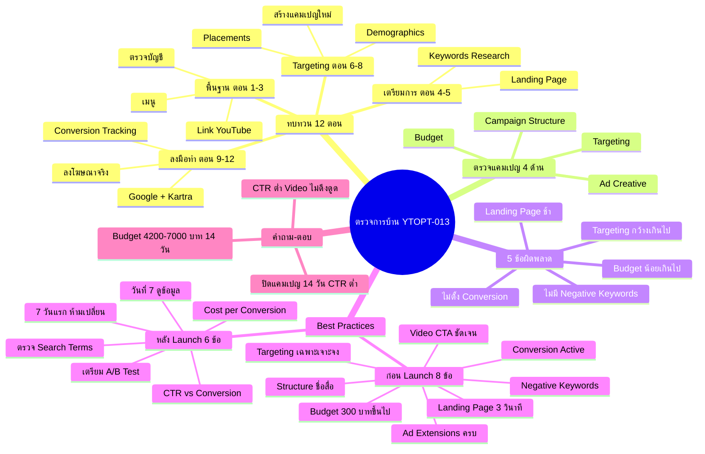

# ตรวจการบ้าน — YTOPT-013 Mind Map
> **Format:** Mind Map
> **Source:** SWP3 Ch22 วิธีปรับแต่งแคมเปญ Youtube Ads ตอนที่ 13
> **Production:** PinkCastle Academy | จูล่ง CTO
> **Date:** 2026-02-18 | **Duration:** 1:50:01

---

## Text-based Mind Map

```
ตรวจการบ้าน (Homework Review — 12 ตอน → วิเคราะห์ → แก้ไข → Best Practices)
├── ทบทวน 12 ตอน
│   ├── ช่วงที่ 1: พื้นฐาน (ตอน 1-3)
│   │   ├── ตรวจสอบบัญชี Google Ads
│   │   ├── ทำความรู้จักเมนู
│   │   └── Link YouTube Channel
│   ├── ช่วงที่ 2: เตรียมการ (ตอน 4-5)
│   │   ├── Landing Page
│   │   └── Keywords Research
│   ├── ช่วงที่ 3: Targeting (ตอน 6-8)
│   │   ├── Demographics
│   │   ├── Placements
│   │   └── สร้างแคมเปญใหม่
│   ├── ช่วงที่ 4: ลงมือทำ (ตอน 9-12)
│   │   ├── Conversion Tracking
│   │   ├── Google + Kartra
│   │   └── ลงโฆษณาจริง 2 ตอน
│   └── หลักการ: ทุกตอนเชื่อมเป็นลูกโซ่
├── ตรวจแคมเปญนักเรียน (4 ด้าน)
│   ├── Campaign Structure
│   │   ├── ชื่อ Campaign สื่อไหม
│   │   └── แยก Ad Group ถูกต้องไหม
│   ├── Targeting
│   │   ├── กว้างเกินไปไหม
│   │   └── แคบเกินไปไหม
│   ├── Budget
│   │   ├── เพียงพอสำหรับ Learning Phase ไหม
│   │   └── อย่างน้อย 300 ฿/วัน
│   └── Ad Creative
│       ├── Video ดึงดูด 5 วินาทีแรกไหม
│       └── CTA ชัดเจนไหม
├── 5 ข้อผิดพลาดที่พบบ่อย
│   ├── 1. Targeting กว้างเกินไป
│   │   ├── อาการ: Impressions เยอะ Views น้อย
│   │   └── แก้: ตั้ง Demographics + Interests + Custom
│   ├── 2. Budget น้อยเกินไป
│   │   ├── อาการ: Learning Phase ยาวนาน
│   │   └── แก้: เริ่ม 300 ฿ เพิ่มทีละ 20-30%
│   ├── 3. ไม่ตั้ง Conversion Tracking
│   │   ├── อาการ: วัดผลไม่ได้ ไม่รู้ ROI
│   │   └── แก้: ตรวจ Tag Active + Webhook
│   ├── 4. Landing Page ช้า
│   │   ├── อาการ: Bounce Rate สูง
│   │   └── แก้: PageSpeed Insights เป้า < 3 วินาที
│   └── 5. ไม่ใส่ Negative Keywords
│       ├── อาการ: โฆษณาแสดงกับคำไม่เกี่ยวข้อง
│       └── แก้: ตรวจ Search Terms ทุกสัปดาห์
├── Best Practices
│   ├── Checklist ก่อน Launch (8 ข้อ)
│   │   ├── Campaign Structure ชื่อสื่อ
│   │   ├── Targeting เฉพาะเจาะจง
│   │   ├── Budget อย่างน้อย 300 ฿/วัน
│   │   ├── Conversion Tracking Active
│   │   ├── Landing Page < 3 วินาที
│   │   ├── Negative Keywords ใส่แล้ว
│   │   ├── Ad Extensions ครบ
│   │   └── Video Ad + CTA ชัดเจน
│   └── Checklist หลัง Launch (6 ข้อ)
│       ├── 7 วันแรก ห้ามเปลี่ยน
│       ├── วันที่ 7 ดูข้อมูลรอบแรก
│       ├── ตรวจ Search Terms ทุกสัปดาห์
│       ├── เปรียบเทียบ CTR vs Conversion Rate
│       ├── ดู Cost per Conversion
│       └── เตรียม A/B Test
└── คำถาม-ตอบ
    ├── ทำไม CTR ต่ำ?
    │   └── Video ไม่ดึงดูด 5 วินาทีแรก / Targeting ไม่ตรง
    ├── ควรปิดแคมเปญเมื่อไร?
    │   └── 14 วัน + CTR < 0.5% + ไม่มี Conversion
    └── Budget ขั้นต่ำเท่าไร?
        └── 300-500 ฿/วัน × 14 วัน = 4,200-7,000 ฿
```

---

## Mermaid Mind Map



---

> ทบทวนต่อ: **YTOPT-014** — วิธีปรับแต่งแคมเปญ Advance ตอน 1
> Series: SWP3 Ch22 วิธีปรับแต่งแคมเปญ Youtube Ads
> PinkCastle Academy © 2026

---

*Node count: 68 | Depth: 4 levels*
