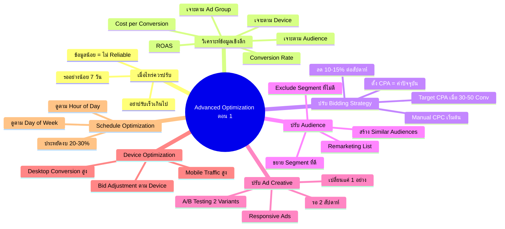

# วิธีปรับแต่งแคมเปญ Advance ตอน 1 — YTOPT-014 Mind Map
> **Format:** Mind Map
> **Source:** SWP3 Ch22 วิธีปรับแต่งแคมเปญ Youtube Ads ตอนที่ 14
> **Production:** PinkCastle Academy | จูล่ง CTO
> **Date:** 2026-02-18 | **Duration:** 0:50:18

---

## Text-based Mind Map

```
Advanced Campaign Optimization ตอน 1 (7 เทคนิค)
├── 1. เมื่อไหร่ควรปรับแคมเปญ
│   ├── กฎ: รออย่างน้อย 7 วัน
│   ├── ข้อมูลน้อยกว่า 7 วัน = ไม่ Reliable
│   ├── ปรับเร็วเกินไป = ขุดต้นไม้ดูรากทุกวัน
│   └── ยิ่งมีข้อมูลเยอะ = ยิ่งตัดสินใจแม่นยำ
├── 2. วิเคราะห์ข้อมูลเชิงลึก
│   ├── 3 Metrics หลัก
│   │   ├── Conversion Rate (อัตราการ Convert)
│   │   ├── Cost per Conversion (ต้นทุนต่อ Conversion)
│   │   └── ROAS (Return on Ad Spend)
│   └── 3 Dimensions เจาะลึก
│       ├── Ad Group (เปรียบเทียบกลุ่ม)
│       ├── Audience (เปรียบเทียบ Segment)
│       └── Device (Mobile / Desktop / Tablet)
├── 3. ปรับ Bidding Strategy
│   ├── เริ่มต้น: Manual CPC
│   ├── เปลี่ยนเมื่อ: 30-50 Conversions ใน 30 วัน
│   ├── เปลี่ยนเป็น: Target CPA
│   ├── ตั้ง Target CPA = Cost per Conversion ปัจจุบัน
│   └── ค่อยๆ ลด 10-15% ต่อสัปดาห์
├── 4. ปรับ Audience
│   ├── ขยาย Audience ที่ดี
│   │   ├── สร้าง Ad Group ใหม่เจาะกลุ่มนี้
│   │   └── เพิ่มงบให้มากขึ้น
│   ├── Exclude Audience ที่ไม่ดี
│   │   ├── 0 Conversions หลัง 14 วัน
│   │   └── ตัดออกหยุดเสียเงิน
│   └── สร้าง Similar Audiences
│       ├── เหมือน Lookalike ของ Facebook
│       ├── สร้าง Remarketing List จากคนที่ Converted
│       └── เลือก "Similar to" ใน Google Ads
├── 5. ปรับ Ad Creative
│   ├── A/B Testing
│   │   ├── สร้าง 2 Variants ใน Ad Group เดียวกัน
│   │   ├── ต่างกันแค่ 1 อย่าง
│   │   ├── รอ 2 สัปดาห์ดูผล
│   │   └── ปิดตัวแพ้ สร้างใหม่ทดสอบต่อ
│   ├── Responsive Ads
│   │   ├── ใส่ Headlines 3-5 ตัว
│   │   ├── ใส่ Description 2-3 ตัว
│   │   └── Google ผสมคอมบิเนชันอัตโนมัติ
│   └── สิ่งที่ทดสอบได้
│       ├── Headlines ใหม่
│       ├── เปลี่ยนวิดีโอ
│       └── เปลี่ยน CTA
├── 6. Device Optimization
│   ├── ตลาดไทย
│   │   ├── Mobile = Traffic สูงสุด
│   │   ├── Desktop = Conversion Rate สูงกว่า
│   │   └── คน Research บน Mobile → Convert บน Desktop
│   ├── Bid Adjustment
│   │   ├── Desktop Conversion สูง → +20-30%
│   │   └── Mobile Performance ต่ำ → -10-20%
│   └── ดูที่ Tab "Devices" ใน Google Ads
└── 7. Schedule Optimization
    ├── ดู Performance ตาม
    │   ├── วันในสัปดาห์ (Day of Week)
    │   └── ช่วงเวลาของวัน (Hour of Day)
    ├── ปรับ Ad Schedule
    │   ├── เพิ่ม Bid ช่วงเวลาทอง
    │   └── ลด/หยุดช่วงที่ไม่ดี (เช่น ตี 2-5)
    └── ประหยัดงบได้ 20-30%
```

---

## Mermaid Mind Map



---

> ทบทวนต่อ: **YTOPT-015** — วิธีปรับแต่งแคมเปญ Advance ตอน 2
> Series: SWP3 Ch22 วิธีปรับแต่งแคมเปญ Youtube Ads
> PinkCastle Academy © 2026

---

*Node count: 58 | Depth: 3 levels*
