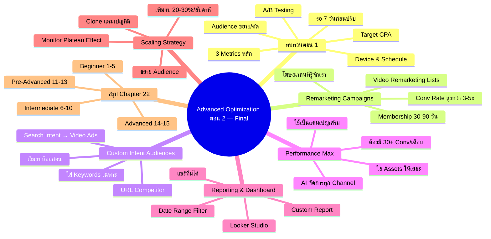

# วิธีปรับแต่งแคมเปญ Advance ตอน 2 — YTOPT-015 Mind Map
> **Format:** Mind Map
> **Source:** SWP3 Ch22 วิธีปรับแต่งแคมเปญ Youtube Ads ตอนที่ 15
> **Production:** PinkCastle Academy | จูล่ง CTO
> **Date:** 2026-02-18 | **Duration:** 0:52:20

---

## Text-based Mind Map

```
Advanced Campaign Optimization ตอน 2 — ตอนจบ (6 เทคนิค + สรุป Chapter)
├── 1. ทบทวน Advance ตอน 1
│   ├── รอ 7 วันก่อนปรับ
│   ├── วิเคราะห์ Conversion Rate / Cost per Conv / ROAS
│   ├── เปลี่ยน Bidding → Target CPA (30-50 Conv)
│   ├── ปรับ Audience ขยาย/ตัด/Similar
│   ├── A/B Testing Creative
│   ├── Device Optimization
│   └── Schedule Optimization
├── 2. Remarketing Campaigns
│   ├── หลักการ
│   │   ├── โฆษณาให้คนที่รู้จักเราแล้ว
│   │   ├── Conversion Rate สูงกว่าคนใหม่ 3-5 เท่า
│   │   └── Cost per Conversion ต่ำกว่า
│   ├── Video Remarketing Lists
│   │   ├── ดูวิดีโอ (Viewed any video)
│   │   ├── ดูจนจบ (Viewed to completion)
│   │   ├── Subscribe ช่อง
│   │   └── เข้าเว็บไซต์ (Google Tag Manager)
│   ├── วิธีสร้าง
│   │   ├── Tools & Settings → Audience Manager
│   │   └── สร้าง Audience → YouTube Users
│   └── Membership Duration: 30-90 วัน
├── 3. Custom Intent Audiences
│   ├── คืออะไร
│   │   ├── สร้าง Audience จากคนที่ค้นหา Keywords
│   │   └── นำ Search Intent มาใช้กับ Video Ads
│   ├── วิธีสร้าง
│   │   ├── Custom Segments
│   │   └── "People who searched for any of these terms"
│   ├── เทคนิค URL Competitor
│   │   ├── ใส่ URL เว็บคู่แข่ง 3-5 เว็บ
│   │   └── Google หาคนที่มีพฤติกรรมคล้าย
│   └── คำเตือน
│       ├── เริ่มงบน้อยก่อน
│       └── ดู Performance 2 สัปดาห์
├── 4. Performance Max (PMax)
│   ├── การทำงาน
│   │   ├── ใส่ Assets (วิดีโอ, รูป, Headlines, Descriptions)
│   │   ├── Google AI จัดสรรไปทุก Channel
│   │   └── YouTube, Search, Display, Gmail, Maps, Discover
│   ├── ข้อดี
│   │   ├── Reach กว้าง
│   │   └── AI Optimize อัตโนมัติ
│   ├── ข้อเสีย
│   │   ├── ควบคุมน้อย
│   │   └── ไม่รู้ว่าโฆษณาไปที่ไหน
│   ├── เงื่อนไข
│   │   ├── ต้องมี 30+ Conversions/เดือนก่อน
│   │   └── อย่าใช้เป็นแคมเปญแรก
│   └── Assets แนะนำ
│       ├── Headlines: 5-15 ตัว
│       ├── Descriptions: 2-5 ตัว
│       └── รูปภาพ/วิดีโอ: หลายตัว
├── 5. Reporting & Dashboard
│   ├── Custom Report (Google Ads)
│   │   ├── เลือก Metrics + Dimensions
│   │   └── Save ไว้ใช้ซ้ำ
│   ├── Looker Studio
│   │   ├── Dashboard สวยงาม
│   │   ├── อัพเดทอัตโนมัติ
│   │   ├── แชร์ลิงก์ให้ทีมได้
│   │   └── Date Range Filter
│   └── Metrics ที่ต้องมี
│       ├── Spend, Impressions, Views, CTR
│       ├── Conversions, Cost per Conversion, ROAS
│       └── แยกตามแคมเปญ
├── 6. Scaling Strategy
│   ├── กฎ 1: เพิ่มงบ 20-30%/สัปดาห์
│   │   └── อย่าเพิ่ม 100% → Reset Learning Phase
│   ├── กฎ 2: ขยาย Audience
│   │   ├── Similar Audiences
│   │   └── Custom Intent ที่กว้างขึ้น
│   ├── กฎ 3: Clone แคมเปญที่ดี
│   │   ├── เปลี่ยน Targeting เล็กน้อย
│   │   └── ไม่ต้องเริ่มจากศูนย์
│   └── กฎ 4: Monitor Plateau Effect
│       ├── CPC เพิ่ม >20% → ชะลอ Scale
│       └── ขยาย Audience ใหม่แทน
└── 7. สรุป Chapter 22 — 15 ตอน
    ├── Beginner (ตอน 1-5)
    │   └── พื้นฐาน, ตั้งค่า, สร้างแคมเปญ, Targeting, งบ
    ├── Intermediate (ตอน 6-10)
    │   └── Ad Formats, Landing Page, Tracking, Analytics, A/B
    ├── Pre-Advanced (ตอน 11-13)
    │   └── Launch จริง, ตรวจการบ้าน, Monitoring
    └── Advanced (ตอน 14-15)
        └── Optimization, Remarketing, PMax, Scaling
```

---

## Mermaid Mind Map



---

> จบ Chapter 22: วิธีปรับแต่งแคมเปญ Youtube Ads — 15 ตอน
> Series: SWP3 Ch22 วิธีปรับแต่งแคมเปญ Youtube Ads
> PinkCastle Academy © 2026

---

*Node count: 72 | Depth: 3 levels | Final Episode*
