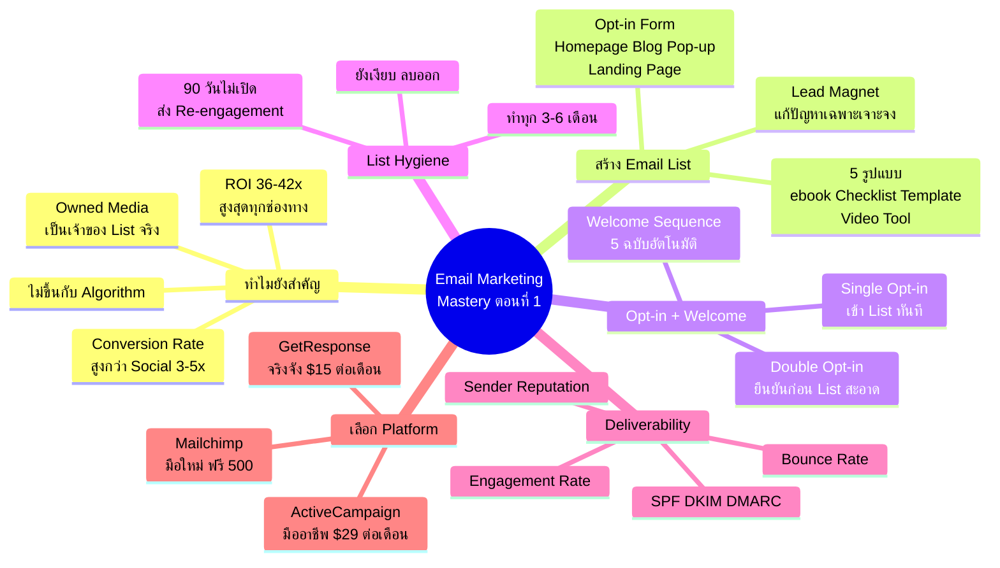
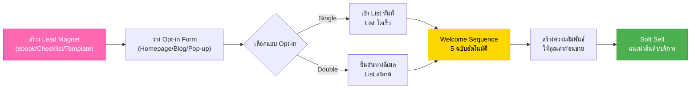
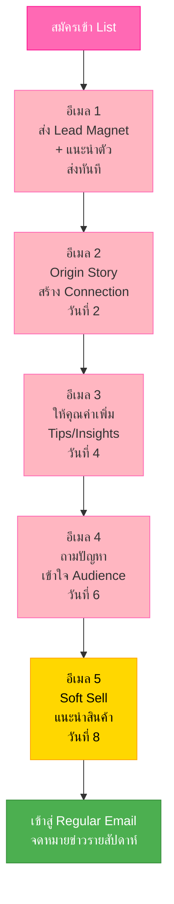
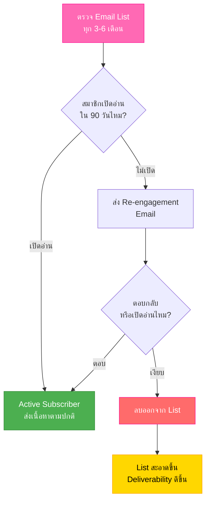

# Email Marketing ตอนที่ 1 — EMKTG-001 Mind Map
> **Format:** Mind Map (Text Structure + Mermaid)
> **Source:** SWP3 Ch24 Email Marketing Mastery ตอนที่ 1
> **Production:** PinkCastle Academy | จูล่ง CTO
> **Date:** 2026-02-18 | **Duration:** 2:31:44

---

## Part 1: Mind Map — โครงสร้างข้อความ (Text Structure)

```
Email Marketing Mastery ตอนที่ 1
│
├── 1. ทำไม Email Marketing ยังสำคัญ
│   ├── ROI สูงสุด 36-42 เท่า
│   ├── Owned Media
│   │   └── เป็นเจ้าของ List จริงๆ
│   ├── ไม่ขึ้นกับ Algorithm
│   │   └── Facebook เปลี่ยน → Reach ตก
│   ├── Inbox = พื้นที่ส่วนตัว
│   │   └── คนยอมให้เข้า = สนใจจริง
│   └── Conversion Rate
│       └── สูงกว่า Social Media 3-5 เท่า
│
├── 2. การสร้าง Email List ตั้งแต่ศูนย์
│   ├── Lead Magnet (กุญแจสำคัญ)
│   │   ├── ต้องแก้ปัญหาเฉพาะเจาะจง
│   │   └── 5 รูปแบบ
│   │       ├── ebook
│   │       ├── Checklist
│   │       ├── Template
│   │       ├── Video Series
│   │       └── Free Tool
│   └── Opt-in Form (จุดเก็บอีเมล)
│       ├── Homepage
│       ├── Blog Post
│       ├── Pop-up
│       └── Dedicated Landing Page
│
├── 3. Opt-in Strategies + Welcome Sequence
│   ├── Single Opt-in
│   │   └── กรอกปุ๊บ เข้า List เลย
│   ├── Double Opt-in (แนะนำ)
│   │   └── ยืนยันอีเมลก่อน → List สะอาด
│   └── Welcome Sequence (5 ฉบับ)
│       ├── ฉบับ 1: ส่ง Lead Magnet + แนะนำตัว
│       ├── ฉบับ 2: เล่าเรื่องราว Origin Story
│       ├── ฉบับ 3: ให้คุณค่าเพิ่มเติม
│       ├── ฉบับ 4: ถามปัญหา/สำรวจ
│       └── ฉบับ 5: แนะนำสินค้า Soft Sell
│
├── 4. List Hygiene + Deliverability
│   ├── List Hygiene
│   │   ├── ทำทุก 3-6 เดือน
│   │   ├── ไม่เปิดอ่าน 90 วัน → Re-engagement
│   │   └── ยังเงียบ → ลบออก
│   └── Deliverability (4 ปัจจัย)
│       ├── Sender Reputation
│       ├── Authentication (SPF/DKIM/DMARC)
│       ├── Engagement Rate
│       └── Bounce Rate
│
└── 5. เลือก Email Platform
    ├── Mailchimp
    │   ├── ฟรี 500 คน
    │   ├── UI สวย ใช้ง่าย
    │   └── เหมาะกับมือใหม่
    ├── GetResponse
    │   ├── ~$15/เดือน
    │   ├── Landing Page ในตัว
    │   └── เหมาะกับเริ่มจริงจัง
    └── ActiveCampaign
        ├── ~$29/เดือน
        ├── Automation ยอดเยี่ยม
        └── เหมาะกับมืออาชีพ
```

---

## Part 2: Mind Map — Mermaid Diagram



---

## Part 3: Flowchart — Email List Building Journey



---

## Part 4: Flowchart — Welcome Sequence Timeline



---

## Part 5: Flowchart — List Hygiene Process



---

## Part 6: เปรียบเทียบ — Email Marketing vs Social Media

| ด้าน | Email Marketing | Social Media |
|-----|----------------|-------------|
| **ความเป็นเจ้าของ** | Owned Media (เราเป็นเจ้าของ) | Rented Media (ยืมพื้นที่) |
| **ROI** | 36-42x | 5-10x |
| **Algorithm** | ไม่มีผลกระทบ | เปลี่ยนตลอด Reach ตกได้ |
| **Conversion** | สูงกว่า 3-5 เท่า | ต่ำกว่า |
| **ความเป็นส่วนตัว** | Inbox ส่วนตัว | Feed สาธารณะ |
| **ต้นทุน** | ต่ำ-ปานกลาง | ค่า Ads สูงขึ้นเรื่อยๆ |
| **สรุป** | สินทรัพย์ระยะยาว | เครื่องมือเสริม |

---

## Part 7: สรุปโครงสร้าง Mind Map

| กิ่งหลัก | จำนวนกิ่งย่อย | ประเด็นสำคัญ |
|---------|-------------|-------------|
| ทำไมยังสำคัญ | 5 | ROI 36-42x, Owned Media, ไม่ขึ้น Algorithm, Inbox ส่วนตัว, Conversion สูง |
| สร้าง Email List | 7 | Lead Magnet 5 แบบ + Opt-in Form 4 จุด |
| Opt-in + Welcome | 8 | Single/Double Opt-in + Welcome Sequence 5 ฉบับ |
| List Hygiene | 4 | ทุก 3-6 เดือน, 90 วัน threshold, Re-engagement, ลบออก |
| Deliverability | 4 | Sender Reputation, SPF/DKIM/DMARC, Engagement, Bounce Rate |
| เลือก Platform | 6 | Mailchimp (มือใหม่) / GetResponse (จริงจัง) / ActiveCampaign (มืออาชีพ) |

**จำนวน node ทั้งหมด:** 41 nodes (6 กิ่งหลัก + 35 กิ่งย่อย)

---

> **หมายเหตุ:** Mermaid mindmap สามารถ render ได้ใน GitHub, Notion (embed), VS Code (Mermaid Preview extension)
> Flowchart แบบทางเลือกใช้ได้ในกรณีที่ platform ไม่รองรับ mindmap syntax

---

> ทบทวนต่อ: **EMKTG-002** — Email Marketing ตอนที่ 2
> Series: SWP3 Ch24 Email Marketing Mastery
> PinkCastle Academy © 2026
