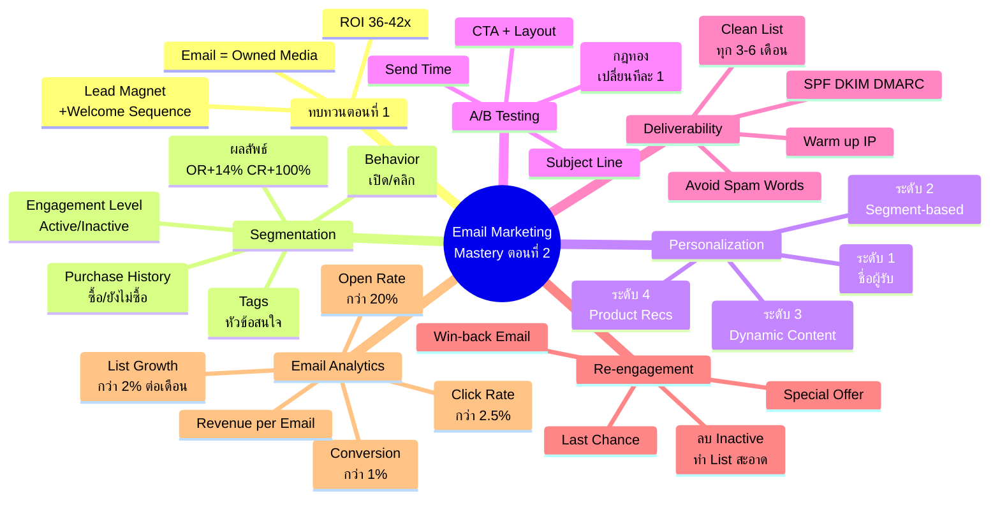

# Email Marketing ตอนที่ 2 — EMKTG-002 Mind Map
> **Format:** Mind Map (Text Structure + Mermaid)
> **Source:** SWP3 Ch24 Email Marketing Mastery ตอนที่ 2
> **Production:** PinkCastle Academy | จูล่ง CTO
> **Date:** 2026-02-18 | **Duration:** 1:18:44

---

## Mind Map — โครงสร้างข้อความ (Text Structure)

```
Email Marketing Mastery ตอนที่ 2
│
├── 1. ทบทวนตอนที่ 1 (Quick Recap)
│   ├── ROI 36-42 เท่า
│   ├── Email List = Owned Media
│   ├── Lead Magnet สร้าง List
│   ├── Welcome Sequence 3-5 ฉบับ
│   └── เลือก Platform ตามระดับ
│
├── 2. Segmentation (แบ่งกลุ่ม)
│   ├── Behavior
│   │   └── เปิดอ่าน / คลิก
│   ├── Purchase History
│   │   └── ซื้อแล้ว / ยังไม่ซื้อ
│   ├── Engagement Level
│   │   ├── Active (7 วัน)
│   │   ├── Semi-active (30 วัน)
│   │   └── Inactive (90+ วัน)
│   ├── Tags
│   │   └── หัวข้อที่สนใจ
│   └── ผลลัพธ์
│       ├── Open Rate +14%
│       └── Click Rate +100%
│
├── 3. Personalization (4 ระดับ)
│   ├── ระดับ 1: ชื่อผู้รับ
│   │   └── Open Rate +10%
│   ├── ระดับ 2: Segment-based
│   │   └── Click Rate +25%
│   ├── ระดับ 3: Dynamic Content
│   │   └── Conversion +20%
│   ├── ระดับ 4: Product Recommendations
│   │   └── Revenue +30%
│   └── หลักการ
│       └── "พูดกับเขาโดยเฉพาะ"
│
├── 4. A/B Testing (ทดสอบทีละตัวแปร)
│   ├── สิ่งที่ทดสอบได้
│   │   ├── Subject Line → วัด Open Rate
│   │   ├── Send Time → วัด Open Rate
│   │   ├── CTA → วัด Click Rate
│   │   └── Layout → วัด Click Rate
│   ├── กฎทอง
│   │   ├── เปลี่ยนทีละ 1 ตัวแปร
│   │   ├── ส่งกลุ่มทดสอบ 20%
│   │   └── ส่งตัวชนะให้ 80%
│   └── ทำซ้ำทุกสัปดาห์
│
├── 5. Deliverability (เข้า Inbox ไม่ใช่ Spam)
│   ├── SPF/DKIM/DMARC
│   │   └── DNS Authentication
│   ├── Warm up IP
│   │   └── 100 → 500 → 1,000 → เป้าหมาย
│   ├── Clean List
│   │   └── ทุก 3-6 เดือน
│   ├── Avoid Spam Words
│   │   └── "ฟรี!!!" "รวยทันที"
│   └── Sender Reputation
│       ├── Open Rate > 20%
│       └── Spam Complaint < 0.1%
│
├── 6. Re-engagement Campaign
│   ├── ขั้นที่ 1: Win-back Email
│   │   └── "เราคิดถึงคุณ!"
│   ├── ขั้นที่ 2: Special Offer
│   │   └── ส่วนลด/ของฟรี exclusive
│   ├── ขั้นที่ 3: Last Chance
│   │   └── "ถ้าไม่ตอบ จะลบออก"
│   └── ผลลัพธ์
│       └── List สะอาด → Deliverability ดีขึ้น
│
└── 7. Email Analytics (5 Metrics)
    ├── Open Rate > 20%
    │   └── วัด Subject Line
    ├── Click Rate > 2.5%
    │   └── วัด CTA/เนื้อหา
    ├── Conversion Rate > 1%
    │   └── วัด Landing Page
    ├── Revenue per Email
    │   └── วัด ROI
    └── List Growth Rate > 2%/เดือน
        └── วัด Lead Magnet
```

---

## Mind Map — Mermaid Diagram



---

## Mind Map — Mermaid Flowchart (แบบทางเลือก)

```mermaid
graph TB
    CENTER["Email Marketing<br/>Mastery ตอนที่ 2<br/>SWP3 Ch24"]

    CENTER --> RECAP["ทบทวนตอนที่ 1<br/>Quick Recap"]
    RECAP --> RE1["ROI 36-42x<br/>Owned Media"]
    RECAP --> RE2["Lead Magnet<br/>Welcome Sequence"]

    CENTER --> SEG["Segmentation<br/>แบ่งกลุ่ม"]
    SEG --> S1["Behavior<br/>เปิด/คลิก"]
    SEG --> S2["Purchase History<br/>ซื้อ/ยังไม่ซื้อ"]
    SEG --> S3["Engagement<br/>Active/Inactive"]
    SEG --> S4["Tags<br/>หัวข้อสนใจ"]

    CENTER --> PER["Personalization<br/>4 ระดับ"]
    PER --> P1["ชื่อผู้รับ<br/>OR +10%"]
    PER --> P2["Segment-based<br/>CR +25%"]
    PER --> P3["Dynamic Content<br/>Conv +20%"]
    PER --> P4["Product Recs<br/>Rev +30%"]

    CENTER --> AB["A/B Testing<br/>ทีละตัวแปร"]
    AB --> A1["Subject Line<br/>+ Send Time"]
    AB --> A2["CTA + Layout"]
    AB --> A3["กฎทอง<br/>20% test → 80% winner"]

    CENTER --> DEL["Deliverability<br/>เข้า Inbox"]
    DEL --> D1["SPF/DKIM/DMARC"]
    DEL --> D2["Warm up IP<br/>100→500→1000"]
    DEL --> D3["Clean List<br/>+ Avoid Spam Words"]

    CENTER --> RE["Re-engagement<br/>ดึงคนกลับ"]
    RE --> R1["Win-back<br/>คิดถึงคุณ"]
    RE --> R2["Special Offer<br/>ส่วนลดพิเศษ"]
    RE --> R3["Last Chance<br/>ลบถ้าไม่ตอบ"]

    CENTER --> ANA["Email Analytics<br/>5 Metrics"]
    ANA --> AN1["Open Rate > 20%"]
    ANA --> AN2["Click Rate > 2.5%"]
    ANA --> AN3["Conversion > 1%<br/>Revenue + Growth"]

    style CENTER fill:#FF69B4,stroke:#FF1493,color:#fff,stroke-width:3px
    style SEG fill:#FFD700,stroke:#FFA500,color:#000
    style PER fill:#FFD700,stroke:#FFA500,color:#000
    style AB fill:#FFB6C1,stroke:#FF69B4
    style DEL fill:#FF6B6B,stroke:#FF1493,color:#fff
    style RE fill:#FFB6C1,stroke:#FF69B4
    style ANA fill:#FFB6C1,stroke:#FF69B4
    style RECAP fill:#FFB6C1,stroke:#FF69B4
```



---

## สรุปโครงสร้าง Mind Map

| กิ่งหลัก | จำนวนกิ่งย่อย | ประเด็นสำคัญ |
|---------|-------------|-------------|
| ทบทวนตอนที่ 1 | 5 | ROI 36-42x, Owned Media, Lead Magnet, Welcome, Platform |
| Segmentation | 6 | 4 เกณฑ์ + ผลลัพธ์ OR+14% CR+100% |
| Personalization | 5 | 4 ระดับ + หลักการ "พูดกับเขาโดยเฉพาะ" |
| A/B Testing | 6 | 4 ตัวแปร + กฎทอง 3 ข้อ + ทำซ้ำทุกสัปดาห์ |
| Deliverability | 7 | SPF/DKIM/DMARC + Warm up + Clean + Spam Words + Reputation |
| Re-engagement | 4 | 3 ขั้นตอน + List สะอาด |
| Email Analytics | 5 | 5 Metrics + เป้าหมาย + วิธีปรับ |

**จำนวน node ทั้งหมด:** 52 nodes (7 กิ่งหลัก + 45 กิ่งย่อย)

---

> **หมายเหตุ:** Mermaid mindmap สามารถ render ได้ใน GitHub, Notion (embed), VS Code (Mermaid Preview extension)
> Flowchart แบบทางเลือกใช้ได้ในกรณีที่ platform ไม่รองรับ mindmap syntax

---

> ทบทวนต่อ: **EMKTG-003** — Email Marketing ตอนที่ 3
> Series: SWP3 Ch24 Email Marketing Mastery
> PinkCastle Academy © 2026
