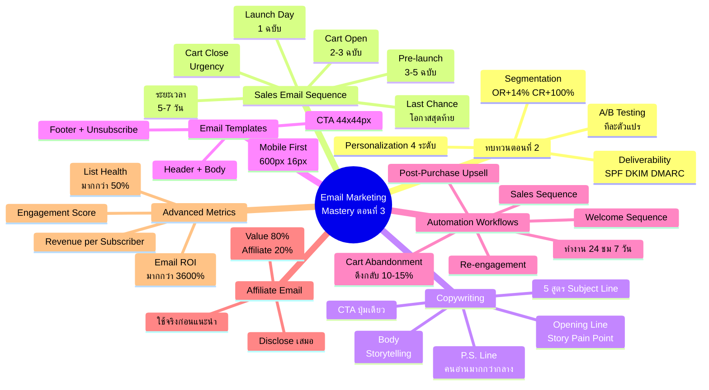

# Email Marketing ตอนที่ 3 — EMKTG-003 Mind Map
> **Format:** Mind Map (Text Structure + Mermaid)
> **Source:** SWP3 Ch24 Email Marketing Mastery ตอนที่ 3
> **Production:** PinkCastle Academy | จูล่ง CTO
> **Date:** 2026-02-18 | **Duration:** 2:32:45

---

## Mind Map — โครงสร้างข้อความ (Text Structure)

```
Email Marketing Mastery ตอนที่ 3
│
├── 1. ทบทวนตอนที่ 2 (Quick Recap)
│   ├── Segmentation 4 แบบ
│   │   └── OR +14%, CR +100%
│   ├── Personalization 4 ระดับ
│   ├── A/B Testing ทีละตัวแปร
│   └── Deliverability SPF/DKIM/DMARC
│
├── 2. Sales Email Sequence (ชุดอีเมลขาย)
│   ├── Pre-launch (3-5 ฉบับ)
│   │   └── สร้าง anticipation
│   ├── Launch Day (1 ฉบับ)
│   │   └── ประกาศ + ลิงก์ซื้อ
│   ├── Cart Open (2-3 ฉบับ)
│   │   └── Social proof + FAQ
│   ├── Cart Close (1-2 ฉบับ)
│   │   └── Urgency + FOMO
│   ├── Last Chance (1 ฉบับ)
│   │   └── โอกาสสุดท้าย
│   └── ระยะเวลา
│       └── 5-7 วัน, 8-12 ฉบับ
│
├── 3. Copywriting สำหรับ Email
│   ├── 5 สูตร Subject Line
│   │   ├── Curiosity Gap
│   │   ├── Number Hook
│   │   ├── Question
│   │   ├── Urgency
│   │   └── Personal
│   ├── Opening Line
│   │   └── Story / Pain Point
│   ├── Body
│   │   └── Storytelling, ย่อหน้าสั้น
│   ├── CTA
│   │   └── ปุ่มเดียว ชัดเจน
│   ├── P.S. Line
│   │   └── คนอ่านมากกว่าเนื้อหากลาง
│   └── กฎทอง
│       └── "คุณ" > "เรา", คุยกับเพื่อน 1 คน
│
├── 4. Email Templates (5 ส่วน)
│   ├── Header
│   │   └── โลโก้ + Preheader
│   ├── Body
│   │   └── ย่อหน้าสั้น 1-3 บรรทัด
│   ├── CTA
│   │   └── สีเด่น 44x44px+
│   ├── Footer
│   │   └── ข้อมูลผู้ส่ง + ที่อยู่
│   ├── Unsubscribe Link
│   │   └── บังคับมี (ไม่มี = spam)
│   └── Mobile First
│       ├── 70% เปิดบนมือถือ
│       ├── กว้างไม่เกิน 600px
│       └── ตัวอักษร 16px+
│
├── 5. Automation Workflows (If/Then)
│   ├── Welcome Sequence
│   │   └── สมัคร → ส่ง 3-5 ฉบับ
│   ├── Sales Sequence
│   │   └── เปิดขาย → 5 ขั้น
│   ├── Cart Abandonment
│   │   ├── คลิกไม่ซื้อ → Reminder
│   │   └── ดึงกลับ 10-15%
│   ├── Post-Purchase Upsell
│   │   └── ซื้อ → Thank You + Upsell
│   ├── Re-engagement
│   │   └── Inactive 90 วัน → 3 ขั้น
│   └── หลักการ
│       └── ตั้งครั้งเดียว ทำงาน 24/7
│
├── 6. Affiliate Email Marketing
│   ├── สัดส่วน
│   │   └── Value 80% : Affiliate 20%
│   ├── กฎ 3 ข้อ
│   │   ├── ใช้ของจริงก่อน
│   │   ├── รีวิวจากประสบการณ์จริง
│   │   └── Disclose เสมอ
│   └── โครงสร้าง
│       └── ปัญหา → สินค้าช่วย → ผลลัพธ์ → CTA
│
└── 7. Advanced Metrics (4 ตัวชี้วัด)
    ├── Revenue per Subscriber
    │   └── รายได้ / สมาชิก
    ├── Email ROI
    │   └── (รายได้-ต้นทุน) / ต้นทุน x100
    ├── Engagement Score
    │   └── Open + Click + Reply + Forward
    └── List Health
        ├── Active / Total x 100
        └── เป้าหมาย > 50%
```

---

## Mind Map — Mermaid Diagram



---

## Mind Map — Mermaid Flowchart (แบบทางเลือก)

```mermaid
graph TB
    CENTER["Email Marketing<br/>Mastery ตอนที่ 3<br/>SWP3 Ch24"]

    CENTER --> RECAP["ทบทวนตอนที่ 2<br/>Quick Recap"]
    RECAP --> RE1["Segmentation<br/>OR+14% CR+100%"]
    RECAP --> RE2["Personalization<br/>A/B Testing<br/>Deliverability"]

    CENTER --> SALES["Sales Email<br/>Sequence 5 ขั้น"]
    SALES --> SL1["Pre-launch<br/>3-5 ฉบับ"]
    SALES --> SL2["Launch Day<br/>1 ฉบับ"]
    SALES --> SL3["Cart Open<br/>2-3 ฉบับ"]
    SALES --> SL4["Cart Close<br/>+ Last Chance"]

    CENTER --> COPY["Copywriting<br/>สำหรับ Email"]
    COPY --> C1["5 สูตร Subject Line<br/>Curiosity Number<br/>Question Urgency Personal"]
    COPY --> C2["Opening + Body<br/>Story + Pain Point"]
    COPY --> C3["CTA ปุ่มเดียว<br/>+ P.S. Line"]

    CENTER --> TEMP["Email Templates<br/>5 ส่วนมาตรฐาน"]
    TEMP --> T1["Header + Body<br/>+ CTA"]
    TEMP --> T2["Footer<br/>+ Unsubscribe"]
    TEMP --> T3["Mobile First<br/>600px 16px 44x44"]

    CENTER --> AUTO["Automation<br/>Workflows If/Then"]
    AUTO --> A1["Welcome<br/>+ Cart Abandon"]
    AUTO --> A2["Sales Sequence<br/>+ Upsell"]
    AUTO --> A3["Re-engagement<br/>ทำงาน 24/7"]

    CENTER --> AFF["Affiliate Email<br/>Marketing"]
    AFF --> AF1["Value 80%<br/>Affiliate 20%"]
    AFF --> AF2["ใช้จริง + Disclose"]
    AFF --> AF3["ปัญหา → สินค้า<br/>→ ผลลัพธ์ → CTA"]

    CENTER --> MET["Advanced Metrics<br/>4 ตัวชี้วัด"]
    MET --> M1["Revenue/Subscriber<br/>Email ROI"]
    MET --> M2["Engagement Score<br/>List Health > 50%"]

    style CENTER fill:#FF69B4,stroke:#FF1493,color:#fff,stroke-width:3px
    style SALES fill:#FFD700,stroke:#FFA500,color:#000
    style COPY fill:#FFD700,stroke:#FFA500,color:#000
    style TEMP fill:#FFB6C1,stroke:#FF69B4
    style AUTO fill:#FF6B6B,stroke:#FF1493,color:#fff
    style AFF fill:#FFB6C1,stroke:#FF69B4
    style MET fill:#FFB6C1,stroke:#FF69B4
    style RECAP fill:#FFB6C1,stroke:#FF69B4
```



---

## สรุปโครงสร้าง Mind Map

| กิ่งหลัก | จำนวนกิ่งย่อย | ประเด็นสำคัญ |
|---------|-------------|-------------|
| ทบทวนตอนที่ 2 | 4 | Segmentation, Personalization, A/B Testing, Deliverability |
| Sales Email Sequence | 7 | 5 ขั้นตอน + ระยะเวลา 5-7 วัน, 8-12 ฉบับ |
| Copywriting | 8 | 5 สูตร Subject Line + Opening + Body + CTA + P.S. + กฎทอง |
| Email Templates | 8 | 5 ส่วนมาตรฐาน + Mobile First 600px 16px 44x44 |
| Automation Workflows | 7 | 5 Workflows หลัก + If/Then Logic + ทำงาน 24/7 |
| Affiliate Email | 5 | สัดส่วน 80/20 + กฎ 3 ข้อ + โครงสร้างการเขียน |
| Advanced Metrics | 5 | Revenue/Subscriber, ROI, Engagement Score, List Health > 50% |

**จำนวน node ทั้งหมด:** 58 nodes (7 กิ่งหลัก + 51 กิ่งย่อย)

---

> **หมายเหตุ:** Mermaid mindmap สามารถ render ได้ใน GitHub, Notion (embed), VS Code (Mermaid Preview extension)
> Flowchart แบบทางเลือกใช้ได้ในกรณีที่ platform ไม่รองรับ mindmap syntax

---

> ทบทวนต่อ: **EMKTG-004** — Email Marketing ตอนที่ 4
> Series: SWP3 Ch24 Email Marketing Mastery
> PinkCastle Academy © 2026
