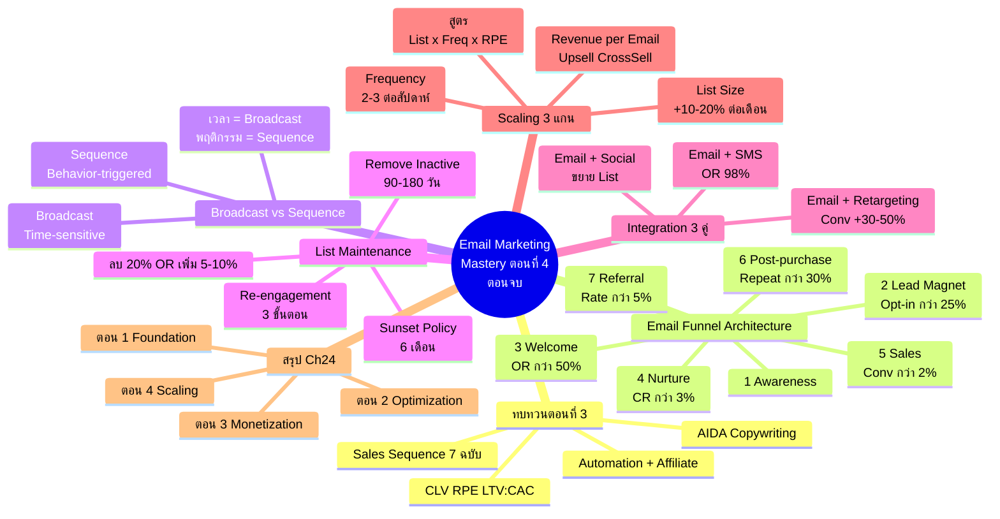

# Email Marketing ตอนที่ 4 — EMKTG-004 Mind Map
> **Format:** Mind Map (Text Structure + Mermaid)
> **Source:** SWP3 Ch24 Email Marketing Mastery ตอนที่ 4
> **Production:** PinkCastle Academy | จูล่ง CTO
> **Date:** 2026-02-18 | **Duration:** 2:24:52

---

## Mind Map — โครงสร้างข้อความ (Text Structure)

```
Email Marketing Mastery ตอนที่ 4 (ตอนจบ)
│
├── 1. ทบทวนตอนที่ 3 (Quick Recap)
│   ├── Sales Sequence 7 ฉบับ
│   ├── AIDA Copywriting
│   ├── Templates 5 แบบ
│   ├── Marketing Automation
│   ├── Affiliate Email Marketing
│   └── Advanced Metrics (CLV, RPE, LTV:CAC)
│
├── 2. Email Funnel Architecture (7 ขั้นตอน)
│   ├── Awareness
│   │   └── SEO, Ads, Social Media
│   ├── Lead Magnet
│   │   └── Opt-in Rate > 25%
│   ├── Welcome Sequence
│   │   └── 5 ฉบับ, Open Rate > 50%
│   ├── Nurture Sequence
│   │   └── ให้คุณค่า, Click Rate > 3%
│   ├── Sales Sequence
│   │   └── 7 ฉบับ AIDA, Conversion > 2%
│   ├── Post-purchase
│   │   └── Onboarding + Upsell, Repeat > 30%
│   └── Referral
│       └── Referral Program, Rate > 5%
│
├── 3. Broadcast vs Sequence
│   ├── Broadcast
│   │   ├── ส่งด้วยมือ
│   │   ├── Time-sensitive
│   │   └── Flash Sale, ข่าวสด, ประกาศ
│   ├── Sequence
│   │   ├── อัตโนมัติ
│   │   ├── Behavior-triggered
│   │   └── Welcome, Sales, Cart Abandonment
│   └── กฎเลือกใช้
│       ├── "เวลา" = Broadcast
│       └── "พฤติกรรม" = Sequence
│
├── 4. List Maintenance (3 กลยุทธ์)
│   ├── Remove Inactive
│   │   └── ลบหลัง 90-180 วัน
│   ├── Re-engagement Campaign
│   │   ├── Win-back
│   │   ├── Special Offer
│   │   └── Last Chance
│   ├── Sunset Policy
│   │   └── ลบอัตโนมัติหลัง 6 เดือน
│   └── ผลลัพธ์
│       └── ลบ 20% → OR เพิ่ม 5-10%
│
├── 5. Integration (3 คู่ทรงพลัง)
│   ├── Email + Social Media
│   │   └── ขยาย List + Engagement
│   ├── Email + Retargeting
│   │   └── Conversion +30-50%
│   ├── Email + SMS
│   │   └── SMS Open Rate 98%
│   └── หลักการ
│       └── ส่งเสริมกัน ไม่แข่งกัน
│
├── 6. Scaling (3 แกนหลัก)
│   ├── List Size
│   │   ├── Lead Magnet เพิ่ม
│   │   ├── Co-registration
│   │   └── เป้า +10-20%/เดือน
│   ├── Frequency
│   │   ├── เพิ่มเป็น 2-3 ครั้ง/สัปดาห์
│   │   └── Unsub < 0.5%/ครั้ง
│   ├── Revenue per Email
│   │   ├── Upsell, Cross-sell
│   │   ├── Bundle, Premium Tier
│   │   └── RPE x3
│   └── สูตร
│       └── Revenue = List x Freq x RPE
│
└── 7. สรุป Chapter 24 (4 ตอน)
    ├── ตอน 1: Foundation
    ├── ตอน 2: Optimization
    ├── ตอน 3: Monetization
    ├── ตอน 4: Architecture & Scaling
    └── รวม ~7+ ชั่วโมง
```

---

## Mind Map — Mermaid Diagram



---

## Mind Map — Mermaid Flowchart (แบบทางเลือก)

```mermaid
graph TB
    CENTER["Email Marketing<br/>Mastery ตอนที่ 4<br/>Architecture & Scaling<br/>SWP3 Ch24 (ตอนจบ)"]

    CENTER --> RECAP["ทบทวนตอนที่ 3<br/>Quick Recap"]
    RECAP --> RE1["Sales Sequence 7 ฉบับ<br/>AIDA Copywriting"]
    RECAP --> RE2["Automation + Affiliate<br/>CLV / RPE / LTV:CAC"]

    CENTER --> FUNNEL["Email Funnel<br/>Architecture<br/>7 ขั้นตอน"]
    FUNNEL --> F1["1. Awareness<br/>SEO, Ads, Social"]
    FUNNEL --> F2["2. Lead Magnet<br/>Opt-in > 25%"]
    FUNNEL --> F3["3. Welcome<br/>OR > 50%"]
    FUNNEL --> F4["4. Nurture<br/>CR > 3%"]
    FUNNEL --> F5["5. Sales<br/>Conv > 2%"]
    FUNNEL --> F6["6. Post-purchase<br/>Repeat > 30%"]
    FUNNEL --> F7["7. Referral<br/>Rate > 5%"]

    CENTER --> BVSS["Broadcast<br/>vs Sequence"]
    BVSS --> BV1["Broadcast<br/>Time-sensitive<br/>Flash Sale, ข่าวสด"]
    BVSS --> BV2["Sequence<br/>Behavior-triggered<br/>Welcome, Sales, Cart"]

    CENTER --> MAINT["List Maintenance<br/>3 กลยุทธ์"]
    MAINT --> M1["Remove Inactive<br/>90-180 วัน"]
    MAINT --> M2["Re-engagement<br/>Win-back → Offer → Last"]
    MAINT --> M3["Sunset Policy<br/>ลบอัตโนมัติ 6 เดือน"]

    CENTER --> INTEG["Integration<br/>3 คู่ทรงพลัง"]
    INTEG --> I1["Email + Social Media<br/>ขยาย List + Engagement"]
    INTEG --> I2["Email + Retargeting<br/>Conv +30-50%"]
    INTEG --> I3["Email + SMS<br/>OR 98%"]

    CENTER --> SCALE["Scaling<br/>3 แกนหลัก"]
    SCALE --> SC1["List Size<br/>+10-20%/เดือน"]
    SCALE --> SC2["Frequency<br/>2-3 ครั้ง/สัปดาห์"]
    SCALE --> SC3["Revenue per Email<br/>Upsell + CrossSell"]
    SCALE --> SC4["สูตร<br/>Rev = List x Freq x RPE"]

    CENTER --> SUMMARY["สรุป Ch24<br/>4 ตอนครบ"]
    SUMMARY --> SU1["ตอน 1: Foundation<br/>List + Welcome"]
    SUMMARY --> SU2["ตอน 2: Optimization<br/>Segment + A/B"]
    SUMMARY --> SU3["ตอน 3: Monetization<br/>Sales + Automation"]
    SUMMARY --> SU4["ตอน 4: Scaling<br/>Funnel + Integration"]

    style CENTER fill:#FF69B4,stroke:#FF1493,color:#fff,stroke-width:3px
    style FUNNEL fill:#FFD700,stroke:#FFA500,color:#000
    style SCALE fill:#FFD700,stroke:#FFA500,color:#000
    style BVSS fill:#FFB6C1,stroke:#FF69B4
    style MAINT fill:#FF6B6B,stroke:#FF1493,color:#fff
    style INTEG fill:#FFB6C1,stroke:#FF69B4
    style RECAP fill:#FFB6C1,stroke:#FF69B4
    style SUMMARY fill:#98FB98,stroke:#2E8B57,color:#000
```



---

## สรุปโครงสร้าง Mind Map

| กิ่งหลัก | จำนวนกิ่งย่อย | ประเด็นสำคัญ |
|---------|-------------|-------------|
| ทบทวนตอนที่ 3 | 6 | Sales Sequence, AIDA, Templates, Automation, Affiliate, Metrics |
| Email Funnel Architecture | 7 | 7 ขั้นตอนจาก Awareness ถึง Referral + Metrics ทุกขั้น |
| Broadcast vs Sequence | 5 | เวลา=Broadcast, พฤติกรรม=Sequence, ใช้ทั้งสองผสม |
| List Maintenance | 5 | Remove, Re-engagement, Sunset Policy, ลบ 20% OR เพิ่ม 5-10% |
| Integration 3 คู่ | 4 | Social (+List), Retargeting (+30-50% Conv), SMS (98% OR) |
| Scaling 3 แกน | 5 | List Size, Frequency, RPE + สูตร Compound Growth |
| สรุป Chapter 24 | 5 | 4 ตอน Foundation→Optimization→Monetization→Scaling |

**จำนวน node ทั้งหมด:** 55 nodes (7 กิ่งหลัก + 48 กิ่งย่อย)

---

> **หมายเหตุ:** Mermaid mindmap สามารถ render ได้ใน GitHub, Notion (embed), VS Code (Mermaid Preview extension)
> Flowchart แบบทางเลือกใช้ได้ในกรณีที่ platform ไม่รองรับ mindmap syntax

---

> จบ Chapter 24: Email Marketing Mastery — 4 ตอน
> Series: SWP3 Ch24 Email Marketing Mastery
> PinkCastle Academy © 2026
