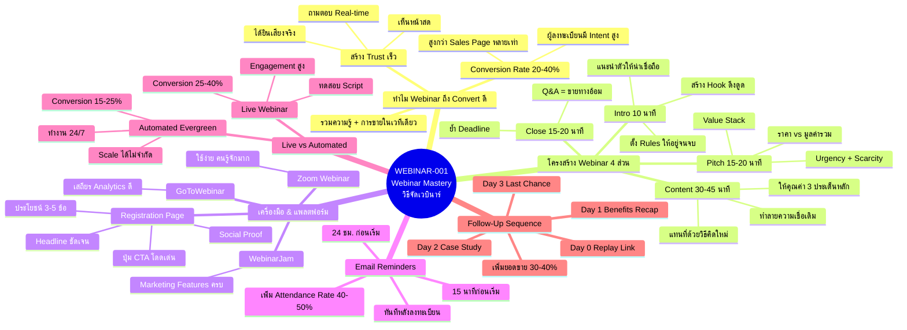
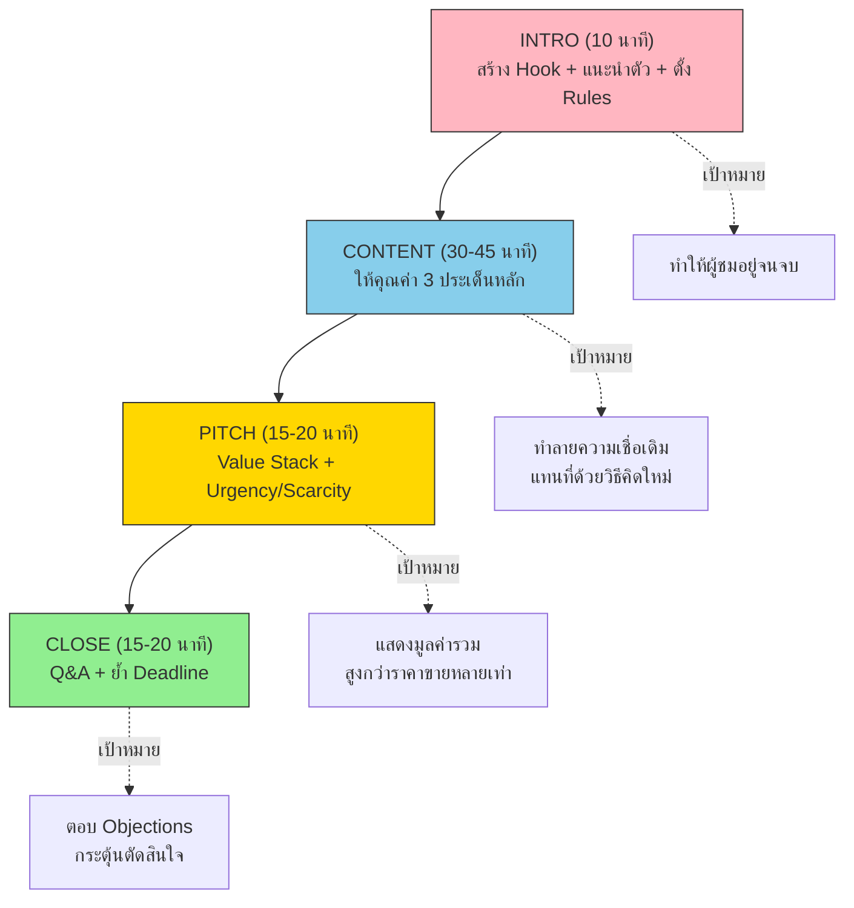
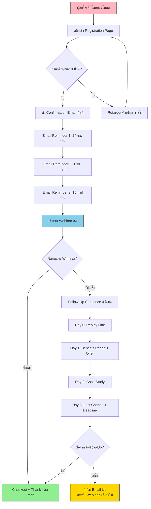
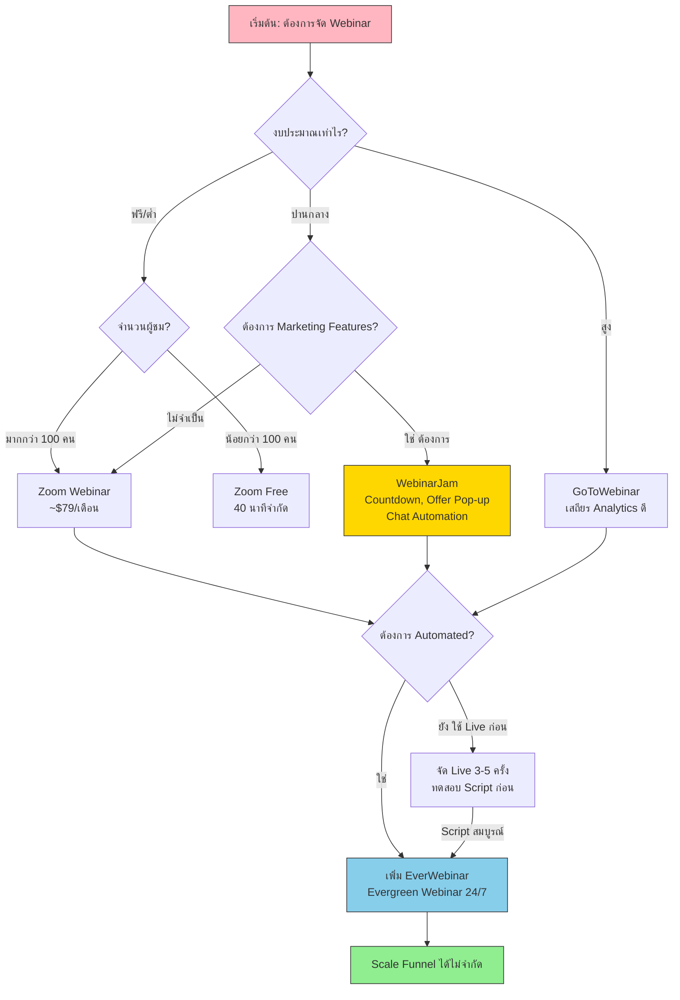

# Webinar Mastery — WEBINAR-001 Mind Map
> Format: Mind Map / แผนผังความคิด
> Source: SWP3 Ch25 Webinar Mastery ตอนที่ 1
> Production: PinkCastle Academy | จูล่ง CTO
> Date: 2026-02-18 | Duration: 2:53:03

---

## Part 1: Text-Based Mind Map

```
                    ┌─────────────────────────────────────────┐
                    │  WEBINAR-001: Webinar Mastery            │
                    │  วิธีจัดเวบินาร์ให้ปิดการขายได้            │
                    └────────────────┬────────────────────────┘
                                     │
                ┌────────────────────┼────────────────────┐
                │                    │                    │
     ┌──────────┴──────────┐  ┌─────┴──────┐  ┌─────────┴──────────┐
     │ โครงสร้าง Webinar    │  │ เครื่องมือ  │  │ กลยุทธ์หลัง         │
     │ 4 ส่วนหลัก           │  │ & แพลตฟอร์ม │  │ Webinar            │
     └──────────┬──────────┘  └─────┬──────┘  └─────────┬──────────┘
                │                   │                    │
     ┌──────────┼──────────┐       ┌┼─────────┐        ┌┴───────────┐
     │          │          │       ││         │        │            │
  ┌──┴──┐  ┌───┴──┐  ┌───┴──┐  ┌─┴┴──┐  ┌──┴──┐  ┌──┴──┐  ┌────┴───┐
  │4 ส่วน│  │เทคนิค│  │การ   │  │3 แพลต│  │Reg. │  │Follow│  │Live vs │
  │     │  │ปิดขาย│  │เตรียม│  │ฟอร์ม │  │Page │  │ Up   │  │Auto   │
  │     │  │      │  │      │  │      │  │     │  │     │  │       │
  │Intro│  │Value │  │Script│  │Zoom  │  │Head │  │Day 0│  │Live   │
  │Cont.│  │Stack │  │Q&A   │  │GoTo  │  │line │  │Day 1│  │เริ่มต้น│
  │Pitch│  │Urgen │  │Rule  │  │WJam  │  │CTA  │  │Day 2│  │Auto   │
  │Close│  │Scarce│  │Hook  │  │      │  │Proof│  │Day 3│  │Scale  │
  └─────┘  └──────┘  └──────┘  └──────┘  └─────┘  └─────┘  └───────┘
```

---

## Part 2: Mermaid Mind Map



---

## Part 3: Flowchart — โครงสร้าง Webinar 4 ส่วน



---

## Part 4: Flowchart — Funnel Integration (Registration → Sale)



---

## Part 5: Flowchart — เลือกแพลตฟอร์ม Webinar



---

## Part 6: Comparison Diagram — ก่อน vs หลัง เรียนรู้

```
╔══════════════════════════════════════════════════════════════════════╗
║                    ก่อนเรียน vs หลังเรียน                           ║
╠════════════════════════════╦═════════════════════════════════════════╣
║       ก่อนเรียน (แบบเดิม)   ║       หลังเรียน (แบบมืออาชีพ)          ║
╠════════════════════════════╬═════════════════════════════════════════╣
║                            ║                                         ║
║ จัด Webinar ไม่มีโครงสร้าง  ║ ใช้โครงสร้าง 4 ส่วน Intro-Content-     ║
║ พูดไปเรื่อย ไม่มีทิศทาง     ║ Pitch-Close อย่างเป็นระบบ              ║
║                            ║                                         ║
║ บอกราคาแล้วรอลุ้น          ║ Stack Value ให้เห็นมูลค่ามากกว่าราคา    ║
║                            ║                                         ║
║ ไม่ส่ง Reminder ก่อนงาน    ║ Email Reminders 3-4 ครั้ง               ║
║ คนลงทะเบียนลืมมา          ║ Attendance Rate เพิ่มเป็น 40-50%        ║
║                            ║                                         ║
║ Registration Page ธรรมดา   ║ Headline ชัด + ประโยชน์ 3-5 ข้อ +      ║
║ ไม่มี Social Proof          ║ CTA โดดเด่น + Social Proof              ║
║                            ║                                         ║
║ จบ Webinar แล้วก็จบ        ║ Follow-Up Sequence 4 อีเมลใน 3 วัน     ║
║ ไม่ติดตามผลอะไร            ║ เพิ่มยอดขายอีก 30-40%                  ║
║                            ║                                         ║
║ ไม่รู้จะใช้ Live หรือ Auto   ║ Live ก่อน 3-5 ครั้ง ทดสอบ Script       ║
║                            ║ แล้วค่อยเปลี่ยนเป็น Automated Scale    ║
║                            ║                                         ║
║ Q&A ตอบมั่วไม่มีเตรียม     ║ เตรียมคำถาม 5-10 ข้อ                  ║
║                            ║ ตอบแบบนำกลับสู่ข้อเสนอ                 ║
║                            ║                                         ║
╠════════════════════════════╬═════════════════════════════════════════╣
║ ผลลัพธ์: Conversion 2-5%  ║ ผลลัพธ์: Conversion 20-40%             ║
║ ขายไม่ได้ เสียเวลาเปล่า    ║ ปิดการขายสินค้า High-Ticket ได้         ║
╚════════════════════════════╩═════════════════════════════════════════╝
```

---

## Part 7: Summary Box

```
╔══════════════════════════════════════════════════════════════╗
║                                                              ║
║   สรุป WEBINAR-001: Webinar Mastery                         ║
║   วิธีจัดเวบินาร์ให้ปิดการขายได้                              ║
║                                                              ║
║   ━━━━━━━━━━━━━━━━━━━━━━━━━━━━━━━━━━━━━━━━━━━━━━━━━━━━━━   ║
║                                                              ║
║   ทำไม WEBINAR ถึงทรงพลัง                                    ║
║   ● Conversion Rate 20-40% สูงกว่า Sales Page               ║
║   ● สร้าง Trust ผ่าน Real-time Interaction                   ║
║   ● รวมความรู้ + การขายในเวทีเดียว                           ║
║                                                              ║
║   ━━━━━━━━━━━━━━━━━━━━━━━━━━━━━━━━━━━━━━━━━━━━━━━━━━━━━━   ║
║                                                              ║
║   โครงสร้าง 4 ส่วน                                           ║
║   ● Intro (10 นาที): Hook + Rules + ความน่าเชื่อถือ           ║
║   ● Content (30-45 นาที): 3 ประเด็น ทำลายความเชื่อเดิม       ║
║   ● Pitch (15-20 นาที): Value Stack + Urgency/Scarcity      ║
║   ● Close (15-20 นาที): Q&A ขายทางอ้อม + ย้ำ Deadline       ║
║                                                              ║
║   ━━━━━━━━━━━━━━━━━━━━━━━━━━━━━━━━━━━━━━━━━━━━━━━━━━━━━━   ║
║                                                              ║
║   เครื่องมือ & แพลตฟอร์ม                                     ║
║   ● Zoom: ใช้ง่าย / GoToWebinar: เสถียร /                    ║
║     WebinarJam: Marketing Features ครบ                       ║
║   ● Registration Page: Headline + CTA + Social Proof        ║
║   ● Email Reminders: 3 ครั้ง เพิ่ม Attendance 40-50%         ║
║                                                              ║
║   ━━━━━━━━━━━━━━━━━━━━━━━━━━━━━━━━━━━━━━━━━━━━━━━━━━━━━━   ║
║                                                              ║
║   กลยุทธ์หลัง WEBINAR                                        ║
║   ● Live ก่อน 3-5 ครั้ง → ค่อยเปลี่ยนเป็น Automated          ║
║   ● Follow-Up 4 อีเมลใน 3 วัน เพิ่มยอดขาย 30-40%           ║
║   ● Q&A เตรียมล่วงหน้า 5-10 ข้อ = ขายทางอ้อม               ║
║                                                              ║
║   ━━━━━━━━━━━━━━━━━━━━━━━━━━━━━━━━━━━━━━━━━━━━━━━━━━━━━━   ║
║                                                              ║
║   KEY TAKEAWAY:                                              ║
║   "Webinar ที่ดี = โครงสร้างชัด + เครื่องมือเหมาะ              ║
║    + Follow-Up ครบ ปิดการขายได้แม้คนไม่ซื้อในวันนั้น"         ║
║                                                              ║
╚══════════════════════════════════════════════════════════════╝
```

---

> ทบทวนต่อ: **WEBINAR-002** — Email Marketing Calendar + เทคนิค Powerpoint
> Series: SWP3 Ch25 Webinar Mastery
> PinkCastle Academy © 2026
