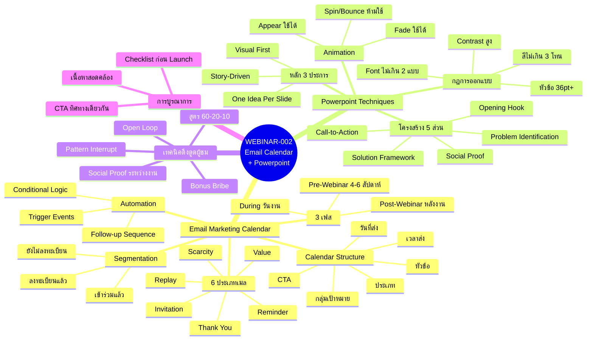
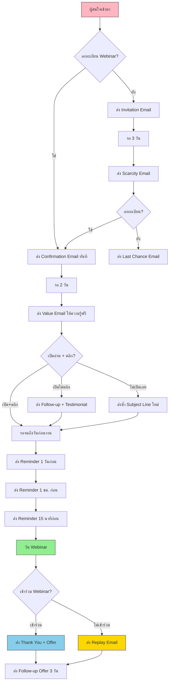
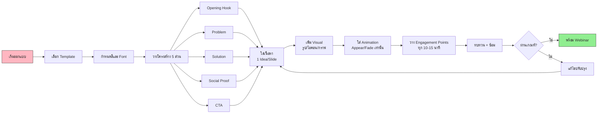
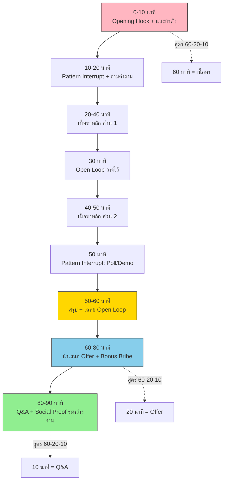

# Email Marketing Calendar + เทคนิค Powerpoint — WEBINAR-002 Mind Map
> Format: Mind Map / แผนผังความคิด
> Source: SWP3 Ch25 Webinar Mastery ตอนที่ 2
> Production: PinkCastle Academy | จูล่ง CTO
> Date: 2026-02-18 | Duration: 3:38:10

---

## Part 1: Text-Based Mind Map

```
                    ┌─────────────────────────────────────────┐
                    │  WEBINAR-002: Email Marketing Calendar   │
                    │  + เทคนิค Powerpoint                     │
                    └────────────────┬────────────────────────┘
                                     │
                ┌────────────────────┼────────────────────┐
                │                    │                    │
     ┌──────────┴──────────┐  ┌─────┴──────┐  ┌─────────┴──────────┐
     │ Email Marketing     │  │ Powerpoint │  │ การบูรณาการ         │
     │ Calendar            │  │ Techniques │  │ Email + Slide       │
     └──────────┬──────────┘  └─────┬──────┘  └─────────┬──────────┘
                │                   │                    │
     ┌──────────┼──────────┐       ┌┼─────────┐        ┌┴───────────┐
     │          │          │       ││         │        │            │
  ┌──┴──┐  ┌───┴──┐  ┌───┴──┐  ┌─┴┴──┐  ┌──┴──┐  ┌──┴──┐  ┌────┴───┐
  │3 เฟส│  │6 ประเภท│  │Auto │  │3 หลัก│  │5 ส่วน│  │CTA  │  │Checklist│
  │     │  │เมล   │  │mation│  │การ   │  │โครง │  │ตรง  │  │ตรวจสอบ  │
  │Pre  │  │      │  │      │  │ออกแบบ│  │สร้าง │  │กัน  │  │ก่อน    │
  │During│  │Invite│  │Trigger│  │      │  │      │  │     │  │Launch  │
  │Post │  │Remind│  │Cond. │  │1 Idea│  │Hook  │  │     │  │        │
  │     │  │Value │  │Logic │  │Visual│  │Problem│ │     │  │        │
  │     │  │Scarce│  │      │  │Story │  │Solution│ │    │  │        │
  │     │  │Thank │  │      │  │      │  │Proof │  │     │  │        │
  │     │  │Replay│  │      │  │      │  │CTA   │  │     │  │        │
  └─────┘  └──────┘  └──────┘  └──────┘  └──────┘  └─────┘  └────────┘
```

---

## Part 2: Mermaid Mind Map



---

## Part 3: Flowchart — Email Automation Sequence



---

## Part 4: Flowchart — Powerpoint Design Process



---

## Part 5: Flowchart — Webinar Day Timeline



---

## Part 6: Comparison Diagram — ก่อน vs หลัง เรียนรู้

```
╔══════════════════════════════════════════════════════════════════════╗
║                    ก่อนเรียน vs หลังเรียน                           ║
╠════════════════════════════╦═════════════════════════════════════════╣
║       ก่อนเรียน (แบบเดิม)   ║       หลังเรียน (แบบมืออาชีพ)          ║
╠════════════════════════════╬═════════════════════════════════════════╣
║                            ║                                         ║
║ ส่งเมลแค่ 1 ฉบับ           ║ วางแผน Calendar 3 เฟส 8-12 ฉบับ         ║
║                            ║                                         ║
║ ส่งเมลเดียวกันให้ทุกคน      ║ Segment ตามพฤติกรรม 3 กลุ่ม             ║
║                            ║                                         ║
║ ส่งเมลเอง ลืมบ่อย          ║ Automation + Conditional Logic           ║
║                            ║                                         ║
║ สไลด์ยัดข้อมูลเต็มหน้า      ║ One Idea Per Slide + Visual First       ║
║                            ║                                         ║
║ ไม่มีโครงสร้าง             ║ โครงสร้าง 5 ส่วน (Hook-CTA)              ║
║                            ║                                         ║
║ ผู้ชมออกก่อนจบ 50%+        ║ Open Loop + Pattern Interrupt            ║
║                            ║                                         ║
║ เมลบอกอย่าง สอนอีกอย่าง    ║ เนื้อหาสอดคล้อง CTA ทิศทางเดียวกัน      ║
║                            ║                                         ║
║ ไม่มีแผนหลังงาน            ║ Post-Webinar Sequence + Replay           ║
║                            ║                                         ║
╠════════════════════════════╬═════════════════════════════════════════╣
║ ผลลัพธ์: Show-up 20-30%   ║ ผลลัพธ์: Show-up 50-70%                 ║
║ Conversion: 1-3%          ║ Conversion: 10-20%                       ║
╚════════════════════════════╩═════════════════════════════════════════╝
```

---

## Part 7: Summary Box

```
╔══════════════════════════════════════════════════════════════╗
║                                                              ║
║   สรุป WEBINAR-002: Email Marketing Calendar                ║
║   + เทคนิค Powerpoint                                       ║
║                                                              ║
║   ━━━━━━━━━━━━━━━━━━━━━━━━━━━━━━━━━━━━━━━━━━━━━━━━━━━━━━   ║
║                                                              ║
║   EMAIL MARKETING CALENDAR                                   ║
║   ● 3 เฟส: Pre-Webinar / During / Post-Webinar              ║
║   ● 6 คอลัมน์: วันที่, เวลา, หัวข้อ, ประเภท, กลุ่ม, CTA     ║
║   ● 6 ประเภทเมล: Invite, Remind, Value, Scarcity,           ║
║     Thank You, Replay                                        ║
║   ● Segment 3 กลุ่ม: สมัครแล้ว / ยังไม่สมัคร / เข้าร่วมแล้ว   ║
║   ● Automation: Trigger + Conditional Logic                  ║
║                                                              ║
║   ━━━━━━━━━━━━━━━━━━━━━━━━━━━━━━━━━━━━━━━━━━━━━━━━━━━━━━   ║
║                                                              ║
║   POWERPOINT TECHNIQUES                                      ║
║   ● หลัก 3: One Idea / Visual First / Story-Driven          ║
║   ● กฎ: Font 2 แบบ, สี 3 โทน, หัวข้อ 36pt+, Contrast สูง   ║
║   ● โครงสร้าง 5 ส่วน: Hook > Problem > Solution >           ║
║     Social Proof > CTA                                       ║
║   ● Animation: Appear + Fade เท่านั้น                        ║
║                                                              ║
║   ━━━━━━━━━━━━━━━━━━━━━━━━━━━━━━━━━━━━━━━━━━━━━━━━━━━━━━   ║
║                                                              ║
║   ENGAGEMENT & TIMING                                        ║
║   ● สูตร 60-20-10: 60 นาทีเนื้อหา / 20 Offer / 10 Q&A      ║
║   ● เทคนิค: Open Loop, Pattern Interrupt, Bonus Bribe       ║
║   ● Engagement Point ทุก 10-15 นาที                         ║
║   ● เนื้อหา Email + Slide ต้องสอดคล้องกัน                    ║
║                                                              ║
║   ━━━━━━━━━━━━━━━━━━━━━━━━━━━━━━━━━━━━━━━━━━━━━━━━━━━━━━   ║
║                                                              ║
║   KEY TAKEAWAY:                                              ║
║   "วางแผนล่วงหน้า ทุกอย่างสอดคล้อง                          ║
║    ทั้ง Email และ Slide ต้องชี้ไปที่เป้าหมายเดียวกัน"          ║
║                                                              ║
╚══════════════════════════════════════════════════════════════╝
```

---

> ทบทวนต่อ: กลับไปดู **WEBINAR-001** หรือไปบทต่อไป
> Series: SWP3 Ch25 Webinar Mastery
> PinkCastle Academy © 2026
