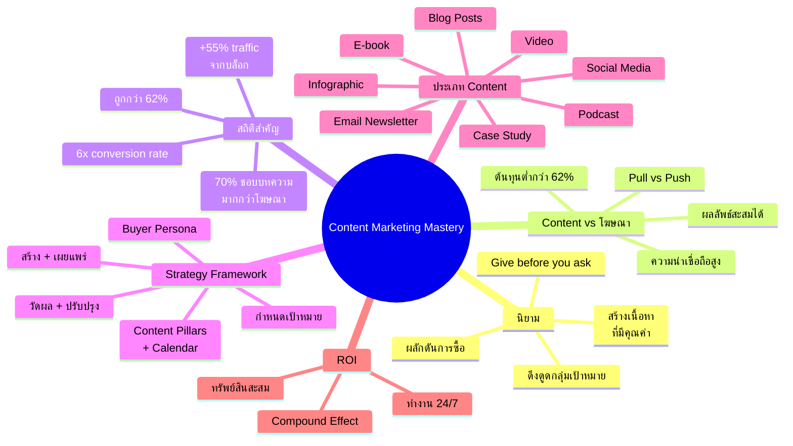

# Content Marketing Mastery — CMKTG-001
> **Format:** Mind Map (Text Structure + Mermaid)
> **Source:** SWP3 Ch28 Content Marketing Mastery ตอนที่ 1
> **Production:** PinkCastle Academy | จูล่ง CTO
> **Date:** 2026-02-17

---

## Mind Map — โครงสร้างข้อความ (Text Structure)

```
Content Marketing Mastery
│
├── 1. นิยาม Content Marketing
│   ├── สร้างเนื้อหาที่มีคุณค่า ตรงประเด็น สม่ำเสมอ
│   ├── ดึงดูดกลุ่มเป้าหมายที่ชัดเจน
│   ├── ผลักดันการตัดสินใจซื้อ
│   └── หลักการ "Give before you ask"
│
├── 2. Content Marketing vs โฆษณา
│   ├── Pull vs Push
│   ├── ผู้บริโภคเลือกรับ vs ถูกขัดจังหวะ
│   ├── ต้นทุนต่ำกว่า 62%
│   └── ผลลัพธ์สะสมได้ vs หายเมื่อหยุดจ่าย
│
├── 3. สถิติสำคัญ
│   ├── 70% ชอบเรียนรู้ผ่านบทความ
│   ├── 60% นักการตลาดยืนยันสร้าง leads ได้
│   ├── +55% traffic จากบล็อก
│   ├── ต้นทุนถูกกว่า 62%
│   └── Conversion rate สูงกว่า 6 เท่า
│
├── 4. Strategy Framework
│   ├── ขั้น 1: กำหนดเป้าหมาย
│   │   ├── Brand Awareness
│   │   ├── Lead Generation
│   │   └── Sales
│   ├── ขั้น 2: รู้จักกลุ่มเป้าหมาย
│   │   └── Buyer Persona
│   ├── ขั้น 3: วางแผนเนื้อหา
│   │   ├── Content Pillars
│   │   └── Content Calendar
│   ├── ขั้น 4: สร้างและเผยแพร่
│   │   └── เลือก format + ช่องทาง
│   └── ขั้น 5: วัดผลและปรับปรุง
│       └── KPIs + Analytics
│
├── 5. ประเภท Content
│   ├── Blog Posts (SEO)
│   ├── Video (Engagement)
│   ├── Podcast (On-the-go)
│   ├── Infographic (Visual)
│   ├── Case Study (Proof)
│   ├── E-book / Whitepaper (Lead Magnet)
│   ├── Email Newsletter (Nurture)
│   └── Social Media Posts (Awareness)
│
├── 6. ROI ของ Content Marketing
│   ├── เป็นทรัพย์สินสะสมได้
│   ├── ทำงาน 24/7 ไม่หมดอายุ
│   └── ยิ่งทำนาน ยิ่งได้ผลดี (compound effect)
│
└── 7. หลักการสำคัญ
    ├── ให้คุณค่าก่อนขาย
    ├── สม่ำเสมอคือกุญแจ
    ├── รู้จักลูกค้าก่อนสร้างเนื้อหา
    └── วัดผล → ปรับปรุง → ทำซ้ำ
```

---

## Mind Map — Mermaid Diagram



---

## Mind Map — Mermaid Flowchart (แบบทางเลือก)

```mermaid
graph TB
    CENTER["Content Marketing<br/>Mastery"]

    CENTER --> DEF["นิยาม"]
    DEF --> DEF1["สร้างเนื้อหา<br/>ที่มีคุณค่า"]
    DEF --> DEF2["ดึงดูดกลุ่มเป้าหมาย"]
    DEF --> DEF3["Give before you ask"]

    CENTER --> VS["Content vs โฆษณา"]
    VS --> VS1["Pull vs Push"]
    VS --> VS2["ต้นทุนต่ำกว่า 62%"]
    VS --> VS3["ผลลัพธ์สะสมได้"]

    CENTER --> STAT["สถิติ"]
    STAT --> STAT1["70% ชอบบทความ"]
    STAT --> STAT2["+55% traffic"]
    STAT --> STAT3["6x conversion"]

    CENTER --> FW["Strategy Framework"]
    FW --> FW1["เป้าหมาย"]
    FW --> FW2["Buyer Persona"]
    FW --> FW3["Content Pillars"]
    FW --> FW4["สร้าง + เผยแพร่"]
    FW --> FW5["วัดผล + ปรับปรุง"]

    CENTER --> TYPE["ประเภท Content"]
    TYPE --> TYPE1["Blog / Video"]
    TYPE --> TYPE2["Podcast / Infographic"]
    TYPE --> TYPE3["Case Study / E-book"]
    TYPE --> TYPE4["Email / Social Media"]

    CENTER --> ROI["ROI"]
    ROI --> ROI1["ทรัพย์สินสะสม"]
    ROI --> ROI2["ทำงาน 24/7"]

    style CENTER fill:#FF69B4,stroke:#FF1493,color:#fff,stroke-width:3px
    style DEF fill:#FFB6C1,stroke:#FF69B4
    style VS fill:#FFB6C1,stroke:#FF69B4
    style STAT fill:#FFB6C1,stroke:#FF69B4
    style FW fill:#FFB6C1,stroke:#FF69B4
    style TYPE fill:#FFB6C1,stroke:#FF69B4
    style ROI fill:#FFB6C1,stroke:#FF69B4
```



---

## สรุปโครงสร้าง Mind Map

| กิ่งหลัก | จำนวนกิ่งย่อย | ประเด็นสำคัญ |
|---------|-------------|-------------|
| นิยาม Content Marketing | 4 | ให้คุณค่าก่อนขาย |
| Content vs โฆษณา | 4 | Pull vs Push, ต้นทุนต่ำกว่า |
| สถิติสำคัญ | 5 | 6x conversion, 62% ถูกกว่า |
| Strategy Framework | 5 | 5 ขั้นตอน วนซ้ำ |
| ประเภท Content | 8 | Blog, Video, Podcast ฯลฯ |
| ROI | 3 | ทรัพย์สินสะสม compound effect |
| หลักการสำคัญ | 4 | สม่ำเสมอ วัดผล ปรับปรุง |

**จำนวน nodes ทั้งหมด:** 40 nodes

---

> **หมายเหตุ:** Mermaid mindmap สามารถ render ได้ใน GitHub, Notion (embed), VS Code (Mermaid Preview extension)
> Flowchart แบบทางเลือกใช้ได้ในกรณีที่ platform ไม่รองรับ mindmap syntax
