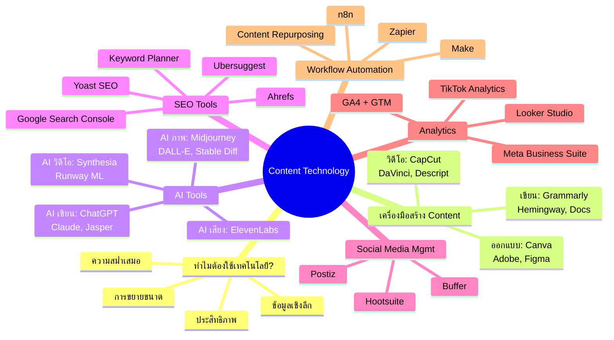
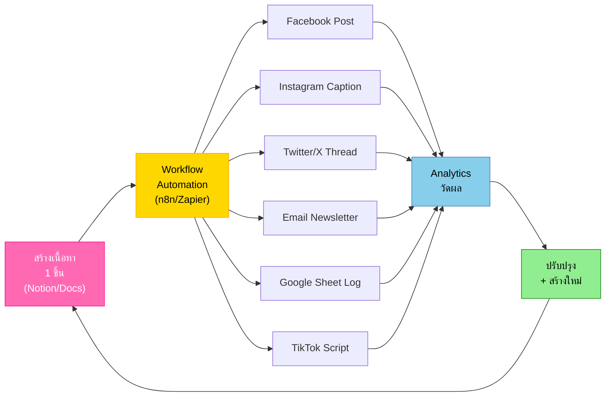
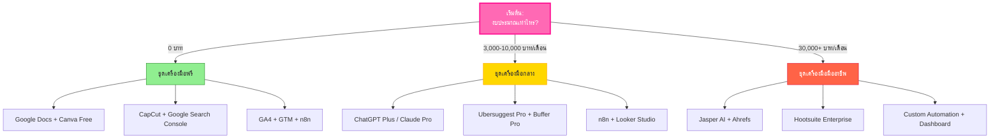
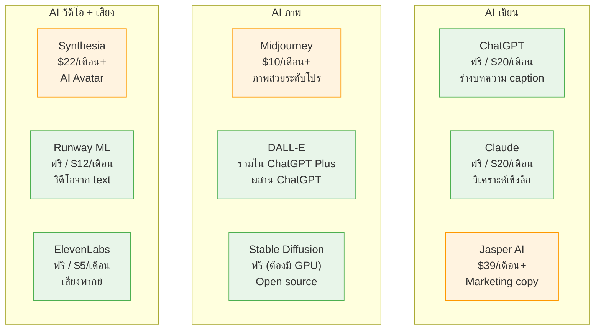

# Content Technology — CMKTG-002 Mind Map
> **Format:** Mind Map (Text Structure + Mermaid)
> **Source:** SWP3 Ch28 Content Marketing Mastery ตอนที่ 2
> **Production:** PinkCastle Academy | จูล่ง CTO
> **Date:** 2026-02-18 | **Duration:** 0:11:06

---

## Part 1: Mind Map — โครงสร้างข้อความ (Text Structure)

```
Content Technology
│
├── 1. ทำไมต้องใช้เทคโนโลยี?
│   ├── ประสิทธิภาพ — ทำงานเร็วขึ้นหลายเท่า
│   ├── ความสม่ำเสมอ — Scheduling โพสต์ตรงเวลา
│   ├── ข้อมูลเชิงลึก — Analytics บอกว่าเนื้อหาไหนได้ผล
│   └── การขยายขนาด — 1 platform → 5 platforms
│
├── 2. เครื่องมือสร้าง Content
│   ├── เขียน
│   │   ├── Grammarly — ตรวจไวยากรณ์
│   │   ├── Hemingway Editor — ข้อความอ่านง่าย
│   │   └── Google Docs — ทำงานร่วมกัน real-time
│   ├── ออกแบบ
│   │   ├── Canva — template หมื่น+ ใช้ง่าย
│   │   ├── Adobe Creative Suite — ระดับโปร
│   │   └── Figma — ออกแบบ UI/UX
│   └── วิดีโอ
│       ├── CapCut — ตัดต่อง่ายบนมือถือ
│       ├── DaVinci Resolve — ระดับโปร ฟรี
│       └── Descript — ตัดต่อผ่าน transcript
│
├── 3. AI Tools
│   ├── AI เขียน
│   │   ├── ChatGPT — ร่างบทความ caption ไอเดีย
│   │   ├── Claude — วิเคราะห์เชิงลึก
│   │   ├── Jasper AI — Marketing copy
│   │   └── Copy.ai — Ad copy
│   ├── AI สร้างภาพ
│   │   ├── Midjourney — ภาพสวยระดับโปร
│   │   ├── DALL-E — รวมใน ChatGPT
│   │   └── Stable Diffusion — Open source ฟรี
│   ├── AI วิดีโอ
│   │   ├── Synthesia — AI Avatar หลายภาษา
│   │   └── Runway ML — สร้างวิดีโอจาก text
│   └── AI เสียง
│       └── ElevenLabs — เสียงพากย์เหมือนคนจริง
│
├── 4. SEO Tools
│   ├── ฟรี
│   │   ├── Google Search Console — อันดับ keyword, ปัญหาเทคนิค
│   │   └── Google Keyword Planner — วิจัย keyword เบื้องต้น
│   ├── Freemium
│   │   ├── Ubersuggest — keyword + competitor analysis
│   │   └── Yoast SEO — ตรวจ on-page SEO (WordPress)
│   └── Premium
│       └── Ahrefs — keyword + backlink ระดับโปร
│
├── 5. Social Media Management
│   ├── Hootsuite — หลาย platform ในที่เดียว
│   ├── Buffer — ใช้ง่ายที่สุด
│   └── Postiz — Open source, self-hosted ฟรี
│
├── 6. Analytics
│   ├── GA4 — ติดตาม traffic, conversion
│   ├── GTM — ติด tracking code ไม่ต้องแก้โค้ด
│   ├── Looker Studio — Dashboard สวยๆ หลาย source
│   ├── Meta Business Suite — Facebook/Instagram
│   ├── TikTok Analytics — วิดีโอไวรัล
│   └── Twitter/X Analytics — ทวิตเตอร์
│
└── 7. Workflow Automation
    ├── n8n — Open source, self-hosted ฟรี
    ├── Zapier — ง่ายที่สุด, integrations เยอะ
    ├── Make (Integromat) — ยืดหยุ่น, ราคาถูกกว่า Zapier
    └── Content Repurposing Automation
        └── สร้าง 1 ชิ้น → แปลงหลาย format → กระจายหลาย platform
```

---

## Part 2: Mind Map — Mermaid Diagram



---

## Part 3: Flowchart — Content Technology Stack

```mermaid
graph TB
    CENTER["Content Technology<br/>เทคโนโลยีสำหรับ<br/>Content Marketing"]

    CENTER --> CREATE["เครื่องมือสร้าง Content"]
    CREATE --> WRITE["เขียน"]
    WRITE --> W1["Grammarly"]
    WRITE --> W2["Hemingway"]
    WRITE --> W3["Google Docs"]
    CREATE --> DESIGN["ออกแบบ"]
    DESIGN --> D1["Canva"]
    DESIGN --> D2["Adobe Suite"]
    DESIGN --> D3["Figma"]
    CREATE --> VIDEO["วิดีโอ"]
    VIDEO --> V1["CapCut"]
    VIDEO --> V2["DaVinci Resolve"]
    VIDEO --> V3["Descript"]

    CENTER --> AI["AI Tools"]
    AI --> AW["AI เขียน"]
    AW --> AW1["ChatGPT / Claude"]
    AW --> AW2["Jasper AI / Copy.ai"]
    AI --> AIM["AI ภาพ"]
    AIM --> AIM1["Midjourney / DALL-E"]
    AIM --> AIM2["Stable Diffusion"]
    AI --> AIV["AI วิดีโอ/เสียง"]
    AIV --> AIV1["Synthesia / Runway"]
    AIV --> AIV2["ElevenLabs"]

    CENTER --> SEO["SEO Tools"]
    SEO --> S1["Google Search Console"]
    SEO --> S2["Ahrefs / Ubersuggest"]
    SEO --> S3["Yoast SEO"]

    CENTER --> SOCIAL["Social Media Mgmt"]
    SOCIAL --> SM1["Hootsuite"]
    SOCIAL --> SM2["Buffer"]
    SOCIAL --> SM3["Postiz"]

    CENTER --> ANALYTICS["Analytics"]
    ANALYTICS --> AN1["GA4 + GTM"]
    ANALYTICS --> AN2["Looker Studio"]
    ANALYTICS --> AN3["Platform Analytics"]

    CENTER --> AUTO["Automation"]
    AUTO --> AU1["n8n"]
    AUTO --> AU2["Zapier"]
    AUTO --> AU3["Make"]

    style CENTER fill:#FF69B4,stroke:#FF1493,color:#fff,stroke-width:3px
    style CREATE fill:#FFB6C1,stroke:#FF69B4
    style AI fill:#FFB6C1,stroke:#FF69B4
    style SEO fill:#FFB6C1,stroke:#FF69B4
    style SOCIAL fill:#FFB6C1,stroke:#FF69B4
    style ANALYTICS fill:#FFB6C1,stroke:#FF69B4
    style AUTO fill:#FFB6C1,stroke:#FF69B4
```



---

## Part 4: Flowchart — Content Repurposing Automation



---

## Part 5: Flowchart — เลือกเครื่องมือตามงบประมาณ



---

## Part 6: Comparison Diagram — AI Tools



---

## Part 7: Summary Box

```
╔══════════════════════════════════════════════════════════╗
║              สรุป Content Technology                     ║
╠══════════════════════════════════════════════════════════╣
║                                                          ║
║   6 หมวดเครื่องมือ:                                      ║
║   ┌──────────────────┬──────────────────────────┐        ║
║   │ 1. Content Create│ Canva, CapCut, Descript  │        ║
║   │ 2. AI Tools      │ ChatGPT, Midjourney,     │        ║
║   │                  │ ElevenLabs               │        ║
║   │ 3. SEO           │ GSC, Ahrefs, Ubersuggest │        ║
║   │ 4. Social Mgmt   │ Hootsuite, Buffer, Postiz│        ║
║   │ 5. Analytics     │ GA4, GTM, Looker Studio  │        ║
║   │ 6. Automation    │ n8n, Zapier, Make        │        ║
║   └──────────────────┴──────────────────────────┘        ║
║                                                          ║
║   3 หลักการสำคัญ:                                        ║
║   1. AI = ผู้ช่วย ≠ ผู้ทดแทน                             ║
║   2. เริ่มจากฟรี → อัพเกรดตามโต                          ║
║   3. เครื่องมือดี + กลยุทธ์ดี = ผลลัพธ์ยอดเยี่ยม          ║
║                                                          ║
╚══════════════════════════════════════════════════════════╝
```

---

## สรุปโครงสร้าง Mind Map

| กิ่งหลัก | จำนวนกิ่งย่อย | ประเด็นสำคัญ |
|---------|-------------|-------------|
| ทำไมต้องใช้เทคโนโลยี? | 4 | ประสิทธิภาพ สม่ำเสมอ ข้อมูล ขยายขนาด |
| เครื่องมือสร้าง Content | 9 | เขียน ออกแบบ วิดีโอ |
| AI Tools | 10 | เขียน ภาพ วิดีโอ เสียง |
| SEO Tools | 5 | ฟรี Freemium Premium |
| Social Media Mgmt | 3 | Hootsuite Buffer Postiz |
| Analytics | 6 | GA4 GTM Looker Studio Platform-specific |
| Workflow Automation | 4 | n8n Zapier Make Repurposing |

**จำนวน nodes ทั้งหมด:** 48 nodes

---

> **หมายเหตุ:** Mermaid mindmap สามารถ render ได้ใน GitHub, Notion (embed), VS Code (Mermaid Preview extension)
> Flowchart แบบทางเลือกใช้ได้ในกรณีที่ platform ไม่รองรับ mindmap syntax

---

> ทบทวนต่อ: **CMKTG-003** — Content Marketing Funnel
> Series: SWP3 Ch28 Content Marketing Mastery
> PinkCastle Academy © 2026
