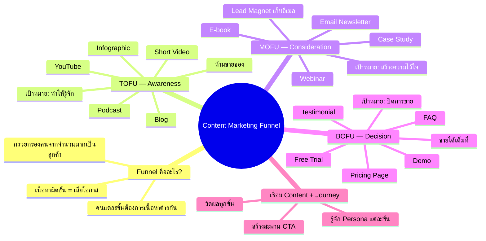
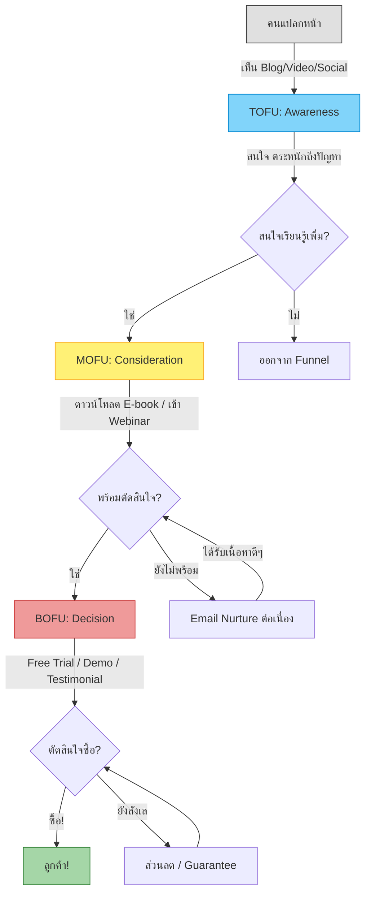
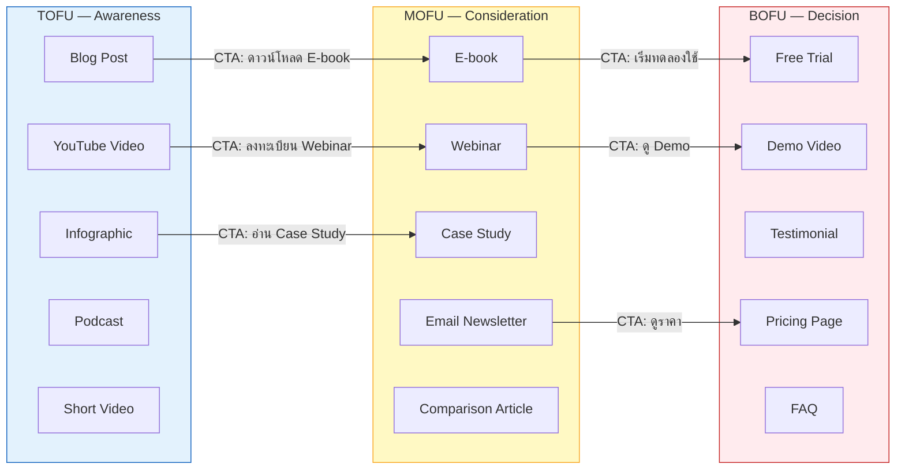
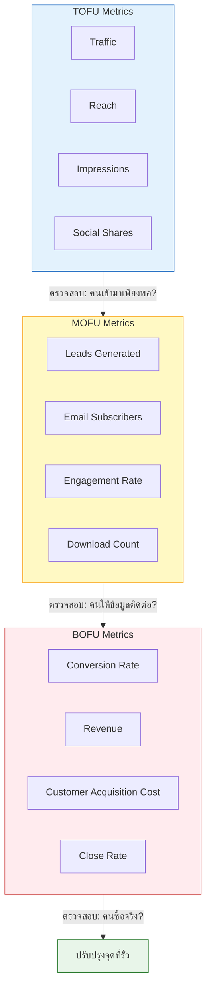
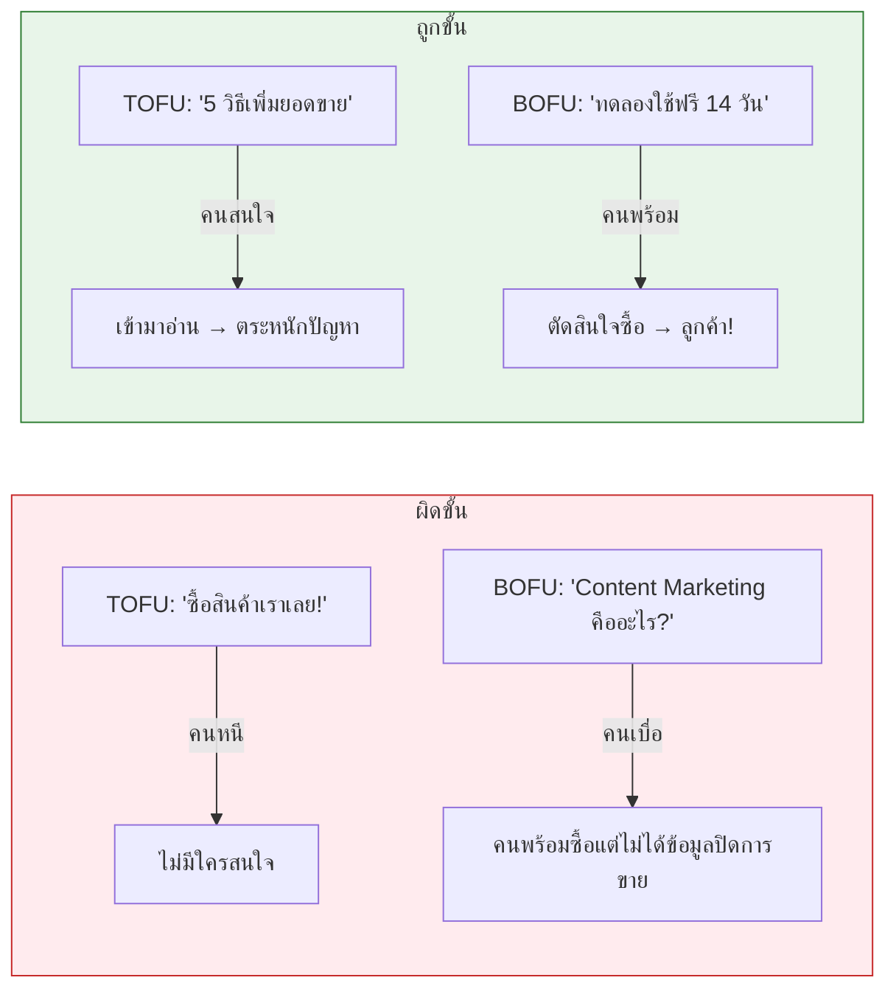

# Content Marketing Funnel — CMKTG-003 Mind Map
> **Format:** Mind Map (Text Structure + Mermaid)
> **Source:** SWP3 Ch28 Content Marketing Mastery ตอนที่ 3
> **Production:** PinkCastle Academy | จูล่ง CTO
> **Date:** 2026-02-18 | **Duration:** 0:09:14

---

## Part 1: Mind Map — โครงสร้างข้อความ (Text Structure)

```
Content Marketing Funnel
│
├── 1. Funnel คืออะไร?
│   ├── กรวยที่กรองคนจากจำนวนมากเป็นลูกค้าจริง
│   ├── ด้านบนกว้าง (คนเยอะ) → ด้านล่างแคบ (คนน้อย)
│   ├── คนแต่ละขั้นต้องการเนื้อหาที่แตกต่างกัน
│   └── เนื้อหาผิดขั้น = เสียโอกาส
│
├── 2. TOFU — Top of Funnel (Awareness)
│   ├── เป้าหมาย: ทำให้คนรู้จักให้มากที่สุด
│   ├── กฎเหล็ก: ห้ามขายของ
│   ├── เนื้อหาที่เหมาะ
│   │   ├── บทความ Blog ให้ความรู้ทั่วไป
│   │   ├── วิดีโอ How-to บน YouTube
│   │   ├── Infographic บน Social Media
│   │   ├── Podcast แชร์ความรู้ในวงการ
│   │   └── Short Video (TikTok / Reels)
│   ├── Persona: ยังไม่รู้ว่าตัวเองมีปัญหา
│   └── Metrics: Traffic, Reach, Impressions
│
├── 3. MOFU — Middle of Funnel (Consideration)
│   ├── เป้าหมาย: สร้างความไว้ใจ + เก็บ Leads
│   ├── จุดสำคัญ: Lead Generation ผ่าน Lead Magnet
│   ├── Lead Magnet = ของมีค่าแลกข้อมูลติดต่อ
│   │   ├── E-book ดาวน์โหลดฟรี
│   │   ├── Webinar ลงทะเบียนฟรี
│   │   └── Checklist / Template
│   ├── เนื้อหาที่เหมาะ
│   │   ├── E-book / Whitepaper
│   │   ├── Case Study ผลลัพธ์จริง
│   │   ├── Webinar เจาะลึก
│   │   ├── Email Newsletter ต่อเนื่อง
│   │   └── บทความ Comparison
│   ├── Persona: รู้ว่ามีปัญหา กำลังเปรียบเทียบตัวเลือก
│   └── Metrics: Leads, Email Subscribers, Engagement Rate
│
├── 4. BOFU — Bottom of Funnel (Decision)
│   ├── เป้าหมาย: ปิดการขาย
│   ├── ขายได้เต็มที่ เพราะคนผ่าน TOFU + MOFU มาแล้ว
│   ├── เนื้อหาที่เหมาะ
│   │   ├── Free Trial ลองใช้งานจริง
│   │   ├── Demo Video โชว์สินค้าละเอียด
│   │   ├── Testimonial รีวิวลูกค้าจริง
│   │   ├── Pricing Page เปรียบเทียบแพ็คเกจ
│   │   └── FAQ ตอบข้อกังวลทั้งหมด
│   ├── แรงผลักดันสุดท้าย: ส่วนลด / โบนัส / Guarantee
│   ├── Persona: พร้อมซื้อแต่ยังลังเล
│   └── Metrics: Conversion Rate, Revenue, CAC
│
├── 5. การเชื่อม Content กับ Customer Journey
│   ├── หลักการ 1: รู้จัก Persona แต่ละขั้น
│   │   ├── TOFU: เนื้อหากว้าง ย่อยง่าย น่าสนใจ
│   │   ├── MOFU: เนื้อหาลึก มีข้อมูลจริง น่าเชื่อถือ
│   │   └── BOFU: เนื้อหาตรงประเด็น ตอบข้อกังวล
│   ├── หลักการ 2: สร้างสะพาน CTA ระหว่างขั้น
│   │   ├── Blog (TOFU) → CTA → E-book (MOFU)
│   │   ├── E-book (MOFU) → CTA → Webinar (MOFU)
│   │   └── Webinar (MOFU) → CTA → Free Trial (BOFU)
│   └── หลักการ 3: วัดผลทุกขั้น
│       ├── TOFU: Traffic, Reach
│       ├── MOFU: Leads, Subscribers
│       └── BOFU: Conversion, Revenue
│
└── 6. สรุป
    ├── TOFU = ทำให้รู้จัก (ไม่ขาย)
    ├── MOFU = ทำให้ไว้ใจ (เก็บ Lead)
    ├── BOFU = ทำให้ซื้อ (ปิดการขาย)
    └── ต้องเชื่อมทุกขั้นด้วย CTA + วัดผลเสมอ
```

---

## Part 2: Mind Map — Mermaid Diagram



---

## Part 3: Flowchart — Customer Journey ผ่าน Funnel



---

## Part 4: Flowchart — Content ที่เหมาะกับแต่ละขั้น



---

## Part 5: Flowchart — Metrics วัดผลแต่ละขั้น



---

## Part 6: Comparison Diagram — เนื้อหาผิดขั้น vs ถูกขั้น



---

## Part 7: Summary Box — สรุปภาพรวม

```
┌──────────────────────────────────────────────────────┐
│              CONTENT MARKETING FUNNEL                │
│              สรุปภาพรวม CMKTG-003                    │
├──────────────────────────────────────────────────────┤
│                                                      │
│   Funnel = กรวยที่กรองคนจากจำนวนมากเป็นลูกค้าจริง   │
│                                                      │
│   ┌─────────────────────────────────────┐            │
│   │ TOFU (Awareness)                    │            │
│   │ → ทำให้รู้จัก | ไม่ขาย              │            │
│   │ → Blog, Video, Infographic, Podcast │            │
│   │ → วัด: Traffic, Reach              │            │
│   ├─────────────────────────────────────┤            │
│   │ MOFU (Consideration)                │            │
│   │ → ทำให้ไว้ใจ | Lead Magnet         │            │
│   │ → E-book, Webinar, Case Study      │            │
│   │ → วัด: Leads, Subscribers          │            │
│   ├─────────────────────────────────────┤            │
│   │ BOFU (Decision)                     │            │
│   │ → ทำให้ซื้อ | ปิดการขาย            │            │
│   │ → Free Trial, Demo, Testimonial    │            │
│   │ → วัด: Conversion, Revenue         │            │
│   └─────────────────────────────────────┘            │
│                                                      │
│   3 หลักการเชื่อม:                                   │
│   1. รู้จัก Persona แต่ละขั้น                        │
│   2. สร้างสะพาน CTA ระหว่างขั้น                      │
│   3. วัดผลทุกขั้น ปรับปรุงจุดที่รั่ว                  │
│                                                      │
│   สูตรลัด: TOFU รู้จัก → MOFU ไว้ใจ → BOFU ซื้อ     │
│                                                      │
└──────────────────────────────────────────────────────┘
```

---

> ทบทวนต่อ: **CMKTG-004** — TOFU & MOFU
> Series: SWP3 Ch28 Content Marketing Mastery
> PinkCastle Academy © 2026
