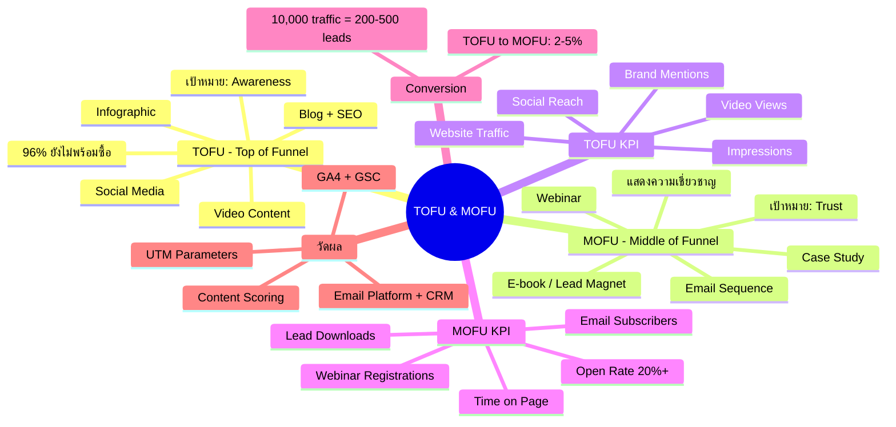
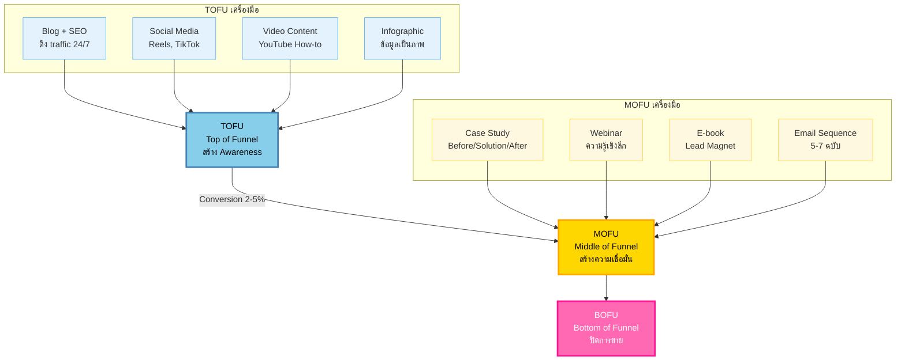
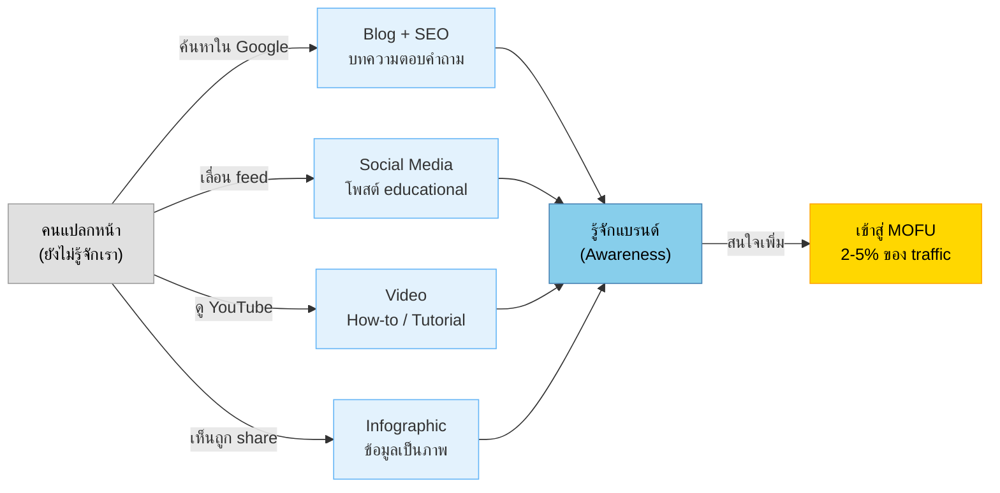
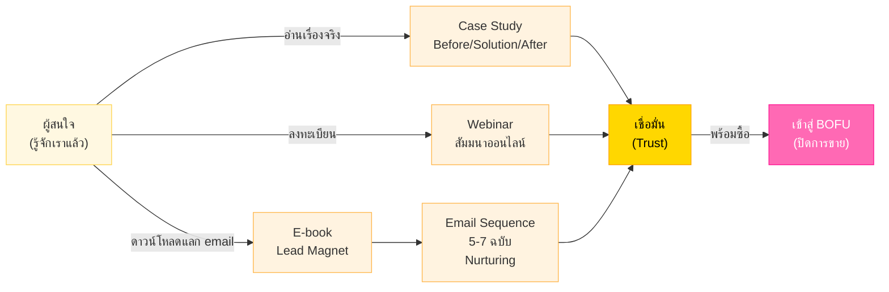
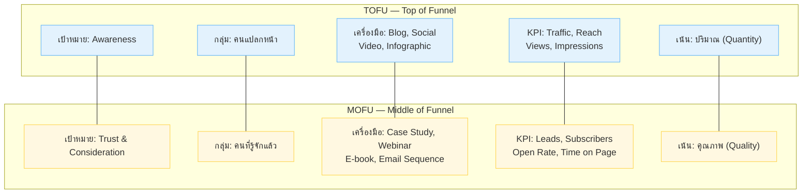

# TOFU & MOFU — CMKTG-004 Mind Map
> **Format:** Mind Map (Text Structure + Mermaid)
> **Source:** SWP3 Ch28 Content Marketing Mastery ตอนที่ 4
> **Production:** PinkCastle Academy | จูล่ง CTO
> **Date:** 2026-02-18 | **Duration:** 0:20:10

---

## Part 1: Mind Map — โครงสร้างข้อความ (Text Structure)

```
TOFU & MOFU
│
├── 1. TOFU (Top of Funnel)
│   ├── เป้าหมาย: สร้าง Awareness
│   ├── กลุ่มเป้าหมาย: คนที่ยังไม่รู้จักเรา
│   ├── หลักการ: ให้คุณค่า ไม่ใช่ขายของ (96% ยังไม่พร้อมซื้อ)
│   └── เครื่องมือ 4 ตัวหลัก
│       ├── Blog + SEO — ดึง traffic จาก Google 24/7
│       ├── Social Media — Facebook, IG, TikTok, YouTube, X
│       ├── Video Content — How-to, Tutorial (engagement +1,200%)
│       └── Infographic — แปลงข้อมูลซับซ้อนเป็นภาพ
│
├── 2. MOFU (Middle of Funnel)
│   ├── เป้าหมาย: สร้างความเชื่อมั่น (Trust & Consideration)
│   ├── กลุ่มเป้าหมาย: คนที่รู้จักเราแล้ว กำลังเปรียบเทียบ
│   ├── หลักการ: แสดงความเชี่ยวชาญ + หลักฐานจริง
│   └── เครื่องมือ 4 ตัวหลัก
│       ├── Case Study — Before/Solution/After + ตัวเลข
│       ├── Webinar — ความรู้เชิงลึก + เก็บ email (73% B2B ยืนยัน)
│       ├── E-book / Lead Magnet — เนื้อหาเชิงลึกแลก email
│       └── Email Sequence — 5-7 ฉบับ, ROI $36/$1
│
├── 3. TOFU KPI (วัด Awareness)
│   ├── Website Traffic — จำนวนคนเข้าเว็บ
│   ├── Social Media Reach — จำนวนคนเห็นโพสต์
│   ├── Impressions — จำนวนครั้งที่เนื้อหาถูกแสดง
│   ├── Video Views — จำนวนคนดูวิดีโอ
│   └── Brand Mentions — จำนวนครั้งที่คนพูดถึงแบรนด์
│
├── 4. MOFU KPI (วัด Engagement & Leads)
│   ├── Email Subscribers — จำนวนคนสมัครรับอีเมล
│   ├── Lead Magnet Downloads — จำนวนดาวน์โหลด
│   ├── Webinar Registrations — จำนวนลงทะเบียน
│   ├── Email Open Rate — เป้า 20%+
│   └── Time on Page — ยิ่งนาน = ยิ่งมีคุณค่า
│
├── 5. Conversion Rate
│   ├── TOFU → MOFU = 2-5%
│   ├── Traffic 10,000 → Leads 200-500
│   └── TOFU ต้องสร้าง traffic มากพอ
│
├── 6. เครื่องมือวัดผล
│   ├── TOFU: GA4, Google Search Console, Social Analytics
│   ├── MOFU: Email Platform, CRM, Webinar Platform
│   └── เทคนิค: UTM Parameters + Content Scoring
│
└── 7. หลักการสำคัญ
    ├── TOFU เน้นปริมาณ, MOFU เน้นคุณภาพ
    ├── ทำทั้งสองชั้นให้สมดุล
    └── ขาดชั้นใดชั้นหนึ่ง Funnel จะรั่ว
```

---

## Part 2: Mind Map — Mermaid Diagram



---

## Part 3: Flowchart — Content Marketing Funnel (TOFU → MOFU → BOFU)



---

## Part 4: Flowchart — TOFU Content Journey



---

## Part 5: Flowchart — MOFU Nurturing Journey



---

## Part 6: Comparison Diagram — TOFU vs MOFU



---

## Part 7: Summary Box

```
+==============================================================+
|                    สรุป TOFU & MOFU                           |
+==============================================================+
|                                                              |
|   TOFU (Top of Funnel) — สร้าง Awareness                    |
|   +--------------------+----------------------------+        |
|   | Blog + SEO         | ดึง traffic 24/7 จาก Google|        |
|   | Social Media       | Reels, TikTok, เข้าถึงเร็ว |        |
|   | Video Content      | engagement +1,200%         |        |
|   | Infographic        | ข้อมูลเป็นภาพ ถูก share สูง |        |
|   +--------------------+----------------------------+        |
|                                                              |
|   MOFU (Middle of Funnel) — สร้างความเชื่อมั่น               |
|   +--------------------+----------------------------+        |
|   | Case Study         | Before/Solution/After      |        |
|   | Webinar            | 73% B2B บอกดีที่สุด        |        |
|   | E-book/Lead Magnet | แลก email ด้วยคุณค่า        |        |
|   | Email Sequence     | ROI $36/$1 สูงที่สุด!      |        |
|   +--------------------+----------------------------+        |
|                                                              |
|   Conversion Rate: TOFU → MOFU = 2-5%                       |
|   (10,000 traffic → 200-500 leads)                           |
|                                                              |
|   3 หลักการสำคัญ:                                            |
|   1. TOFU = ให้คุณค่า ไม่ใช่ขายของ (96% ยังไม่พร้อมซื้อ)    |
|   2. MOFU = สร้างความเชื่อมั่นด้วยหลักฐานจริง               |
|   3. ทำทั้งสองชั้นให้สมดุล ขาดชั้นใดชั้นหนึ่ง Funnel รั่ว!  |
|                                                              |
+==============================================================+
```

---

## สรุปโครงสร้าง Mind Map

| กิ่งหลัก | จำนวนกิ่งย่อย | ประเด็นสำคัญ |
|---------|-------------|-------------|
| TOFU (Top of Funnel) | 7 | Awareness, Blog, Social, Video, Infographic |
| MOFU (Middle of Funnel) | 7 | Trust, Case Study, Webinar, E-book, Email |
| TOFU KPI | 5 | Traffic, Reach, Impressions, Views, Mentions |
| MOFU KPI | 5 | Subscribers, Downloads, Registrations, Open Rate, Time |
| Conversion Rate | 3 | 2-5%, 10K→200-500 leads |
| เครื่องมือวัดผล | 4 | GA4, GSC, Email Platform, UTM |
| หลักการสำคัญ | 3 | ปริมาณ/คุณภาพ, สมดุล, Funnel ห้ามรั่ว |

**จำนวน nodes ทั้งหมด:** 41 nodes

---

> **หมายเหตุ:** Mermaid mindmap สามารถ render ได้ใน GitHub, Notion (embed), VS Code (Mermaid Preview extension)
> Flowchart แบบทางเลือกใช้ได้ในกรณีที่ platform ไม่รองรับ mindmap syntax

---

> ทบทวนต่อ: **CMKTG-005** — BOFU
> Series: SWP3 Ch28 Content Marketing Mastery
> PinkCastle Academy © 2026
