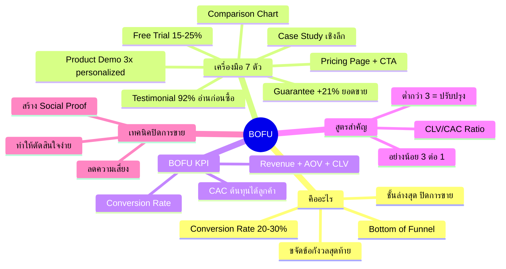
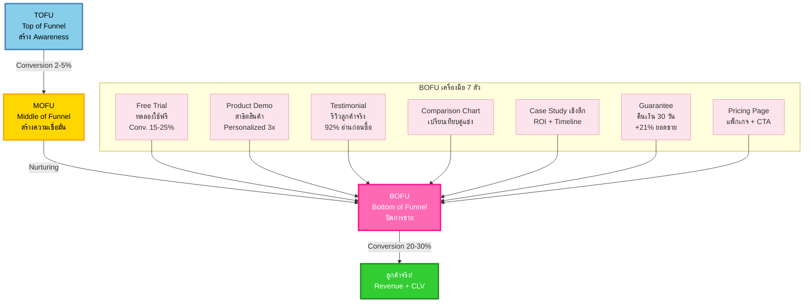
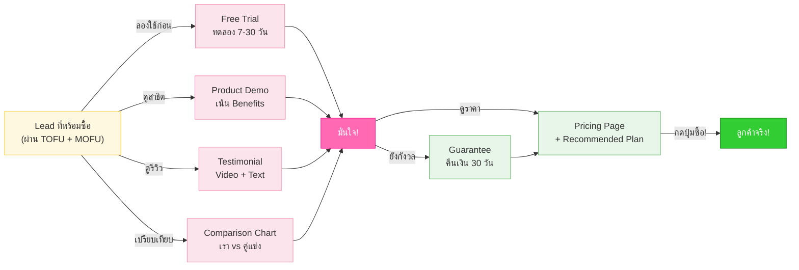
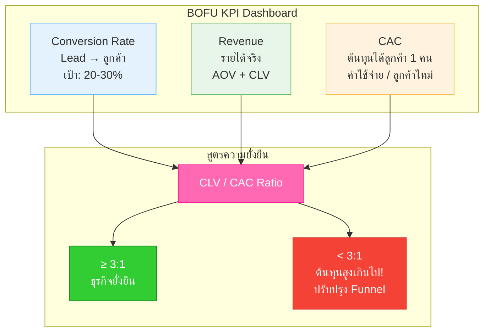
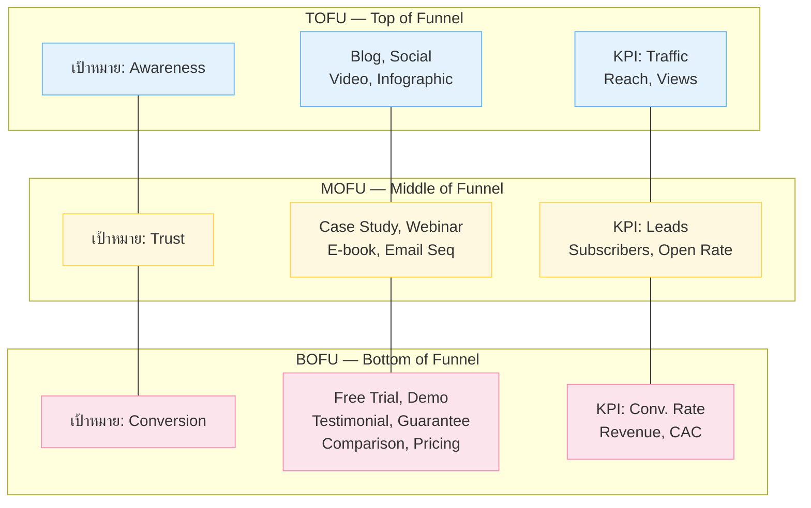

# BOFU — CMKTG-005 Mind Map
> **Format:** Mind Map (Text Structure + Mermaid)
> **Source:** SWP3 Ch28 Content Marketing Mastery ตอนที่ 5
> **Production:** PinkCastle Academy | จูล่ง CTO
> **Date:** 2026-02-18 | **Duration:** 0:08:10

---

## Part 1: Mind Map — โครงสร้างข้อความ (Text Structure)

```
BOFU (Bottom of Funnel)
│
├── 1. BOFU คืออะไร?
│   ├── เป้าหมาย: ปิดการขาย (Conversion)
│   ├── กลุ่มเป้าหมาย: คนที่พร้อมซื้อ (ผ่าน TOFU + MOFU แล้ว)
│   ├── Conversion Rate: 20-30% (เทียบ TOFU 1-2%)
│   └── หลักการ: ขจัดข้อกังวลสุดท้าย ทำให้มั่นใจ 100%
│
├── 2. เครื่องมือ BOFU — 7 ตัวหลัก
│   ├── [1] Free Trial — ทดลองใช้ฟรี (Conversion 15-25%)
│   ├── [2] Product Demo — สาธิตสินค้า เน้น Benefits (Personalized = 3x)
│   ├── [3] Testimonial — รีวิวจากลูกค้าจริง (92% อ่านก่อนซื้อ)
│   ├── [4] Comparison Chart — เปรียบเทียบคู่แข่งอย่างยุติธรรม
│   ├── [5] Case Study เชิงลึก — ROI + Timeline + ขั้นตอน implement
│   ├── [6] Guarantee/Warranty — คืนเงิน 30 วัน (+21% ยอดขาย)
│   └── [7] Pricing Page — แพ็กเกจ + Recommended + FAQ + CTA
│
├── 3. BOFU KPI (วัดการปิดการขาย)
│   ├── Conversion Rate — lead → ลูกค้า (20-30%)
│   ├── Revenue — รายได้จริง + AOV + CLV
│   └── CAC — ต้นทุนได้ลูกค้า 1 คน
│
├── 4. สูตรสำคัญ
│   ├── CAC = ค่าใช้จ่ายทั้งหมด / ลูกค้าใหม่
│   ├── CLV = AOV x ความถี่ซื้อ x อายุลูกค้า
│   └── CLV/CAC Ratio ≥ 3:1 (ต่ำกว่า = ต้องปรับปรุง)
│
├── 5. ความต่างจาก TOFU & MOFU
│   ├── TOFU: Awareness → Blog, Social, Video, Infographic
│   ├── MOFU: Trust → Case Study, Webinar, E-book, Email
│   └── BOFU: Conversion → Trial, Demo, Testimonial, Guarantee
│
├── 6. เทคนิคปิดการขาย
│   ├── ลดความเสี่ยง (Guarantee, Free Trial)
│   ├── สร้าง Social Proof (Testimonial, Case Study)
│   └── ทำให้ตัดสินใจง่าย (Comparison, Pricing, CTA)
│
└── 7. หลักการสำคัญ
    ├── BOFU leads คุณภาพสูง ต้อง nurture มาจาก TOFU + MOFU
    ├── ขจัดข้อกังวลสุดท้าย = ทำให้มั่นใจ 100%
    └── ทั้ง 3 ชั้นต้องทำงานร่วมกัน ขาดชั้นใด Funnel รั่ว
```

---

## Part 2: Mind Map — Mermaid Diagram



---

## Part 3: Flowchart — Full Marketing Funnel (TOFU → MOFU → BOFU)



---

## Part 4: Flowchart — BOFU Decision Journey



---

## Part 5: Flowchart — BOFU KPI & Measurement



---

## Part 6: Comparison Diagram — TOFU vs MOFU vs BOFU



---

## Part 7: Summary Box

```
+==============================================================+
|                      สรุป BOFU                                |
|            Bottom of Funnel — ปิดการขาย                       |
+==============================================================+
|                                                              |
|   เครื่องมือ BOFU 7 ตัวหลัก                                   |
|   +----------------------+------------------------------+    |
|   | Free Trial           | ทดลองฟรี Conversion 15-25%  |    |
|   | Product Demo         | เน้น Benefits, Personalized  |    |
|   | Testimonial          | 92% อ่านรีวิวก่อนซื้อ        |    |
|   | Comparison Chart     | เปรียบเทียบยุติธรรม          |    |
|   | Case Study เชิงลึก   | ROI + Timeline + ขั้นตอน     |    |
|   | Guarantee/Warranty   | คืนเงิน 30 วัน +21% ยอดขาย  |    |
|   | Pricing Page         | Recommended + FAQ + CTA     |    |
|   +----------------------+------------------------------+    |
|                                                              |
|   BOFU KPI                                                   |
|   +----------------------+------------------------------+    |
|   | Conversion Rate      | Lead → ลูกค้า 20-30%         |    |
|   | Revenue              | AOV + CLV                    |    |
|   | CAC                  | ต้นทุนได้ลูกค้า 1 คน          |    |
|   +----------------------+------------------------------+    |
|                                                              |
|   สูตรสำคัญ: CLV/CAC Ratio ≥ 3:1                             |
|   (ต่ำกว่า 3 เท่า = ต้นทุนสูงเกินไป ต้องปรับปรุง funnel)     |
|                                                              |
|   Full Funnel:                                               |
|   TOFU (รู้จัก) → MOFU (เชื่อมั่น) → BOFU (ซื้อ!)            |
|                                                              |
|   3 หลักการสำคัญ:                                             |
|   1. ขจัดข้อกังวลสุดท้าย → ทำให้มั่นใจ 100%                  |
|   2. วัดผลด้วย Conversion Rate + Revenue + CAC               |
|   3. ทั้ง 3 ชั้นต้องสมดุล ขาดชั้นใด Funnel รั่ว!              |
|                                                              |
+==============================================================+
```

---

## สรุปโครงสร้าง Mind Map

| กิ่งหลัก | จำนวนกิ่งย่อย | ประเด็นสำคัญ |
|---------|-------------|-------------|
| BOFU คืออะไร | 4 | Conversion, 20-30%, ขจัดข้อกังวลสุดท้าย |
| เครื่องมือ 7 ตัว | 7 | Trial, Demo, Testimonial, Comparison, Case Study, Guarantee, Pricing |
| BOFU KPI | 3 | Conversion Rate, Revenue, CAC |
| สูตรสำคัญ | 3 | CAC, CLV, CLV/CAC Ratio ≥ 3:1 |
| ความต่างจาก TOFU & MOFU | 3 | Awareness → Trust → Conversion |
| เทคนิคปิดการขาย | 3 | ลดความเสี่ยง, Social Proof, ตัดสินใจง่าย |
| หลักการสำคัญ | 3 | Leads คุณภาพ, มั่นใจ 100%, 3 ชั้นสมดุล |

**จำนวน nodes ทั้งหมด:** 38 nodes

---

> **หมายเหตุ:** Mermaid mindmap สามารถ render ได้ใน GitHub, Notion (embed), VS Code (Mermaid Preview extension)
> Flowchart แบบทางเลือกใช้ได้ในกรณีที่ platform ไม่รองรับ mindmap syntax

---

> ทบทวนต่อ: **CMKTG-006** — เจาะลึก Blog Marketing
> Series: SWP3 Ch28 Content Marketing Mastery
> PinkCastle Academy © 2026
