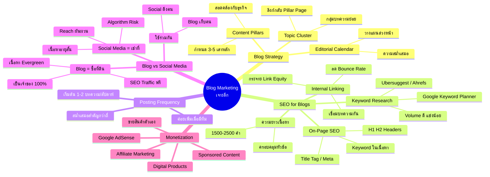

# เจาะลึก Blog Marketing — CMKTG-006
> **Format:** Mind Map (Mermaid)
> **Source:** SWP3 Ch28 Content Marketing Mastery ตอนที่ 6
> **Production:** PinkCastle Academy | จูล่ง CTO
> **Date:** 2026-02-17

---

## Mermaid Mind Map



---

## Text-based Mind Map

```
                    Blog Marketing
                    เจาะลึก (CMKTG-006)
                          |
    ┌──────────┬──────────┼──────────┬──────────┐
    |          |          |          |          |
 [Strategy] [SEO]   [Frequency] [Blog vs    [Monetize]
                                Social]
```

## Center Node: เจาะลึก Blog Marketing

### Branch 1: Blog Strategy (กลยุทธ์การทำ Blog)
- Content Pillars
  - กำหนด 3-5 เสาหลักของเนื้อหา
  - สอดคล้องกับธุรกิจและกลุ่มเป้าหมาย
- Topic Cluster
  - กลุ่มบทความย่อยภายใต้ Pillar
  - ทุก Topic ลิงก์กลับ Pillar Page
- Editorial Calendar
  - วางแผนเนื้อหาล่วงหน้า
  - รักษาความสม่ำเสมอ

### Branch 2: SEO for Blogs (การทำ SEO สำหรับ Blog)
- Keyword Research
  - เครื่องมือ: Google Keyword Planner, Ubersuggest, Ahrefs
  - เลือก Keywords ที่ Volume ดี แข่งขันไม่สูง
- On-Page SEO
  - ใส่ Keyword ใน Title Tag, Meta, H1, H2
  - ใส่ Keyword ในเนื้อหาอย่างเป็นธรรมชาติ
- Internal Linking
  - เชื่อมบทความเข้าด้วยกัน
  - กระจาย Link Equity, ลด Bounce Rate
- ความยาวเนื้อหา
  - 1,500-2,500 คำ เพื่อครอบคลุมหัวข้อ

### Branch 3: Posting Frequency (ความถี่ในการโพสต์)
- ความสม่ำเสมอสำคัญกว่าความถี่
- เริ่มต้น 1-2 บทความ/สัปดาห์
- ค่อยๆ เพิ่มเมื่อมีทีม

### Branch 4: Blog vs Social Media (เปรียบเทียบ)
- Blog = ซื้อที่ดิน
  - เป็นเจ้าของ 100%
  - เนื้อหา Evergreen หลายปี
  - ได้ SEO Traffic ฟรี
- Social Media = เช่าที่
  - Algorithm Risk สูง
  - เนื้อหาอายุสั้น
  - Reach ผันผวน
- ใช้ร่วมกัน
  - Social Media ดึงคนเข้ามา
  - Blog เก็บคนและแปลงเป็น Lead

### Branch 5: Monetization (การสร้างรายได้)
- Affiliate Marketing (ค่าคอมมิชชั่น)
- ขายสินค้า/บริการตัวเอง
- Google AdSense (โฆษณา)
- Digital Products (eBook, คอร์ส, Template)
- Sponsored Content (แบรนด์จ้างเขียน)

---

**จำนวน Nodes ทั้งหมด: 48 nodes**

| ระดับ | จำนวน |
|-------|-------|
| Center Node | 1 |
| Branch (ระดับ 1) | 5 |
| Sub-branch (ระดับ 2) | 19 |
| Leaf (ระดับ 3) | 23 |
| **รวม** | **48** |
