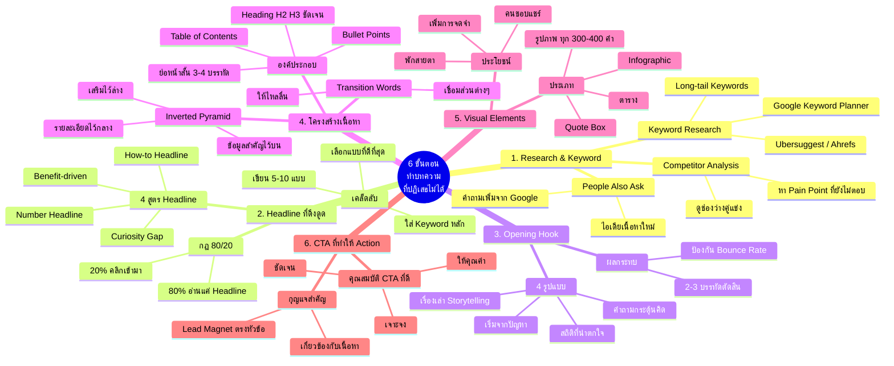
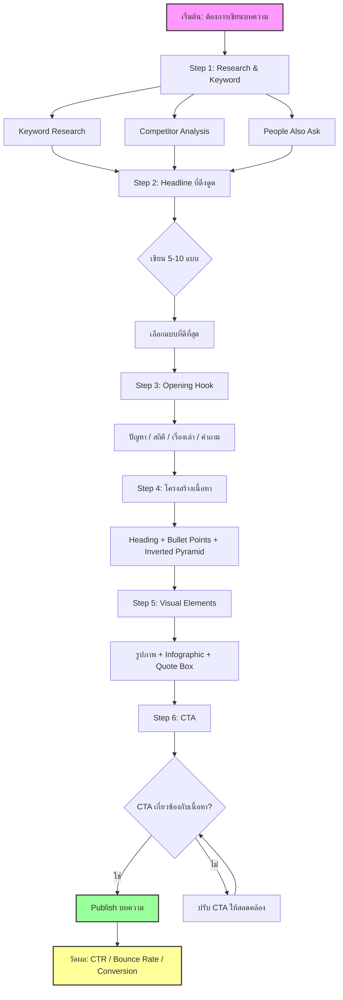
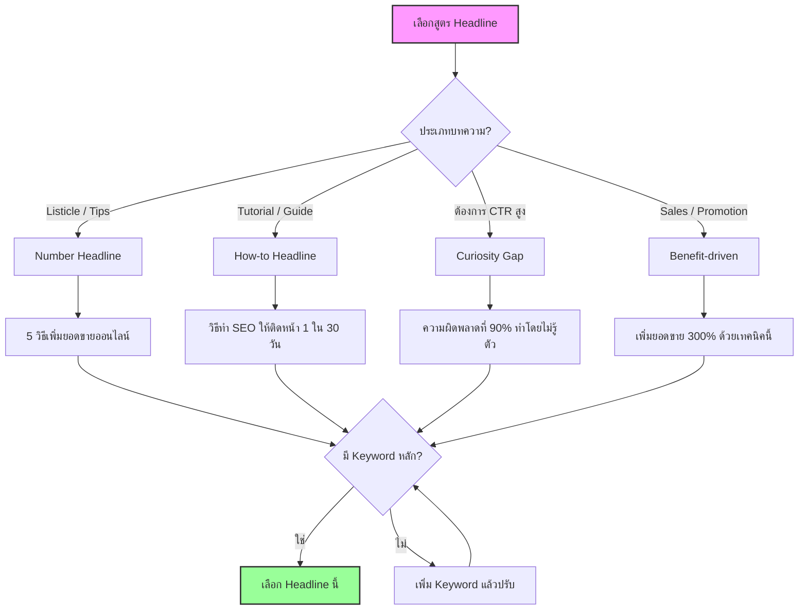
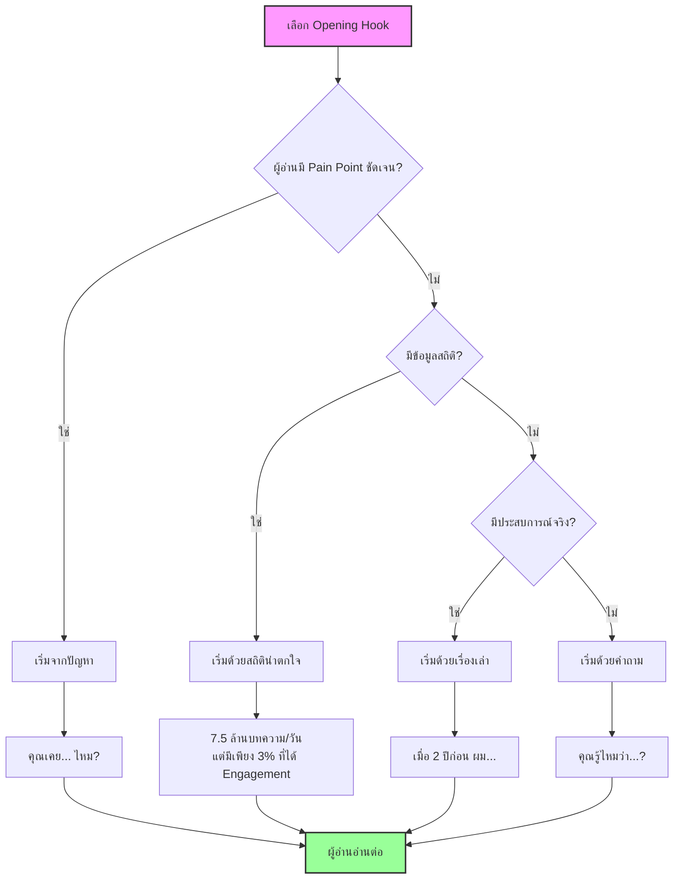
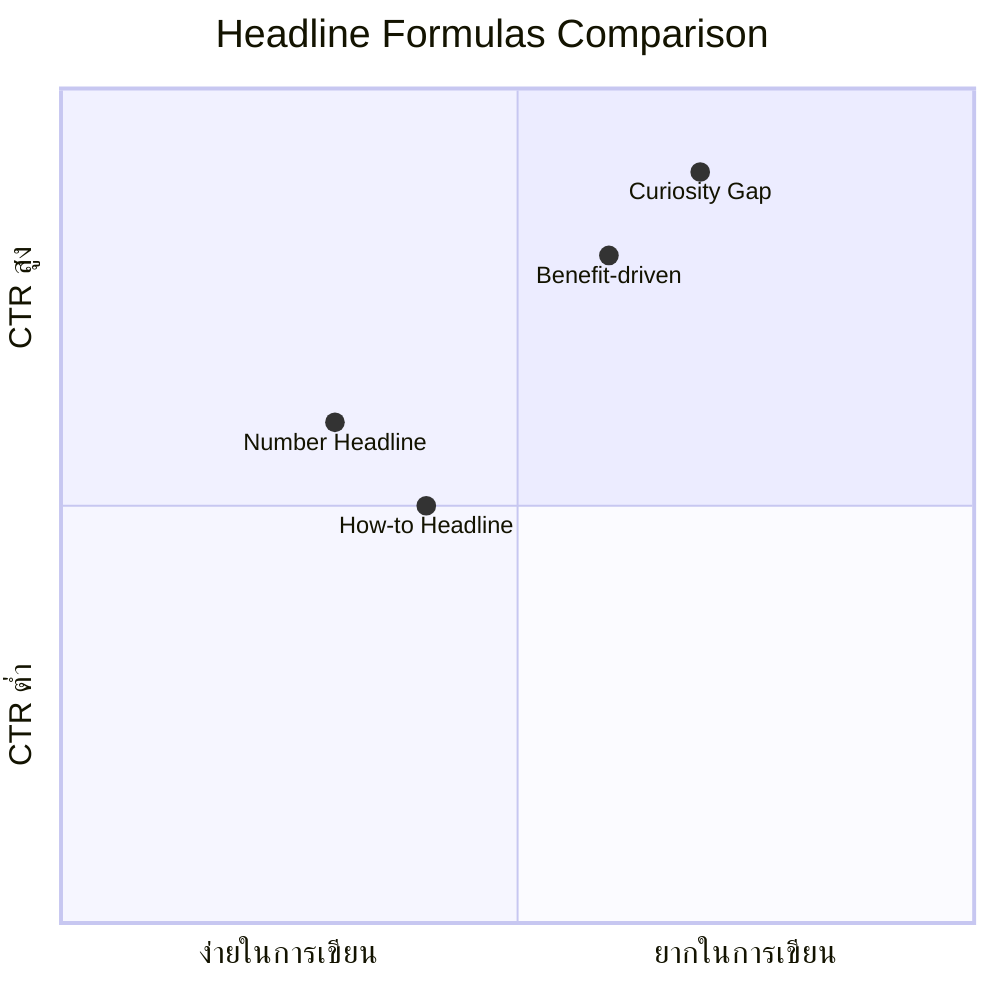

# 6 ขั้นตอนทำบทความที่ผู้อ่านไม่สามารถปฏิเสธได้ — CMKTG-007 Mind Map
> **Format:** Mind Map (Mermaid)
> **Source:** SWP3 Ch28 Content Marketing Mastery ตอนที่ 7
> **Production:** PinkCastle Academy | จูล่ง CTO
> **Date:** 2026-02-18 | **Duration:** 0:06:39

---

## Part 1: Text-based Mind Map

```
                   6 ขั้นตอนทำบทความ
                  ที่ผู้อ่านไม่สามารถปฏิเสธได้
                       (CMKTG-007)
                            |
    ┌──────────┬────────────┼────────────┬──────────┬──────────┐
    |          |            |            |          |          |
[1.Research] [2.Headline] [3.Hook]  [4.โครงสร้าง] [5.Visual] [6.CTA]
 & Keyword    ที่ดึงดูด   Opening     เนื้อหา    Elements  ที่ Action
```

---

## Part 2: Mermaid Mind Map



---

## Part 3: Flowchart — กระบวนการ 6 ขั้นตอนเขียนบทความ



---

## Part 4: Flowchart — Headline Decision Tree



---

## Part 5: Flowchart — Opening Hook Selection



---

## Part 6: ตารางเปรียบเทียบ — Headline 4 สูตร



| สูตร | ความง่ายในการเขียน | CTR ที่คาดหวัง | เหมาะกับ | ตัวอย่าง |
|------|:---:|:---:|------|----------|
| Number | ง่ายมาก | ปานกลาง-สูง | Listicle, Tips, รวมข้อมูล | "7 เคล็ดลับ..." |
| How-to | ง่าย | ปานกลาง | Tutorial, Guide, สอนทำ | "วิธีทำ...ใน 30 วัน" |
| Curiosity Gap | ปานกลาง-ยาก | สูงมาก | ต้องการ CTR สูง, ไวรัล | "สิ่งที่ 90% ไม่รู้..." |
| Benefit-driven | ปานกลาง | สูง | Sales, Promotion, เน้นผลลัพธ์ | "เพิ่มยอดขาย 300%..." |

---

## Part 7: Summary Box

```
┌──────────────────────────────────────────────────────────┐
│           6 ขั้นตอนทำบทความที่ปฏิเสธไม่ได้              │
│                     CMKTG-007                            │
├──────────────────────────────────────────────────────────┤
│                                                          │
│  Step 1: Research & Keyword                              │
│  ├── Keyword Research (เครื่องมือ: KW Planner, etc.)     │
│  ├── Competitor Analysis (หาช่องว่าง)                    │
│  └── People Also Ask (คำถามจาก Google)                   │
│                                                          │
│  Step 2: Headline ที่ดึงดูด                              │
│  ├── กฎ 80/20 (80% อ่านแค่ Headline)                    │
│  ├── 4 สูตร: Number, How-to, Curiosity, Benefit         │
│  └── เขียน 5-10 แบบ เลือกดีที่สุด                       │
│                                                          │
│  Step 3: Opening Hook                                    │
│  ├── 4 แบบ: ปัญหา, สถิติ, เรื่องเล่า, คำถาม            │
│  └── 2-3 บรรทัดแรก ตัดสินทุกอย่าง                       │
│                                                          │
│  Step 4: โครงสร้างเนื้อหา                                │
│  ├── Heading + Bullet Points + ย่อหน้าสั้น              │
│  ├── Inverted Pyramid (สำคัญไว้บน)                       │
│  └── Table of Contents สำหรับบทความยาว                   │
│                                                          │
│  Step 5: Visual Elements                                 │
│  ├── รูปภาพ ทุก 300-400 คำ                               │
│  ├── Infographic (คนชอบแชร์)                             │
│  └── Quote Box + ตาราง                                   │
│                                                          │
│  Step 6: CTA ที่ทำให้ Action                             │
│  ├── ชัดเจน เจาะจง ให้คุณค่า                            │
│  └── ต้องเกี่ยวข้องกับเนื้อหา                           │
│                                                          │
├──────────────────────────────────────────────────────────┤
│  Nodes: 62 | Branches: 6 | Diagrams: 5                  │
└──────────────────────────────────────────────────────────┘
```

---

**จำนวน Nodes ทั้งหมด: 62 nodes**

| ระดับ | จำนวน |
|-------|:---:|
| Center Node | 1 |
| Branch (ระดับ 1) | 6 |
| Sub-branch (ระดับ 2) | 22 |
| Leaf (ระดับ 3) | 33 |
| **รวม** | **62** |

---

> ทบทวนต่อ: **CMKTG-008** — 6 ขั้นตอนทำบทความ ตอนที่ 1-3
> Series: SWP3 Ch28 Content Marketing Mastery
> PinkCastle Academy © 2026
