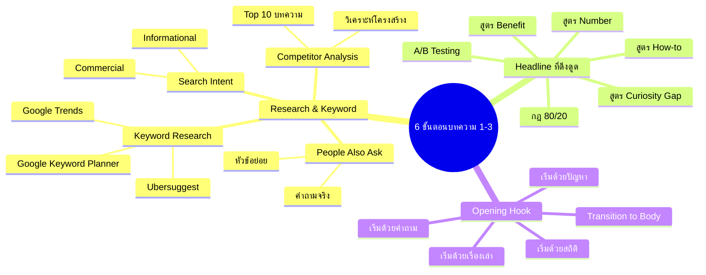
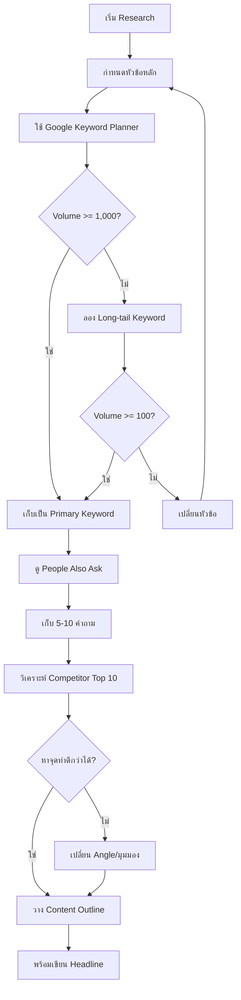
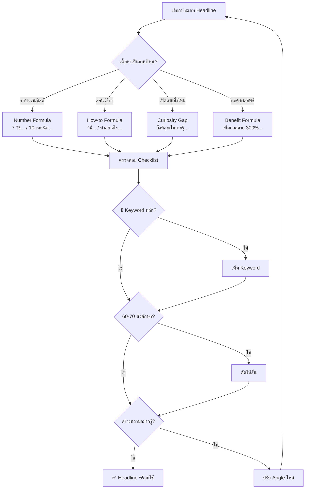
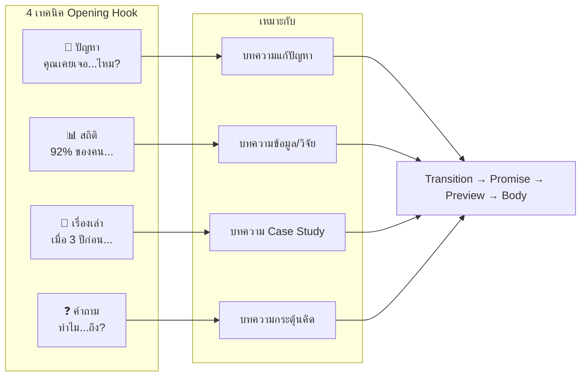
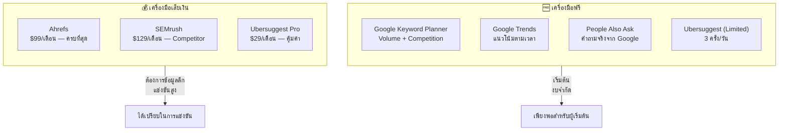

# 6 ขั้นตอนทำบทความ ตอนที่ 1-3 — CMKTG-008 Mind Map
> Format: Mind Map (7 Parts)
> Source: SWP3 Ch28 Content Marketing Mastery ตอนที่ 8
> Production: PinkCastle Academy | จูล่ง CTO
> Date: 2026-02-18 | Duration: 0:11:19

---

## Part 1: Text-based Mind Map

```
6 ขั้นตอนทำบทความ (ตอนที่ 1-3)
│
├── ขั้นตอน 1: Research & Keyword
│   ├── Keyword Research
│   │   ├── Google Keyword Planner (ฟรี)
│   │   ├── Ubersuggest (ฟรี/เสียเงิน)
│   │   ├── Ahrefs (Pro)
│   │   └── Google Trends (ฟรี)
│   ├── Competitor Analysis
│   │   ├── ดู Top 10 บทความในหน้าแรก
│   │   ├── วิเคราะห์โครงสร้าง
│   │   └── หาจุดที่ทำได้ดีกว่า
│   ├── People Also Ask
│   │   ├── ดูคำถามที่คนถามจริง
│   │   ├── เปลี่ยนเป็นหัวข้อย่อย
│   │   └── ตอบให้ครบทุกคำถาม
│   └── Search Intent
│       ├── Informational → บทความให้ความรู้
│       ├── Navigational → หน้า Brand
│       ├── Commercial → เปรียบเทียบ/รีวิว
│       └── Transactional → หน้าขาย
│
├── ขั้นตอน 2: Headline ที่ดึงดูด
│   ├── กฎ 80/20
│   │   ├── 80% คนอ่านแค่ Headline
│   │   ├── 20% อ่านต่อเนื้อหา
│   │   └── Headline ตัดสินชะตาบทความ
│   ├── สูตร 4 แบบ
│   │   ├── Number: "7 วิธี..." "10 เทคนิค..."
│   │   ├── How-to: "วิธี..." "ทำอย่างไร..."
│   │   ├── Curiosity Gap: "สิ่งที่คุณไม่เคยรู้..."
│   │   └── Benefit: "เพิ่มยอดขาย 300%..."
│   ├── องค์ประกอบ Headline ดี
│   │   ├── มี Keyword หลัก
│   │   ├── สั้นกระชับ (60-70 ตัวอักษร)
│   │   ├── สร้างความอยากรู้
│   │   └── บอกประโยชน์ชัดเจน
│   └── A/B Testing
│       ├── เขียน 5-10 Headline
│       ├── เลือก 2 แบบทดสอบ
│       └── วัดผล CTR เลือกตัวชนะ
│
└── ขั้นตอน 3: Opening Hook
    ├── 4 เทคนิคเปิดเรื่อง
    │   ├── เริ่มด้วยปัญหา → "คุณเคยเจอ...ไหม?"
    │   ├── เริ่มด้วยสถิติ → "92% ของคน..."
    │   ├── เริ่มด้วยเรื่องเล่า → "เมื่อ 3 ปีก่อน..."
    │   └── เริ่มด้วยคำถาม → "ทำไม...ถึง?"
    ├── หลักการ Hook ที่ดี
    │   ├── 3 วินาทีแรกตัดสินใจ
    │   ├── ต้องเกี่ยวข้องกับ Headline
    │   ├── สร้าง Curiosity ให้อ่านต่อ
    │   └── ห้ามยาวเกิน 3 ประโยค
    └── Transition to Body
        ├── Promise → บอกว่าจะได้อะไร
        ├── Preview → สรุปหัวข้อที่จะกล่าวถึง
        └── Bridge → เชื่อม Hook กับเนื้อหา
```

---

## Part 2: Mermaid Mind Map



---

## Part 3: Flowchart — Keyword Research Process



---

## Part 4: Flowchart — Headline Decision Tree



---

## Part 5: Flowchart — Opening Hook Selection



---

## Part 6: Comparison — เครื่องมือ Keyword Research



---

## Part 7: สรุป — 3 ขั้นตอนแรก

```
╔══════════════════════════════════════════════════╗
║                                                  ║
║  3 ขั้นตอนแรกของการทำบทความ                       ║
║  = รากฐานที่แข็งแกร่ง                              ║
║                                                  ║
╠══════════════════════════════════════════════════╣
║                                                  ║
║  ขั้นตอน 1: Research & Keyword                   ║
║  → รู้ว่าคนค้นหาอะไร + คู่แข่งทำอะไร              ║
║                                                  ║
║  ขั้นตอน 2: Headline ที่ดึงดูด                     ║
║  → 80% ตัดสินใจจาก Headline                      ║
║  → ใช้สูตร 4 แบบ + A/B Test                      ║
║                                                  ║
║  ขั้นตอน 3: Opening Hook                         ║
║  → 3 วินาทีแรกตัดสินว่าจะอ่านต่อ                  ║
║  → ใช้ 4 เทคนิค: ปัญหา/สถิติ/เรื่องเล่า/คำถาม     ║
║                                                  ║
║  สูตร: Research ดี + Headline ดี + Hook ดี        ║
║       = บทความที่คนอยากอ่าน                       ║
║                                                  ║
╚══════════════════════════════════════════════════╝
```

---

> ทบทวนต่อ: **CMKTG-009** — 6 ขั้นตอนทำบทความ ตอนที่ 4-6
> Series: SWP3 Ch28 Content Marketing Mastery
> PinkCastle Academy © 2026
